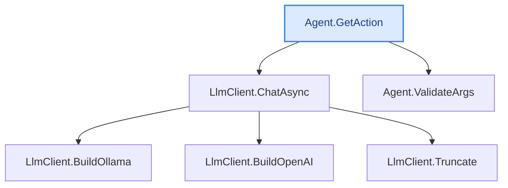

**Deep explain example** (`explain --depth 3 --max-methods 9`)

A real deep run: CodeTracer walks the call chain from `Agent.GetAction` down 3 levels — **6
methods** (`L0` → `L1` → `L2`), each explained on its own — then writes an **end-to-end
synthesis** (`## End-to-end logic`), a plain-words **`## In plain words`** recap, and finally an
auto-generated **`## Call-flow`** diagram (ASCII + Mermaid) so a non-expert can grasp the whole
shape at a glance. Reproducible:

```bash
dotnet run -- explain -s CodeTracer.sln --method "Agent.GetAction" --depth 3 --max-methods 9 \
  --repo-url https://github.com/janjanusek/code_tracer/blob/main
```

> _Run: ~892 s (≈15 min) · 8 model calls (6 methods + the synthesis + the plain-words recap) ·
> in 6121 / out 6632 tokens · gemma4:latest, CPU-only, no GPU. The final `[eli10]` call adds the
> "In plain words" section in ~10 s (out 73 tokens) — a cheap pass that pays off most on long,
> deep explanations, where it's the one section a non-expert reads first._

---

# Agent.GetAction  ([Agent.cs:241](https://github.com/janjanusek/code_tracer/blob/main/Agent.cs#L241))
`Task<(string tool, JsonElement args, string raw)?> Agent.GetAction(List<ChatMsg> messages)`
_Deep explanation following the call chain (6 methods)._

## L0 · Agent.GetAction  ([Agent.cs:241](https://github.com/janjanusek/code_tracer/blob/main/Agent.cs#L241))
This method attempts to extract a structured action (a tool name and its arguments) from an AI model's response, ensuring that the extracted data is valid according to predefined rules. It handles potential failures by retrying the request up to two times after providing corrective feedback to the model.

### Inputs and Outputs
*   **Input:** `List<ChatMsg> messages` (The current conversation history).
*   **Output:** A `Task` that returns a tuple containing:
    1.  `string tool`: The name of the tool requested.
    2.  `JsonElement args`: The arguments for that tool, structured as JSON.
    3.  `string raw`: The original, unparsed text response from the model.
*   **Return Value:** This tuple if successful; otherwise, `null` after all attempts fail.

### Side Effects (State Modification)
The method modifies the input `messages` list by appending new messages whenever a validation or parsing error occurs. These appended messages include:
1.  The raw, incorrect response from the model (`assistant`).
2.  A corrective prompt instructing the user/model on how to fix the output format (`user`).

### Step-by-Step Execution Flow

1.  **Initialization:** It sets up `ChatOptions` for the LLM client, specifying zero temperature (for deterministic output), a maximum number of predictions (`_actionNumPredict`), and forcing the response format to adhere to the predefined `ActionSchema`.
2.  **Retry Loop:** The core logic runs in a loop that allows for 3 total attempts (the initial attempt plus up to two correction retries).
3.  **Model Call:** In each attempt, it calls `_llm.ChatAsync` using the current conversation history (`messages`), the defined options, and the prompt `"action"`. The resulting raw text is trimmed.
4.  **JSON Parsing (Error Handling):** It attempts to parse the raw response into a JSON structure. If parsing fails (e.g., due to incomplete JSON output from the model), it treats this as an error:
    *   It adds the raw and corrective messages to `messages`.
    *   It uses `continue` to immediately start the next retry attempt.
5.  **Structure Validation:** It checks if the root element of the parsed JSON is a valid object and contains a string property named `"tool"`. If not, it records an error in `messages` and retries.
6.  **Tool Name Extraction & Basic Checks:**
    *   It extracts the tool name (lowercased).
    *   It checks if this extracted tool name is present in the list of `AllowedTools`. If not, it records an "Unknown tool" error in `messages` and retries.
7.  **Argument Extraction & Validation:**
    *   It attempts to extract the arguments (`args`) from the JSON object. If the `"args"` property is missing or not a JSON object, it defaults to `EmptyArgs`.
    *   It calls `ValidateArgs(tool, args)` (a method in the same class) to perform deep validation on the extracted arguments based on the tool's requirements.
    *   If `ValidateArgs` returns an error (`err != null`), it records an "Invalid args" error in `messages` and retries.
8.  **Success:** If all parsing, structural checks, and argument validations pass successfully, the method immediately returns the extracted `(tool, args, raw)` tuple.
9.  **Failure:** If the loop completes three attempts without a successful return, the method exits the loop and returns `null`.

## L1 · LlmClient.ChatAsync  ([LlmClient.cs:87](https://github.com/janjanusek/code_tracer/blob/main/LlmClient.cs#L87))
This method sends a chat message history to an external Large Language Model (LLM) API endpoint and retrieves the model's response text while also logging usage statistics.

### Inputs and Outputs
*   **Inputs:**
    *   `messages`: A collection of `ChatMsg` objects representing the conversation history.
    *   `options`: Optional configuration settings for the chat request (defaults to a new `ChatOptions` object if null).
    *   `label`: An optional string used to label the call statistics.
    *   `ct`: A cancellation token for controlling the operation's lifecycle.
*   **Output:** Returns a `Task<string>` containing the model's generated text response, or an empty string if content extraction fails.

### Side Effects (State Changes)
The method updates several internal class fields:
1.  `Calls`: Incremented by one to count the total number of API calls made.
2.  `PromptTokens`: Increased by the token count used for the prompt/input messages (`inTok`).
3.  `EvalTokens`: Increased by the token count generated during evaluation/completion (`outTok`).
4.  `_callLog`: A new `CallStat` object containing timing, input tokens, output tokens, and the provided label is added to this list.

### Execution Steps (What it Does)
1.  **Determine API Style:** It checks the internal `_style` property (`ApiStyle`). Based on whether it's set to `Ollama` or otherwise (implying OpenAI), it calls either `BuildOllama` or `BuildOpenAI`. These helper methods are responsible for constructing the target URL and serializing the chat history into a JSON payload.
2.  **Prepare Request:** It creates an HTTP POST request (`HttpRequestMessage`) using the determined URL and sets the body content to the generated JSON string, specifying UTF-8 encoding and `application/json` media type.
3.  **Execute API Call:** A stopwatch is started. The method asynchronously sends the prepared request using `_http.SendAsync()`. It then reads the entire response body as a string. The stopwatch is stopped upon receiving the response.
4.  **Handle Errors:** If the HTTP status code of the response is not successful, it throws an exception detailing the failure status and truncating the received error body for logging.
5.  **Extract Content (Response Parsing):** It parses the JSON response body using `JsonDocument`. Because different LLM APIs return results in different formats (Ollama vs. OpenAI), it uses conditional logic to navigate the JSON structure:
    *   If **Ollama**, it expects the content at `root["message"]["content"]`.
    *   If **OpenAI**, it expects the content from the first choice's message: `root["choices"][0]["message"]["content"]`.
6.  **Extract Token Usage:** It parses the JSON again to determine token usage statistics (`inTok` and `outTok`). This logic is also conditional based on the API style, looking for fields like `prompt_eval_count`/`eval_count` (Ollama) or `usage["prompt_tokens"]`/`usage["completion_tokens"]` (OpenAI).
7.  **Update State:** It updates the class's internal counters (`Calls`, `PromptTokens`, `EvalTokens`) and records a detailed usage entry in `_callLog`.
8.  **Return Result:** Finally, it returns the extracted content string.

## L1 · Agent.ValidateArgs  ([Agent.cs:293](https://github.com/janjanusek/code_tracer/blob/main/Agent.cs#L293))
This method validates whether the provided arguments (`args`) contain all the necessary fields required by a specific tool (`tool`).

### Inputs and Outputs
*   **Inputs:**
    1.  `tool`: A string identifying the function or operation being called (e.g., `"find_path"`, `"read_file"`).
    2.  `args`: A `JsonElement` containing the arguments passed to the tool.
*   **Output:**
    *   Returns `null` if all required fields are present and valid for the given tool, or if the tool is not recognized (and thus requires no validation).
    *   Returns a descriptive error string detailing which specific fields are missing if validation fails.

### Internal Logic and Delegation

The method defines several local helper functions to manage argument extraction and validation:

1.  **`Get(string k)`:** Attempts to retrieve a property named `k` from the input `args`. It returns the string value of that property if it exists and is a JSON string; otherwise, it returns an empty string (`""`).
2.  **`Has(string k)`:** Checks if the argument corresponding to key `k` (retrieved using `Get`) is non-empty (i.e., not whitespace).
3.  **`Need(params string[] keys)`:** Takes a list of required field names (`keys`). It checks which of these fields are *not* present or valid according to `Has()`. If any fields are missing, it returns an error message listing them; otherwise, it returns an empty string.
4.  **`Empty(string s)`:** A simple wrapper that converts a potentially empty validation string (`s`) into `null` if the string is empty, or keeps the string if it contains content.

### Validation Flow (Switch Statement)

The method uses a `switch` statement based on the input `tool` to determine which set of requirements must be met:

*   **Required Tools:** For tools like `"find_path"`, `"find_callers"`, `"get_method"`, etc., the method calls `Need()` with a specific list of required keys. The result is then passed through `Empty()`.
    *   If `Need()` returns an error string (meaning fields are missing), that error string is returned by the method.
    *   If `Need()` returns an empty string (meaning all fields were present), the method returns `null` (because `Empty("")` evaluates to `null`).
*   **Tools with No Requirements:** For `"finish"`, the method immediately returns `null`.
*   **Unrecognized Tools:** If the input `tool` does not match any defined case, the method defaults to returning `null`.

### Side Effects
The method is purely functional and has no observable side effects; it only reads from its inputs (`tool` and `args`) and returns a validation status string or `null`.

## L2 · LlmClient.BuildOllama  ([LlmClient.cs:136](https://github.com/janjanusek/code_tracer/blob/main/LlmClient.cs#L136))
This method constructs the necessary URL and JSON payload required to communicate with an Ollama chat API endpoint. It takes user messages and specific configuration options, packages them into a structured format, and serializes that structure into a JSON string.

### Inputs
1.  **`messages`**: An `IEnumerable<ChatMsg>` representing the conversation history (the sequence of roles and content).
2.  **`o`**: A `ChatOptions` object containing various configuration settings for the API call (e.g., temperature, context size, format).

### Outputs
A tuple containing two strings:
1.  The **URL string** (`_root/api/chat`), which is the endpoint where the request must be sent.
2.  The **JSON payload string**, which contains all the structured data needed for the API call.

### Logic and Steps

1.  **Build Options Dictionary (`opts`):** It first creates a dictionary (`opts`) to hold general model options, including `temperature`, context size (`num_ctx`), and `repeat_penalty`.
2.  **Handle Optional Parameters:** It checks if the `ChatOptions` object contains a specific value for `NumPredict`; if so, it adds this as `"num_predict"` to the options dictionary.
3.  **Build Payload Dictionary (`payload`):** It initializes the main payload dictionary which includes:
    *   The target model name (`_model`).
    *   A flag indicating streaming is disabled (`"stream": false`).
    *   The `messages`: It uses LINQ's `Select` method to transform the input `ChatMsg` objects into an array of anonymous objects containing only the `role` and `content`, which are then assigned to the `"messages"` key.
    *   The options dictionary (`opts`) is assigned to the `"options"` key.
4.  **Handle Conditional Payload Additions:** It conditionally adds two more keys to the payload:
    *   If `o.Format` is set, it adds the format element (as a JSON object).
    *   If `o.Think` is set, it adds the reasoning flag (`"think"`).
5.  **Serialization and Return:** Finally, it uses `JsonSerializer.Serialize` to convert the entire structured `payload` dictionary into a single JSON string. It then concatenates this JSON string with the base API root URL (`_root`) and appends `/api/chat`, returning the resulting tuple (URL, JSON).

### Delegations
*   **`System.Text.Json.JsonSerializer.Serialize(...)`**: This external method is responsible for taking the C# dictionary structure (`payload`) and converting it into a valid JSON formatted string.
*   **LINQ (`Select`, `ToArray`)**: Used to efficiently transform the collection of input message objects into the specific array format required by the API payload.

## L2 · LlmClient.BuildOpenAI  ([LlmClient.cs:159](https://github.com/janjanusek/code_tracer/blob/main/LlmClient.cs#L159))
This method constructs the necessary components—a URL and a JSON payload—required to send a chat completion request compatible with the OpenAI API specification.

### Inputs and Outputs

*   **Inputs:**
    1.  `messages`: A collection of message objects (`ChatMsg`) representing the conversation history.
    2.  `o`: An object containing various configuration options for the LLM call (e.g., temperature, max tokens, response format).
*   **Output:** A tuple `(string url, string json)`:
    1.  The first element (`url`) is the API endpoint path.
    2.  The second element (`json`) is a JSON-formatted string representing the request body payload.

### Functionality Breakdown (Numbered Steps)

1.  **Initialize Payload:** It starts by creating a dictionary (`payload`) that will hold all parameters for the API call, setting mandatory values like `model` (from the class field `_model`), ensuring streaming is disabled (`"stream": false`), and including the desired `temperature` from the input options (`o`).
2.  **Process Messages:** It transforms the input `messages` collection into a structured array of objects, retaining only the `role` and `content` for each message to fit the OpenAI format.
3.  **Apply Optional Parameters (Max Tokens):** It checks if the `NumPredict` property in the options (`o`) is set. If it is, this value is added to the payload under the key `"max_tokens"`.
4.  **Apply Optional Parameters (Response Format):** It checks if the `Format` property in the options (`o`) contains a JSON structure (`JsonElement`). If so, it constructs a complex nested dictionary for the `"response_format"` field, enabling structured JSON output based on the provided schema.
5.  **Construct and Return:** Finally, it builds the API URL using the class field `_root` appended with `/v1/chat/completions`. It then serializes the complete internal `payload` dictionary into a JSON string and returns this string along with the constructed URL.

### Delegated Calls

*   **`Enumerable.Select()` / `Enumerable.ToArray()`:** Used to iterate over and transform the input list of messages into the specific array structure required by the OpenAI API payload.
*   **`JsonSerializer.Serialize(Dictionary, JsonSerializerOptions)`:** This method is used to convert the final C# dictionary (`payload`) containing all parameters into a JSON string format suitable for network transmission.

## L2 · LlmClient.Truncate  ([LlmClient.cs:201](https://github.com/janjanusek/code_tracer/blob/main/LlmClient.cs#L201))
This method checks if an input string is too long relative to a specified maximum length. If it is, it truncates the string and appends an ellipsis (`...`) to indicate that content was removed.

1.  **Inputs:**
    *   `s`: The original string that needs checking/potential truncation.
    *   `max`: An integer representing the maximum allowed length for the resulting string.

2.  **Logic Flow and Output:**
    *   The method first compares the actual length of `s` (`s.Length`) to the provided limit (`max`).
    *   **If `s` is shorter than or equal to `max`:** The original, unmodified string `s` is returned.
    *   **If `s` is longer than `max`:** The method executes a truncation process: it takes a substring of `s` containing only the first `max` characters (`s[..max]`), and then concatenates an ellipsis string (`...`) to that truncated portion, which is returned.

3.  **Side Effects:**
    *   There are no side effects; the method does not modify its input parameters. It operates purely on the provided strings and integers.

4.  **Delegations (Internal Calls):**
    *   It uses the built-in `Length` property of the string type to determine size.
    *   It utilizes C# substring indexing (`s[..max]`) to extract a portion of the original string.
    *   It uses standard string concatenation (`+`) to append the ellipsis.

## End-to-end logic
This system is designed to determine if a conversational turn requires calling an external function (a "tool") by leveraging a Large Language Model (LLM).

The execution begins at **`Agent.GetAction`**. This method takes the entire conversation history (`List<ChatMsg>`) as input and attempts to extract a structured action—specifically, a tool name and its arguments—from what the LLM generates in response to that history.

### The Core Logic Flow

1.  **LLM Interaction (L0 $\rightarrow$ L1):**
    *   `Agent.GetAction` calls **`LlmClient.ChatAsync`**. This is where the real work of interpreting the conversation happens. `ChatAsync` sends the full message history (`messages`) to an external LLM API endpoint. It also handles logging usage statistics for this call.

2.  **Payload Construction (L1 $\rightarrow$ L2):**
    *   Before sending the request, `ChatAsync` must format the input messages into a structured payload suitable for the chosen LLM provider. Depending on the configuration, it will use one of two methods:
        *   If targeting Ollama, it calls **`LlmClient.BuildOllama`**, which packages the message history and options into a specific JSON structure required by the Ollama API.
        *   If targeting OpenAI, it calls **`LlmClient.BuildOpenAI`**, which constructs the URL and JSON payload according to the OpenAI specification.

3.  **Response Handling (LLM $\rightarrow$ L0):**
    *   The LLM processes the prompt and returns a response text via `ChatAsync`. This raw response is passed back up to `Agent.GetAction`.
    *   `Agent.GetAction` attempts to parse this response, extracting potential tool names (`tool`) and their arguments (as a JSON element, `JsonElement`).

4.  **Validation and Output (L0 $\rightarrow$ L1):**
    *   The extracted data is not trusted immediately; it must be validated. `Agent.GetAction` calls **`Agent.ValidateArgs`**.
    *   `ValidateArgs` takes the proposed tool name (`tool`) and its arguments (`args`). It checks if the provided arguments contain all the fields that are mandatory for that specific tool, or if the tool itself is recognized at all.
    *   If `ValidateArgs` confirms the data is valid (by returning `null`), the process concludes successfully.

### Data Transformation Summary

| Step | Input Data | Process/Transformation | Output Data |
| :--- | :--- | :--- | :--- |
| **Start** | `List<ChatMsg>` (Conversation History) | N/A | N/A |
| **`LlmClient.Build*`** | `IEnumerable<ChatMsg>`, `ChatOptions` | Serialization and Structuring | `(string url, string json)` payload |
| **`LlmClient.ChatAsync`** | Structured Payload | API Call to External LLM | Raw Model Response Text |
| **`Agent.GetAction`** | Raw Model Response Text | Parsing/Extraction (Tool Name & Args) | Potential `(string tool, JsonElement args)` tuple |
| **`Agent.ValidateArgs`** | Tool Name (`tool`), Arguments (`args`) | Schema Validation against Tool Definition | Success (`null`) or Failure (Error indication) |
| **End** | Validated Data | N/A | Final structured action `(string tool, JsonElement args, string raw)` |

The final outcome is a task that returns the name of the function to be called and the arguments required for that function, provided all steps—from API communication to schema validation—succeed. If any step fails (e.g., invalid arguments), the system handles this by retrying the request up to two times after providing corrective feedback to the LLM.

## In plain words
Imagine you are building a robot helper that needs to know when to use its tools. This code acts like a smart brain that reads everything you say in a conversation. Its job is to figure out if your question means, "Hey, I need you to *do* something specific," and if so, exactly what that thing is and what details it needs.

## Call-flow
_How execution flows through the methods explained above — deterministic, straight from Roslyn (no model)._

```text
Agent.GetAction   ◆ start      Agent.cs:241
├─► LlmClient.ChatAsync        LlmClient.cs:87
│   ├─► LlmClient.BuildOllama  LlmClient.cs:136
│   ├─► LlmClient.BuildOpenAI  LlmClient.cs:159
│   └─► LlmClient.Truncate     LlmClient.cs:201
└─► Agent.ValidateArgs         Agent.cs:293
```


