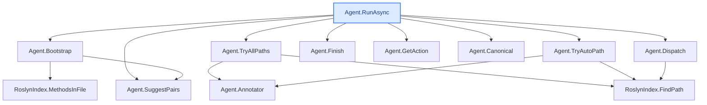

**Deep + wide explain — the full-options showcase** (`explain --depth 3 --max-methods 12`)

The "it went through the whole code and summarised it" run: CodeTracer walks the call chain from
`Agent.RunAsync` down 3 levels — **12 methods** (`L0` → `L1` → `L2`), each explained on its own —
then writes an **end-to-end synthesis** (`## End-to-end logic`), a plain-words **`## In plain
words`** recap, and finally an auto-generated **`## Call-flow`** diagram (ASCII tree + Mermaid) of
the whole call-tree. Everything a dev gets, in one file. Reproducible:

```bash
dotnet run -- explain -s CodeTracer.sln --method "Agent.RunAsync" --depth 3 --max-methods 12 \
  --repo-url https://github.com/janjanusek/code_tracer/blob/main
```

> _Run: ~1849 s (≈31 min) · 14 model calls (12 methods + the synthesis + the plain-words recap) ·
> in 13172 / out 12557 tokens · gemma4:latest, CPU-only, no GPU._
>
> _The result is **saved incrementally** — after every method — so a 31-minute run is never lost.
> If you don't pass `--out` it **auto-saves** to `codetracer-explain-Agent.RunAsync.md` (default on,
> no flag). Open that file **read-only to watch** the explanation fill in live, and **Ctrl+C** any
> time to stop and keep everything finished so far. Progress is shown with a live ETA:_
> ```
> [explain] (7/12) L1  Agent.Canonical ... · ~9m left
> ```

---
# Agent.RunAsync  ([Agent.cs:118](https://github.com/janjanusek/code_tracer/blob/main/Agent.cs#L118))
`Task Agent.RunAsync(string solutionPath, string targetFile, string endpoint)`
_Deep explanation following the call chain (12 methods)._

## L0 · Agent.RunAsync  ([Agent.cs:118](https://github.com/janjanusek/code_tracer/blob/main/Agent.cs#L118))
This method orchestrates the entire process of finding a solution path by first attempting deterministic checks, and if those fail, engaging an external Language Model (LLM) in a multi-step conversation loop until a result is found or limits are hit.

### Inputs/Outputs
*   **Inputs:** `solutionPath` (the location of the final code), `targetFile` (the file being analyzed), and `endpoint` (a specific target point).
*   **Output:** An asynchronous task (`Task`) that, upon completion, signals a result via the internal `Finish()` method.
*   **Side Effects:** Writes detailed status updates to the console (`Console.WriteLine`). It also updates its internal state by storing the most recent successful path found in `_lastPath`.

### Execution Flow (Numbered Steps)

1.  **Initialization and Pre-flight Check:**
    *   The method first calls `Bootstrap(targetFile, endpoint)` to generate an initial "seed" message containing context about the problem.
    *   It then performs a **deterministic pre-flight check**. This step attempts to find a solution path immediately using internal logic (Roslyn) rather than waiting for the LLM.
        *   If `_allPaths` is true, it runs `TryAllPaths()` (brute force). Otherwise, it runs `TryAutoPath()` (first shortest path).
        *   If this deterministic check finds a path (`PATH FOUND`), the method immediately calls `Finish()` and exits.
    *   If no direct path is found, and if LLM usage is disabled (`_useLlm` is false), the process stops and reports failure.

2.  **LLM Engagement (The Main Loop):**
    *   If pre-flight fails but an LLM is enabled, the method initializes a message history containing the system prompt and the initial seed.
    *   It enters a loop that runs up to `_maxSteps`. In each step:
        a. **Get Action:** It calls `GetAction(messages)` to ask the model for its next move (e.g., "call tool X with arguments Y").
        b. **Check for Completion:** If the model's action is a `"finish"` tool call, it retrieves the final path and immediately calls `Finish()`, ending

## L1 · Agent.Bootstrap  ([Agent.cs:411](https://github.com/janjanusek/code_tracer/blob/main/Agent.cs#L411))
This method generates a diagnostic string that helps guide a user in finding potential call chains between two specified files: an `endpoint` file and a `targetFile`.

### Inputs and Outputs
*   **Inputs:**
    1.  `targetFile`: The path to the file containing destination methods (the "call target").
    2.  `endpoint`: The path to the endpoint file, which may or may not be a `.cshtml` view.
*   **Output:** A `string` containing formatted diagnostic information, including suggested method pairs for the user to investigate next.

### Side Effects and Internal State Changes
*   The method reads data from the internal index (`_index`) using both file paths.
*   It modifies the class field `_pairs` by adding tuples of potential source/destination method names (up to 24 pairs).

### Step-by-Step Explanation

1.  **Determine Endpoint Path:** It checks if the provided `endpoint` string ends with `.cshtml`. If it does, it assumes the corresponding code-behind file is located at `endpoint + ".cs"`; otherwise, it uses the original `endpoint`.
2.  **Initialize Output:** A `StringBuilder` (`sb`) is initialized to build the diagnostic message. It starts by stating the goal: finding a call chain from the endpoint down to the target file.
3.  **Analyze Endpoint Methods (Source):**
    *   It checks if the resolved endpoint code-behind file exists on the file system using `File.Exists()`.
    *   If it exists, it calls `_index.MethodsInFile()` to retrieve all methods defined in that file and lists them in the output string.
    *   If it does not exist, it notes the original endpoint path and suggests the user might need to resolve it manually (e.g., via a search tool).
4.  **Analyze Target Methods (Destination):**
    *   It calls `_index.MethodsInFile()` using the `targetFile` path to retrieve all methods defined in that file.
    *   It lists these target methods in the output string.
5.  **Select Candidate Pairs:**
    *   **Source Candidates (`handlers`):** It filters the endpoint methods (`fromMethods`). By default, it selects any method starting with `"On"` (common for event handlers). If no such handlers are found, it falls back to using *all* methods from the endpoint.
    *   **Destination Candidates (`targets`):** It filters the target methods (`toMethods`), excluding constructors (`.ctor`). It then sorts these remaining methods, prioritizing those that end with `"Async"` or start with `"Build"`/`"Generate"`.
6.  **Populate Suggested Pairs:** It iterates through every selected handler and every selected target method, adding a tuple `(handler_class, handler_method, target_class, target_method)` to the internal list `_pairs`, stopping after 24 pairs are added.
7.  **Final Output Generation:** It appends a prompt suggesting the user start by calling `find_path` and calls the helper method `SuggestPairs()` (which uses the populated `_pairs`) to generate the final suggested call path, returning the complete string.

## L1 · Agent.TryAllPaths  ([Agent.cs:493](https://github.com/janjanusek/code_tracer/blob/main/Agent.cs#L493))
This method performs an exhaustive search for all possible code paths connecting candidate source methods to target methods, effectively running a brute-force analysis of connectivity within the codebase.

### Inputs and Outputs
*   **Inputs:** It relies on internal state: `_index` (a pathfinding index), `_pairs` (a list of all candidate method pairs to test), `_repoUrl`, and `_withBodies`.
*   **Output:** It returns a `Task<string>`, which is a single string containing the formatted results. This string either lists all found paths, or if none are found, it provides alternative debugging information about potential callers.

### Side Effects
The method does not modify any persistent state outside of its local variables and the returned string. Its primary side effect is generating a detailed report string summarizing its findings.

### Step-by-Step Execution

1.  **Initialization:** It initializes a `StringBuilder` (`sb`) to accumulate results and a `HashSet<string>` (`seen`) used for deduplication (ensuring identical paths are not reported multiple times). It first calls the private method `Annotator()` to get necessary annotation data.
2.  **Path Iteration (Brute-Force Search):** The method iterates through every candidate pair stored in `_pairs`. For each pair, it asynchronously calls `_index.FindPath()`, attempting to find a complete code path connecting the source and target methods defined by that pair.
3.  **Processing Found Paths:**
    *   If `FindPath` fails (i.e., the result does not contain "PATH FOUND"), the current pair is skipped.
    *   If the found path has already been recorded in the `seen` set, it is skipped (deduplication).
    *   If a unique path is found, the method increments its count (`found`). It then formats and appends a detailed section to the result string: a header indicating the path number and the source/target methods, followed by the actual trimmed path content. Separators are added between distinct paths.
4.  **Handling Zero Paths Found:** If the loop completes and `found` is zero (no direct paths were found), the method generates an alternative report. It selects up to three unique target methods from the pairs and calls `_index.FindCallers()` for each one, listing potential calling code segments in the resulting string.
5.  **Returning Results:**
    *   If no paths were found (Step 4 executed), it returns the formatted "No direct path found" message containing caller information.
    *   If one or more distinct paths were found, it prepends a summary header ("FOUND X distinct path(s) [brute-force]:

## L1 · Agent.TryAutoPath  ([Agent.cs:471](https://github.com/janjanusek/code_tracer/blob/main/Agent.cs#L471))
This method attempts to automatically determine a code path between specified components. It first tries finding a direct path using all known candidate pairs; if successful, it returns the detailed path information. If no direct path is found, it falls back to generating a report listing potential callers for the target methods.

### Inputs and Context
*   **Reads:** Uses internal state fields: `_index` (a code index object), `_pairs` (a list of candidate source/target tuples), `_repoUrl`, and `_withBodies`. It also uses the current value of `_withBodies`.
*   **Side Effects:** None visible, but it modifies its internal state by calling `Annotator()` to generate an annotation object (`ann`).

### Output
*   **Returns:** A `Task<string>`. This string is either:
    1.  A formatted path description (if found).
    2.  A detailed report listing the callers for up to three target methods (if no direct path is found).

### Execution Flow (What it does)

1.  **Annotation Generation:** It first calls `Annotator()` to generate an annotation object (`ann`) required for subsequent index lookups.
2.  **Attempt Direct Path Finding:** It iterates through every candidate pair stored in `_pairs`. For each pair, it asynchronously calls `_index.FindPath()`, passing the source/target components and configuration details (`_withBodies`, `_repoUrl`, `ann`).
3.  **Success Check (Early Exit):** If the result from `FindPath` contains the substring "PATH FOUND", the method immediately formats a descriptive string including the path coordinates and the full result, and returns it.
4.  **Fallback Path Generation:** If the loop completes without finding a direct path:
    a. It initializes a `StringBuilder` with a header indicating no direct path was found.
    b. It processes only the unique target pairs (`(p.tc, p.tm)`) from `_pairs`, limiting the process to the first three distinct targets using `Enumerable.Distinct().Take(3)`.
    c. For each of these limited target pairs, it asynchronously calls `_index.FindCallers()` to retrieve a list of methods that call the target component.
    d. It appends a formatted section header and the results from `FindCallers` to the `StringBuilder`.
5.  **Final Return:** After checking all candidates (or failing to find a path), it converts the accumulated content of the `StringBuilder` into a string and returns this fallback report.

## L1 · Agent.Finish  ([Agent.cs:327](https://github.com/janjanusek/code_tracer/blob/main/Agent.cs#L327))
This method finalizes an agent's analysis by assembling a comprehensive report containing the discovered path and optional summaries, writing it to both the console and potentially a file.

Here is a step-by-step explanation of what `Agent.Finish` does:

1.  **Initialize Output:** It takes the input `pathText`, removes any leading or trailing whitespace using `Trim()`, and assigns this cleaned string to the local variable `output`.
2.  **Generate Path Diagram:** It uses the clean path text (`output`) to generate a visual representation of the discovered call-path (a "flow") by calling `Diagram.FromTraceText()` and wrapping it in `Diagram.Section()`. This diagram is stored in the `flow` variable.
3.  **Conditional Summary Generation:**
    *   It checks if the internal state flag `_summarize` is true AND if the `output` text contains the literal string "PATH FOUND".
    *   If both conditions are met, it prints a status message to `Console.Error`.
    *   It calls `Agent.SummarizeChain(pathText)` to generate a detailed summary (purpose, dependencies, etc.). If this summary is non-empty:
        *   The summary is appended to the `output` string under an "## Summary" heading.
        *   It then calls `Agent.SimplifyForKid(summary)` on the generated summary text to create a simpler version. If this simplified text is non-empty, it is appended to the `output` string under an "## In plain words" heading.
4.  **Append Diagram:** It appends the generated path diagram (`flow`) to the `output` string (if the flow variable is not null or empty).
5.  **Console Output:** It prints a final header indicating completion, including the provided `reason`, and then writes the entire assembled `output` content to the standard console output stream.
6.  **File Writing (Side Effect):** If the internal state field `_outPath` is set (meaning a file destination was specified), it attempts to write the final assembled `output` content, followed by a newline character, to that path asynchronously using `File.WriteAllTextAsync()`. It handles any potential writing exceptions and reports them to `Console.Error`.

***

**Inputs:**
*   `pathText`: The raw text detailing the sequence of calls or steps found during analysis.
*   `reason`: A string providing context for why the agent finished (e.g., "Success", "Timeout").

**Outputs/Side Effects:**
*   The final, assembled report is printed to `Console.WriteLine()`.
*   If `_outPath` is set, the entire report is written to that file path (`File.WriteAllTextAsync`).
*   Status messages (like summary initiation or write errors) are printed to `Console.Error`.

**Delegated Calls:**
*   **`Diagram.FromTraceText(output)`**: Converts the raw call-path text into a structured diagram object.
*   **`Agent.SummarizeChain(pathText)`**: Generates a detailed, prose summary of the entire process based on the original path text.
*   **`Agent.SimplifyForKid(summary)`**: Takes the generated summary and rewrites it in simpler language.

## L1 · Agent.GetAction  ([Agent.cs:241](https://github.com/janjanusek/code_tracer/blob/main/Agent.cs#L241))
This method attempts to extract a structured action (a tool name and its arguments) from a large language model's response, ensuring that the extracted data conforms to predefined rules.

### Inputs and Outputs

*   **Input:** `messages` (`List<ChatMsg>`) – A list of chat messages representing the conversation history.
*   **Output:** `Task<(string tool, JsonElement args, string raw)?>` – An asynchronous task that returns a tuple containing:
    1.  The name of the identified tool (`tool`).
    2.  A JSON element containing the arguments for that tool (`args`).
    3.  The original raw text response from the model (`raw`).
*   **Failure:** If all attempts fail, it returns `null`.

### Side Effects (State Modification)

This method modifies the input `messages` list by appending new chat messages whenever a validation error or parsing failure occurs. These appended messages serve as feedback to the LLM for subsequent retry attempts.

1.  **JSON Parsing Failure:** Appends the raw output and a user message instructing the model to return valid JSON.
2.  **Schema Validation Failure:** Appends the raw output and a user message detailing that the object must contain a string field "tool" and an object "args".
3.  **Tool Not Allowed:** Appends the raw output and a user message listing all allowed tools, indicating the submitted tool is unknown.
4.  **Argument Validation Failure:** Appends the raw output and a user message detailing that the arguments are invalid for the specified tool, asking for corrected JSON.

### Process Explanation (Numbered Steps)

1.  **Initialization:** It sets up `ChatOptions` for the LLM call, ensuring temperature is zero (deterministic) and setting the maximum number of predictions (`_actionNumPredict`) to guide the model's output format using the provided `ActionSchema`.
2.  **Attempt Loop:** The method runs in a loop that allows for three total attempts: one initial attempt plus two correction retries.
3.  **LLM Call:** In each iteration, it calls `_llm.ChatAsync`, passing the conversation history (`messages`), the options, and the prompt "action". The resulting raw text is trimmed.
4.  **JSON Parsing (Attempt 1):** It attempts to parse the raw response into a JSON object. If parsing fails (e.g., due to incomplete JSON output from the model), it treats this as an error, appends corrective messages to `messages`, and continues to the next attempt.
5.  **Schema Validation:** It checks if the parsed root element is a valid JSON object and contains a string property named `"tool"`. If not, it records an error in `messages` and retries.
6.  **Tool Extraction & Argument Initialization:** It extracts the tool name (converting it to lowercase) and attempts to extract the arguments (`args`) from the `"args"` property. If the `"args"` property is missing or not a JSON object, it defaults to an empty argument structure (`EmptyArgs`).
7.  **Allowed Tool Check:** It checks if the extracted `tool` name exists within the predefined list of `AllowedTools`. If not, it records an error in `messages` and retries.
8.  **Argument Validation (Delegation):** It calls a helper method, `ValidateArgs(tool, args)`, to perform deep validation on the arguments based on the tool's schema. If this validation fails, it records an error in `messages` and retries.
9.  **Success:** If the raw response successfully passes all parsing, structural, allowed tool, and argument validations, the method returns the extracted `(tool, args, raw)` tuple immediately.
10. **Failure:** If the loop completes three attempts without successful validation, it exits the loop and returns `null`.

## L1 · Agent.Canonical  ([Agent.cs:321](https://github.com/janjanusek/code_tracer/blob/main/Agent.cs#L321))
This method takes a structured JSON element and converts it into a standardized, lowercase string representation suitable for comparing identical inputs (repeat detection).

1.  **Input:** It accepts one parameter, `args`, which is a `JsonElement` (a structured representation of JSON data).
2.  **Serialization:** It calls `JsonSerializer.Serialize(args)`. This delegates the task of converting the structured `JsonElement` into its raw string format (the standard JSON text).
3.  **Normalization:** The resulting JSON string is then passed to `.ToLowerInvariant()`. This converts every character in the entire string to lowercase, ensuring that casing differences will not affect subsequent comparisons.
4.  **Output:** It returns a `string` which is the fully serialized and lowercased version of the input JSON element.

*(Side Effects: None are apparent; it only reads its input and produces a new string.)*

## L1 · Agent.SuggestPairs  ([Agent.cs:462](https://github.com/janjanusek/code_tracer/blob/main/Agent.cs#L462))
This method generates a formatted string suggestion of potential "find path" tool calls based on stored internal data.

1.  **Inputs:** It reads the private field `_pairs`, which is expected to be a list of tuples, where each tuple represents four strings: (from class, from method, to class, to method).
2.  **Processing/Side Effects:**
    *   It initializes an internal `StringBuilder` (`sb`) to construct the output string efficiently.
    *   It processes only the first three pairs found in the `_pairs` list using `Enumerable.Take(3)`.
    *   For each pair, it constructs a specific JSON-like string format (representing a tool call for `"find_path"`) by embedding the four class/method names (`p.fc`, `p.fm`, `p.tc`, `p.tm`) into the structure. This formatted string is appended to the `StringBuilder`.
3.  **Output:** It returns a single string:
    *   If any pairs were processed, it returns the accumulated content of the `StringBuilder` (which contains multiple lines, each representing a suggested tool call).
    *   If no pairs are available (`sb.Length == 0`), it returns a specific fallback message indicating that candidates were not found and suggesting an alternative resolution method (`find_symbol`).

## L1 · Agent.Dispatch  ([Agent.cs:563](https://github.com/janjanusek/code_tracer/blob/main/Agent.cs#L563))
This method acts as a router or dispatcher. It takes a string specifying an action (`tool`) and a JSON object containing parameters (`a`), then executes the corresponding logic by calling methods on the internal index structure (`_index`).

### Inputs and Outputs
*   **Inputs:**
    1.  `tool`: A string identifying which functionality to execute (e.g., `"find_symbol"`, `"grep"`).
    2.  `a`: A `JsonElement` containing key-value pairs that serve as parameters for the requested tool.
*   **Output:** It returns a `Task<string>`, which resolves to a string result detailing the outcome of the executed action.

### Internal Logic and Execution Flow
The method first defines two helper functions:
1.  **`S(k)`**: Extracts a required string value from the input JSON element `a` using key `k`. If the key is missing or the value is not a string, it returns an empty string (`""`).
2.  **`I(k, def)`**: Extracts an optional integer value from the input JSON element `a` using key `k`. If the key is missing, it uses the provided default value (`def`).

It then uses a `switch` statement based on the `tool` parameter to execute one of several predefined actions:

1.  **`"find_symbol"`**: Calls `_index.FindSymbol("name")`, passing the symbol's name extracted from the JSON parameters.
2.  **`"outline"`**: Calls `_index.Outline("file")`, passing the file name extracted from the JSON parameters.
3.  **`"get_method"`**: Calls `_index.GetMethod("class", "method")`, using class and method names extracted from the JSON parameters.
4.  **`"find_callers"`**: Calls `_index.FindCallers("class", "method")`, using class and method names extracted from the JSON parameters.
5.  **`"find_callees"`**: Calls `_index.FindCallees("class", "method")`, using class and method names extracted from the JSON parameters.
6.  **`"find_references"`**: Calls `_index.FindReferences("class", "method")`, using class and method names extracted from the JSON parameters.
7.  **`"find_path"`**: Calls `_index.FindPath(...)`, passing four strings (from `"fromClass"`, `"fromMethod"`, `"toClass"`, and `"toMethod"`) extracted from the JSON parameters.
8.  **`"read_file"`**: Calls `_index.ReadFile("file", start, end)`, using the file path from the JSON parameters and calculating the starting line (default 1) and ending line (default 0) using the helper function `I`.
9.  **`"grep"`**: Calls `_index.Grep("pattern")`, passing a search pattern extracted from the JSON parameters.
10. **Default Case (`_`)**: If the provided `tool` string does not match any known tool, it returns an error message indicating that the tool is unknown.

### Side Effects and Delegation
*   **Side Effects:** The method itself has no visible side effects; its purpose is solely to coordinate calls.
*   **Delegation:** All core functionality is delegated to methods on the `_index` field (an instance of `RoslynIndex`), which handles the actual interaction with code analysis or file

## L2 · RoslynIndex.MethodsInFile  ([RoslynIndex.cs:592](https://github.com/janjanusek/code_tracer/blob/main/RoslynIndex.cs#L592))
This method is designed to scan a specific source file within the current solution and extract structured metadata about all the methods defined in that file.

### Inputs and Outputs

*   **Input:** `filePath` (a `string`) - The path to the source file whose methods need to be extracted.
*   **Output:** A `List<(string cls, string method, int line)>` - A list where each tuple contains:
    1.  The name of the class (`cls`).
    2.  The name of a method within that class (`method`).
    3.  The line number where the method is defined (`line`).

### Logic Breakdown (What it does)

1.  **Determine Full Path:** It first calculates the absolute, full path for the input `filePath`. If the provided path is not already rooted (e.g., missing a drive letter), it prepends the solution directory (`SolutionDir`) to ensure the correct location is targeted.
2.  **Locate Document:** It iterates through all projects and documents within the overall solution (`_solution`). It finds the single `Document` object whose fully qualified file path matches the calculated full path from Step 1. If no matching document is found, it immediately returns an empty list.
3.  **Get Syntax Tree:** Using the located `Document`, it asynchronously retrieves its complete syntax tree and gets the root node of that tree.
4.  **Traverse and Extract:** It traverses all descendant nodes in the file's syntax tree, specifically looking for nodes that represent class declarations (`TypeDeclarationSyntax`).
5.  **Extract Methods:** For every class found:
    *   It iterates through all members within that class that are method declarations (`MethodDeclarationSyntax`).
    *   For each method, it extracts the class name (from `type.Identifier`), the method name (from `md.Identifier`), and the starting line number of the method definition.
6.  **Return Results:** It compiles these three pieces of information into a tuple and adds them to the result list, which is then returned.

### Dependencies and Delegations

*   **`Path`:** Used for standard file system operations like checking if a path is rooted (`IsPathRooted`) and combining directory segments (`Combine`).
*   **`Enumerable`:** Used extensively for filtering and selecting data (e.g., `SelectMany`, `FirstOrDefault`, `OfType<T>`). This allows the code to efficiently filter collections of documents or syntax nodes.
*   **`Document` / `SyntaxTree`:** These are core Roslyn compiler API components. The method calls `doc.GetSyntaxTreeAsync()` to parse the source code into a navigable, structured tree representation (`SyntaxTree`), which is necessary for inspecting class and method definitions.
*   **`TypeDeclarationSyntax` & `MethodDeclarationSyntax`:** These represent specific structural elements within the C# code (a class definition or a method signature) that allow the code to programmatically identify what constitutes a class or a method.

## L2 · Agent.Annotator  ([Agent.cs:529](https://github.com/janjanusek/code_tracer/blob/main/Agent.cs#L529))
This method constructs and returns a specialized asynchronous annotation function used to generate explanatory notes for code execution chains.

Here is a concise explanation of its functionality:

1.  **Purpose Check:** The method first checks the private field `_annotate`. If this flag is set to `false`, it immediately returns `null`, indicating that no annotation logic should be applied.
2.  **Function Generation (Output):** If `_annotate` is true, the method returns an anonymous asynchronous function (`Func<string, string, string, string, Task<string?>>`). This returned function encapsulates the entire annotation logic and accepts four strings:
    *   `context`: The accumulated history/notes of the chain.
    *   `callerSig`: The signature of the current method executing.
    *   `calleeSig`: The signature of the method being called (or empty if this is the final step).
    *   `code`: The source code snippet for the current call block.
3.  **Prompt Construction:** Inside the returned function, a detailed prompt is constructed based on whether `calleeSig` is empty:
    *   **If `calleeSig` is empty (End of Chain):** The prompt asks the LLM to summarize what the entire chain achieves in one short phrase, treating the current code block as the final step.
    *   **If `calleeSig` is present (Mid-Chain Step):** The prompt asks the LLM to explain *why* the current method calls the next specified method (`calleeSig`) and what that specific step achieves in the overall process.
4.  **Delegation (LLM Call):** The constructed prompt is sent to the `_llm` client via `LlmClient.ChatAsync`. This call uses a system message instructing the model to provide terse annotations, followed by the user-generated prompt.
5.  **Result Processing:** After receiving the LLM's reply:
    *   It checks if the response is empty or if it exactly matches `"null"` (case-insensitive). If either is true, the function returns `null`.
    *   If a valid annotation is received, the function cleans up the string by trimming common formatting characters (`"`, `` ` ``, ` `, `.`) and returns the resulting note.
6.  **Error Handling:** The entire process is wrapped in a `try/catch` block. If any error occurs during the LLM communication (e.g., model failure), the function catches it and safely returns `null`, ensuring the annotation step is simply omitted rather than failing the overall execution.

## L2 · RoslynIndex.FindPath  ([RoslynIndex.cs:281](https://github.com/janjanusek/code_tracer/blob/main/RoslynIndex.cs#L281))
This method performs a deep analysis of the codebase's call graph to determine if there is a compile-time or structural path from a specified starting method (`source`) to a specified ending method (`target`).

### Inputs and Outputs

**Inputs (Parameters):**
1.  `fromClass`, `fromMethod`: The fully qualified name of the source method (the start point).
2.  `toClass`, `toMethod`: The fully qualified name of the target method (the desired end point).
3.  `maxNodes` (Default: 3000): The maximum number of nodes (methods) to explore in the call graph before giving up.
4.  `withBodies`: A boolean indicating whether the path rendering should include the actual source code bodies for each method.
5.  `repoUrl`: An optional URL used when rendering the final path, likely for linking purposes.
6.  `annotate`: An optional callback function used during path rendering to add custom annotations or context to the output.

**Output (Return Value):**
*   A `Task<string>` containing a string representation of the discovered call path if successful.
*   If the source or target methods cannot be found, it returns an error message detailing which method was missing.
*   If no path is found within the exploration limit, it returns a detailed failure message explaining that the link might be dynamic (e.g., reflection).

### Core Functionality and Logic

1.  **Initialization:** The method first resolves both the source and target methods using `ResolveMethod`. It handles immediate failures if either symbol cannot be located.
2.  **Trivial Check:** It checks if the source and target are the exact same method; if so, it returns a specific success message immediately.
3.  **Graph Traversal (BFS):** The core logic uses Breadth-First Search (BFS) starting *at* the `target` method and moving **backward** through the call graph. It searches for methods that call the current node (`FindCallersAsync`).
4.  **Path Tracking:** It maintains a set of `visited` nodes to prevent infinite loops and redundant checks, and a dictionary (`calledBy`) to track which caller led to the currently examined method.
5.  **Goal Check:** In each iteration, when it processes a potential caller (`c`), it checks if that caller is equal to the original source method (`start`). If it finds this connection, it has successfully found the path.
6.  **Path Reconstruction:** Upon finding the link, it reconstructs the path by starting at `start` and iteratively following the `calledBy` map until it reaches the `target`.
7.  **Termination:** The search continues until either the queue is empty (no more reachable nodes) or the maximum node limit (`maxNodes`) is reached.

### Delegated Methods and Side Effects

The method relies heavily on external services and methods:

*   **`ResolveMethod(string, string)`:** Used twice at the start to convert class/method name strings into actual symbol objects (`IMethodSymbol`).
*   **`SymbolFinder.FindCallersAsync(ISymbol, Solution)`:** This is the critical delegated call. It asynchronously finds all methods that *call* a given method symbol. Because it uses callers, the search proceeds backward from the target toward the source.
*   **`RenderPath(...)`:** If a path is successfully found, this method is called to format and return the final string representation of the sequence of calls.

**Side Effects:** The primary side effect is reading and traversing the internal structure of the codebase (the `_solution`), which consumes memory for tracking visited nodes (`HashSet`) and building the call chain map (`Dictionary`).

## End-to-end logic
This system implements an advanced code analysis agent designed to trace execution paths (call chains) within a large codebase. The overall flow starts at `Agent.RunAsync` and proceeds through several stages of path discovery, graph construction, and refinement until a definitive result is found or the process times out.

Here is the complete end-to-end logic flow:

### 1. Initialization and Entry Point (`Agent.RunAsync`)
The entire process begins at `Agent.RunAsync`. This method acts as the orchestrator. Its primary goal is to find a code path connecting an entry point to a target file/method.

1.  **Deterministic Checks:** The agent first attempts simple, deterministic checks to see if a solution can be found immediately using known data structures or rules.
2.  **LLM Fallback Loop:** If the deterministic checks fail, the system engages in a multi-step conversation loop with an external Language Model (LLM). This conversational approach is designed to guide the agent's search process until a path is successfully identified or predefined limits are reached.

### 2. Path Discovery and Initial Analysis
When the agent needs to gather information about potential connections, it uses several specialized methods:

*   **`Agent.Bootstrap`:** If the system suspects a connection between two files (`targetFile` and `endpoint`), this method generates an initial diagnostic report. This report helps guide the user or subsequent steps by suggesting potential method pairs that might be related.
*   **`RoslynIndex.MethodsInFile` (Data Gathering):** To build its internal knowledge base, the agent scans specific source files (`filePath`). It uses this method to extract structured metadata for every method found, recording the class name, method name, and line number. This data populates the system's index.
*   **`Agent.SuggestPairs`:** Using the collected data (specifically the internal list `_pairs`), this method generates a formatted string of potential "find path" tool calls that the agent can use in its LLM interactions.

### 3. Graph Construction and Path Finding Attempts
The core work happens by building and traversing the codebase's call graph:

*   **`Agent.TryAllPaths` (Brute Force):** This method performs an exhaustive, brute-force search for *all* possible code paths connecting candidate source methods to target methods. It relies heavily on internal state (`_index`, `_pairs`) and returns a single string containing the formatted results of this comprehensive analysis.
*   **`Agent.TryAutoPath` (Smart Search):** This is a more targeted attempt. It first tries to find a direct path using all known candidate pairs. If that fails, it gracefully falls back by generating a report listing potential callers for the target methods, narrowing down the search space.
*   **`RoslynIndex.FindPath` (Deep Graph Traversal):** This is the most powerful structural analysis tool. It performs a deep graph traversal to determine if a compile-time or structural path exists between two fully qualified method names (`fromClass/Method` and `toClass/Method`).

### 4. LLM Interaction Loop (The Conversational Core)
When the agent needs external help from the LLM, it follows this cycle:

1.  **Dispatching:** The agent uses `Agent.Dispatch`. It sends a request specifying an action (`tool`, e.g., `"find_symbol"`) and its parameters (`a`). This method acts as a router, executing the appropriate logic on the internal index structure (`_index`).
2.  **Tool Calling/Suggestion:** If the LLM suggests using a tool, `Agent.GetAction` is used to parse the raw LLM response string into a structured format (tool name and JSON arguments), ensuring compliance with predefined rules.
3.  **Normalization:** Before sending data back or comparing inputs, `Agent.Canonical` takes any complex JSON structure (`JsonElement`) and serializes it into a standardized, lowercase string. This ensures that identical conceptual inputs are treated as equal for repeat detection.

### 5. Annotation and Finalization
Once the path is found (or the search concludes), the agent prepares the final output:

*   **`Agent.Annotator`:** If enabled (`_annotate` is true), this method generates specialized asynchronous annotation functions. These functions are designed to generate explanatory notes that accompany the code execution chain, providing context for *why* a path segment exists.
*   **`Agent.Finish` (Output Assembly):** This final method takes all gathered information—the discovered path text (`pathText`) and any generated annotations—and assembles it into a comprehensive report. It cleans up the input string, generates a visual path diagram, and writes the complete analysis to both the console and potentially a file.

### Summary of Data Flow
The system moves from **Input Parameters** $\rightarrow$ **Graph Construction/Indexing** (using `MethodsInFile` and internal state) $\rightarrow$ **Iterative Search** (via `RunAsync`, `Dispatch`, and LLM calls) $\rightarrow$ **Path Determination** (using `FindPath` or `TryAutoPath`) $\rightarrow$ **Annotation Generation** (if needed) $\rightarrow$ **Final Report Output** (`Finish`).

## In plain words
Imagine you have a giant box of LEGOs (your computer code), and you need to figure out exactly how one specific little piece connects to another far away piece.

This whole system is like a super-smart detective that searches through all those connections. It first reads everything, then tries different smart ways—like guessing or doing a full check—to draw the exact path from the start point to the end point. Finally, it writes up a neat report showing you every step of the journey!

## Call-flow
_How execution flows through the methods explained above — deterministic, straight from Roslyn (no model)._

```text
Agent.RunAsync   ◆ start           Agent.cs:118
├─► Agent.Bootstrap                Agent.cs:411
│   ├─► RoslynIndex.MethodsInFile  RoslynIndex.cs:592
│   └─► Agent.SuggestPairs         Agent.cs:462
├─► Agent.TryAllPaths              Agent.cs:493
│   ├─► Agent.Annotator            Agent.cs:529
│   └─► RoslynIndex.FindPath       RoslynIndex.cs:281
├─► Agent.TryAutoPath              Agent.cs:471
│   ├─► Agent.Annotator            Agent.cs:529
│   └─► RoslynIndex.FindPath       RoslynIndex.cs:281
├─► Agent.Finish                   Agent.cs:327
├─► Agent.GetAction                Agent.cs:241
├─► Agent.Canonical                Agent.cs:321
├─► Agent.SuggestPairs             Agent.cs:462
└─► Agent.Dispatch                 Agent.cs:563
    └─► RoslynIndex.FindPath       RoslynIndex.cs:281
```


