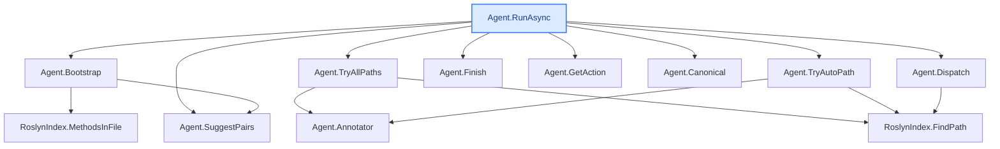

**Full `explain` example — deep + wide, with code** (`--depth 3 --max-methods 12`)

The complete showcase: a developer who has **never seen this code** gets, in one read, what would
otherwise take days of cold-reading. CodeTracer walks the call chain from `Agent.RunAsync` down 3
levels — **12 methods** — and for each one shows its **real source** (indented by call-depth, so the
nesting reads like the Call-flow tree) followed by a step-by-step explanation. Then an **end-to-end
synthesis**, an **"In plain words"** recap, and the auto **`## Call-flow`** diagram (ASCII + Mermaid).
Sections with nothing to report (no side effects / risks) are **omitted, not padded**. Reproducible:

```bash
dotnet run -- explain -s CodeTracer.sln --method "Agent.RunAsync" --depth 3 --max-methods 12 \
  --repo-url https://github.com/janjanusek/code_tracer/blob/main
```

> _Run: ~1645 s (≈27 min) · 14 model calls (12 methods + the synthesis + the plain-words recap) ·
> in 13820 / out 11512 tokens · gemma4:latest, CPU-only, no GPU. Saved **incrementally** (after each
> method) and **auto-saved** if you omit `--out`; **Ctrl+C** stops and keeps what's done._

---

# Agent.RunAsync  ([Agent.cs:118](https://github.com/janjanusek/code_tracer/blob/main/Agent.cs#L118))
`Task Agent.RunAsync(string solutionPath, string targetFile, string endpoint)`
_Deep explanation following the call chain (12 methods)._

## L0 · Agent.RunAsync  ([Agent.cs:118](https://github.com/janjanusek/code_tracer/blob/main/Agent.cs#L118))
```csharp
public async Task RunAsync(string solutionPath, string targetFile, string endpoint)
    {
        var seed = Bootstrap(targetFile, endpoint);

        // Deterministic pre-flight: try candidate find_path pairs IMMEDIATELY. On CPU this is
        // faster and more reliable than waiting for (often under-filled) model calls. Roslyn
        // is the source of truth; the model is here only to navigate harder cases (interface/DI/events).
        // --all-paths/--brute: enumerate ALL paths (deep), not just the first shortest one.
        var mode = _allPaths ? "brute-force (all paths)" : "first path";
        Console.WriteLine($"[pre-flight] deterministic find_path over {_pairs.Count} candidate pairs [{mode}]...");
        var deterministic = _allPaths ? await TryAllPaths() : await TryAutoPath();
        if (deterministic.Contains("PATH FOUND"))
        {
            await Finish(deterministic, _allPaths ? "brute-force" : "pre-flight");
            return;
        }
        if (!_useLlm)
        {
            Console.WriteLine("[pre-flight] no direct path and --no-llm set - stopping.");
            await Finish(deterministic, "deterministic");
            return;
        }
        Console.WriteLine("[pre-flight] no direct path - handing over to the model loop...");

        var messages = new List<ChatMsg>
        {
            new("system", SystemPrompt),
            new("user", seed)
        };

        var seen = new HashSet<string>();
        int escalations = 0;

        for (int step = 1; step <= _maxSteps; step++)
        {
            var act = await GetAction(messages);
            if (act == null)
            {
                // model could not produce a valid action even after corrections -> deterministic escalation
                Console.WriteLine("\n[auto] model gave no valid action - using deterministic result...");
                await Finish(_lastPath ?? deterministic, "auto");
                return;
            }

            var (tool, args, raw) = act.Value;
            Console.WriteLine($"\n===== STEP {step} =====\n{raw}");

            if (tool == "finish")
            {
                var pathText = _lastPath ?? await TryAutoPath();
                await Finish(pathText, "finish");
                return;
            }

            // --- loop detection -------------------------------------------------
            var key = $"{tool}|{Canonical(args)}";
            if (!seen.Add(key))
            {
                escalations++;
                Console.WriteLine($"[!] repeated step ({escalations}) - escalating");

                if (escalations == 1)
                {
                    // one more chance: explicitly dictate the find_path calls to it
                    messages.Add(new("assistant", raw));
                    messages.Add(new("user",
                        "STOP. You already ran this exact tool+args. Do NOT repeat it.\n" +
                        "Call find_path now (return the JSON), e.g.:\n" + SuggestPairs()));
                    continue;
                }

                // model is looping -> use deterministic result (within 2 steps)
                Console.WriteLine("[auto] loop detected - using deterministic result...");
                await Finish(_lastPath ?? deterministic, "auto");
                return;
            }

            string observation;
            try { observation = await Dispatch(tool, args); }
            catch (Exception ex) { observation = $"TOOL ERROR: {ex.Message}"; }

            if (tool == "find_path" && observation.Contains("PATH FOUND"))
                _lastPath = observation;

            if (observation.Length > 3000)
                observation = observation[..3000] + "\n... (truncated)";

            Console.WriteLine($"--- OBSERVATION ---\n{observation.Trim()}");

            messages.Add(new("assistant", raw));
            messages.Add(new("user", $"OBSERVATION:\n{observation}"));
        }

        // step limit exhausted -> use the best available result
        Console.WriteLine($"\n[!] step limit {_maxSteps} reached - using deterministic result");
        await Finish(_lastPath ?? deterministic, "limit");
    }
```

This method executes an agent workflow, attempting to find a solution path by first running deterministic checks and then engaging in an iterative loop with a Large Language Model (LLM) until a conclusion is reached or limits are hit.

### Inputs and Outputs
*   **Inputs:** Takes `solutionPath`, `targetFile`, and `endpoint` strings, which define the context for the agent's task.
*   **Outputs:** Returns a `Task` representing the asynchronous completion of the workflow.
*   **Side Effects:** Writes to the internal field `_lastPath` if a path is successfully found during execution.

### Execution Flow

1.  **Initialization:** The method first calls `Bootstrap(targetFile, endpoint)` to generate an initial seed message containing context for the LLM.
2.  **Pre-flight Check (Deterministic Path Finding):** It performs an immediate, deterministic check using candidate pairs (`_pairs`). This step determines if a solution path can be found without relying on the LLM:
    *   If `_allPaths` is true, it calls `TryAllPaths()` to enumerate all possible paths.
    *   Otherwise, it calls `TryAutoPath()` to find the first shortest path.
3.  **Early Exit (Success):** If the pre-flight check finds a path (`deterministic.Contains("PATH FOUND")`), the method immediately calls `Finish` and exits.
4.  **Early Exit (No LLM/Failure):** If no deterministic path is found, and the agent is configured not to use an LLM (`!_useLlm`), it logs failure and exits.
5.  **LLM Loop Execution:** If a direct path is not found and the LLM is enabled, the method enters a loop that runs up to `_maxSteps` times:
    *   **Get Action:** It calls `GetAction(messages)` to prompt the LLM for its next action (a tool call).
    *   **Check Termination:** If the LLM requests the `"finish"` tool, the method attempts to find a final path and exits.
    *   **Loop Detection:** Before executing the action, it checks if the combination of `tool` and `args` has been seen before.
        *   If repeated (loop detected): The agent escalates. On the first repeat, it prompts the LLM explicitly to call `find_path`. On subsequent repeats (after two steps), it assumes a loop and exits using the best available path found so far (`_lastPath` or `deterministic`).
    *   **Tool Dispatch:** If the action is valid and not a loop, it calls `Dispatch(tool, args)` to execute the tool and retrieve an observation.
    *   **Observation Handling:** The observation is logged, truncated if too long, and added back into the message history for the LLM's next turn.
6.  **Final Termination:** If the loop completes because the step limit (`_maxSteps`) was reached, the method logs a warning and exits using the best available path found so far.

### Delegated Functionality (Calls)
*   `Bootstrap`: Initializes the agent context with the target file and endpoint.
*   `TryAllPaths()` / `TryAutoPath()`: Executes deterministic logic to find potential solution paths without LLM intervention.
*   `GetAction(messages)`: Interacts with the LLM to determine the

## L1 · Agent.Bootstrap  ([Agent.cs:414](https://github.com/janjanusek/code_tracer/blob/main/Agent.cs#L414))
```csharp
   private string Bootstrap(string targetFile, string endpoint)
       {
           // endpoint: if it is a .cshtml, the handler lives in .cshtml.cs
           var endpointCs = endpoint.EndsWith(".cshtml", StringComparison.OrdinalIgnoreCase)
               ? endpoint + ".cs" : endpoint;
   
           var sb = new StringBuilder();
           sb.AppendLine("Goal: find the call chain from the ENDPOINT down to the call in the TARGET FILE.");
           sb.AppendLine();
   
           var fromMethods = new List<(string cls, string method, int line)>();
           if (File.Exists(endpointCs))
           {
               fromMethods = _index.MethodsInFile(endpointCs);
               sb.AppendLine($"ENDPOINT page model ({Path.GetFileName(endpointCs)}):");
               foreach (var m in fromMethods)
                   sb.AppendLine($"  {m.cls}.{m.method}  :{m.line}");
           }
           else
           {
               sb.AppendLine($"ENDPOINT: {endpoint}  (resolve it with find_symbol/grep)");
           }
           sb.AppendLine();
   
           var toMethods = _index.MethodsInFile(targetFile);
           sb.AppendLine($"TARGET FILE ({Path.GetFileName(targetFile)}) methods:");
           foreach (var m in toMethods)
               sb.AppendLine($"  {m.cls}.{m.method}  :{m.line}");
           sb.AppendLine();
   
           // select candidates: handlers (On*) as source, all target methods as destination
           var handlers = fromMethods.Where(m => m.method.StartsWith("On", StringComparison.Ordinal)).ToList();
           if (handlers.Count == 0) handlers = fromMethods;                 // fallback: all
           var targets = toMethods
               .Where(m => !m.method.Equals(".ctor"))
               .OrderByDescending(m => m.method.EndsWith("Async") ||
                                       m.method.StartsWith("Build") || m.method.StartsWith("Generate"))
               .ToList();
   
           foreach (var h in handlers)
               foreach (var t in targets)
               {
                   if (_pairs.Count >= 24) break;
                   _pairs.Add((h.cls, h.method, t.cls, t.method));
               }
   
           sb.AppendLine("Start by calling find_path. Suggested first call:");
           sb.AppendLine(SuggestPairs());
           return sb.ToString();
       }
```

This method generates a diagnostic string suggesting potential call paths from an endpoint model down to methods within a target file, aiming to help trace execution flow in a web application context.

### Inputs and Outputs

*   **Inputs:**
    *   `targetFile`: The path to the file containing destination methods (the "to" location).
    *   `endpoint`: The path to the endpoint model (e.g., a `.cshtml` view), which determines the starting point of the call chain.
*   **Output:** A `string` containing formatted information about the detected methods and suggested initial calls.

### Logic Flow

1.  **Determine Endpoint Handler:** It checks if the provided `endpoint` ends with `.cshtml`. If so, it assumes the corresponding code-behind handler is in a `.cs` file (e.g., `MyView.cshtml` maps to `MyView.cshtml.cs`). Otherwise, it uses the endpoint as is.
2.  **Gather Source Methods (`fromMethods`):**
    *   If the derived endpoint handler file exists on disk, it uses `_index.MethodsInFile()` to retrieve all methods from that file.
    *   If the file does not exist, it records the original endpoint path as a potential symbol for manual lookup.
3.  **Gather Destination Methods (`toMethods`):** It retrieves all methods from the specified `targetFile` using `_index.MethodsInFile()`.
4.  **Filter and Select Candidates:**
    *   It filters the source methods: By default, it selects methods starting with `"On"` (typical handler names). If no such handlers are found, it falls back to including *all* methods from the endpoint file.
    *   It filters the target methods: It excludes constructors (`.ctor`) and orders the remaining methods, prioritizing those ending in `Async` or starting with `Build`/`Generate`.
5.  **Suggest Pairs:** It iterates through the filtered source handlers and target methods, adding pairs of method names (Source Class/Method $\rightarrow$ Target Class/Method) to the internal list `_pairs`, stopping after 24 pairs are recorded.
6.  **Format Output:** It builds a detailed string containing:
    *   The goal statement.
    *   A listing of methods found in the endpoint handler (or noting that it needs manual resolution).
    *   A listing of all methods found in the target file.
    *   The suggested first call, generated by calling `SuggestPairs()`.

### Side Effects and Delegations

*   **State Modification:** The method adds tuples representing potential call pairs to the internal list `_pairs`.
*   **Delegation (`_index`):** It relies on `_index.MethodsInFile(path)` to read and parse methods from specified files, providing structured metadata (class name, method name, line number).
*   **Delegation (`SuggestPairs()`):** It calls the internal `Agent.SuggestPairs()` method to generate a specific suggested starting call path, which is included in the final output string.

## L1 · Agent.TryAllPaths  ([Agent.cs:496](https://github.com/janjanusek/code_tracer/blob/main/Agent.cs#L496))
```csharp
   private async Task<string> TryAllPaths()
       {
           var sb = new StringBuilder();
           var seen = new HashSet<string>();
           var ann = Annotator();
           int found = 0;
           foreach (var p in _pairs)
           {
               var res = await _index.FindPath(p.fc, p.fm, p.tc, p.tm, maxNodes: 20000,
                                               withBodies: _withBodies, repoUrl: _repoUrl, annotate: ann);
               if (!res.Contains("PATH FOUND")) continue;
               if (!seen.Add(res)) continue;       // dedup identical paths
               found++;
               if (found > 1) { sb.AppendLine(); sb.AppendLine("---"); }   // clear separator between paths
               sb.AppendLine();
               sb.AppendLine($"### Path {found}:  {p.fc}.{p.fm}  ->  {p.tc}.{p.tm}");
               sb.AppendLine(res.Trim());
           }
           if (found == 0)
           {
               var fb = new StringBuilder("No direct path found over candidate pairs. " +
                                          "Callers of the target methods (going up):\n");
               foreach (var t in _pairs.Select(p => (p.tc, p.tm)).Distinct().Take(3))
               {
                   fb.AppendLine($"\n# {t.tc}.{t.tm}");
                   fb.AppendLine(await _index.FindCallers(t.tc, t.tm));
               }
               return fb.ToString();
           }
           return $"FOUND {found} distinct path(s) [brute-force]:\n\n" + sb.ToString();
       }
```

This method performs a brute-force search to identify all distinct execution paths connecting candidate source methods to target methods defined in the system's configuration (`_pairs`).

### Inputs/Outputs
1.  **Inputs:** The method relies on internal state:
    *   `_index`: A `RoslynIndex` used for performing code analysis (finding paths and callers).
    *   `_pairs`: A collection of candidate pairs, each defining a potential source call (`fc`, `fm`) to a target call (`tc`, `tm`).
    *   `_repoUrl` and `_withBodies`: Configuration flags passed to the path finding mechanism.
2.  **Output:** It returns a single string containing either:
    *   A summary of all distinct paths found, followed by the formatted details of each path.
    *   If no paths are found, a fallback report listing the top 3 target methods and who calls them (the callers).

### Execution Steps
1.  **Path Iteration:** The method iterates through every candidate pair (`p`) in `_pairs`.
2.  **Path Discovery:** For each pair, it asynchronously calls `_index.FindPath()` to attempt locating an execution path between the source and target methods.
3.  **Deduplication & Recording:** If a path is found:
    *   It checks if the exact path string has already been recorded using a `HashSet<string>` (`seen`). Only unique paths are processed.
    *   If unique, the path count increases, and the formatted details (including separators) are appended to a `StringBuilder`.
4.  **No Path Found Fallback:** If, after checking all pairs, no distinct paths were found (`found == 0`), the method executes a fallback analysis:
    *   It identifies the top 3 unique target methods from `_pairs`.
    *   For these targets, it calls `_index.FindCallers()` to list which other parts of the code call those target methods (analyzing "up" the call stack).
5.  **Return Value:** The method returns the accumulated results string based on whether paths were found or if the fallback mechanism was triggered.

### Side Effects/Delegations
*   **`Annotator()`:** Calls an internal method to obtain an `Annotator` object, which is used during path finding.
*   **`_index.FindPath(...)`:** Delegates the core task of traversing the codebase and identifying a concrete execution path for a given pair of methods.
*   **`_index.FindCallers(...)`:** Delegates the task of reverse-engineering the call graph to list all methods that invoke a specified target method.

## L1 · Agent.TryAutoPath  ([Agent.cs:474](https://github.com/janjanusek/code_tracer/blob/main/Agent.cs#L474))
```csharp
   private async Task<string> TryAutoPath()
       {
           var ann = Annotator();
           foreach (var p in _pairs)
           {
               var res = await _index.FindPath(p.fc, p.fm, p.tc, p.tm,
                                               withBodies: _withBodies, repoUrl: _repoUrl, annotate: ann);
               if (res.Contains("PATH FOUND"))
                   return $"(find_path {p.fc}.{p.fm} -> {p.tc}.{p.tm})\n{res}";
           }
           // no direct path -> at least show who calls the target methods (callers going up)
           var sb = new StringBuilder("No direct path found. Callers of the target methods (going up):\n");
           foreach (var t in _pairs.Select(p => (p.tc, p.tm)).Distinct().Take(3))
           {
               sb.AppendLine($"\n# {t.tc}.{t.tm}");
               sb.AppendLine(await _index.FindCallers(t.tc, t.tm));
           }
           return sb.ToString();
       }
```

This method attempts to find an automatic implementation path between candidate code pairs defined in `_pairs`. If successful, it returns the path details; otherwise, it reports potential calling locations for the target methods.

### Execution Flow

1.  **Initialization:** It first calls `Annotator()` to obtain an annotator object (`ann`).
2.  **Path Search (Primary Loop):** It iterates through every pair (`p`) in the internal list `_pairs`. For each pair, it asynchronously calls `_index.FindPath()`, attempting to find a connection path using the source/function/target details stored in `p` and configuration values like `_withBodies` and `_repoUrl`.
3.  **Success Condition:** If the result from `FindPath` contains the string `"PATH FOUND"`, the method immediately stops and returns a formatted string detailing the successful path found (e.g., `(find_path source.function -> target.function)\n[result]`).
4.  **Fallback (No Direct Path):** If the loop completes without finding a direct path, it constructs a fallback report:
    *   It initializes a `StringBuilder` with a header indicating no direct path was found.
    *   It selects unique pairs from `_pairs`, taking a maximum of three distinct target method pairs (`(p.tc, p.tm)`).
    *   For each selected target pair, it appends a section header and then calls `_index.FindCallers()` to retrieve and append all methods that call the target function/method (i.e., "going up" the call stack).
5.  **Return:** Finally, it converts the accumulated content in the `StringBuilder` into a string and returns it.

### Dependencies and Delegations

*   **`Annotator()`:** Calls an internal method to generate necessary annotation context (`ann`).
*   **`_index.FindPath(...)`:** Delegates the core logic of path discovery. It uses the pair details, configuration flags, and the annotator object to search for a connection within the index.
*   **`_index.FindCallers(String, String)`:** Used in the fallback scenario. This method queries the index to find all definitions that call the specified target function/method names.

### Side Effects

The primary side effect is the construction and return of a detailed string report containing either the successful path or a list of potential calling locations for the target methods.

## L1 · Agent.Finish  ([Agent.cs:327](https://github.com/janjanusek/code_tracer/blob/main/Agent.cs#L327))
```csharp
   private async Task Finish(string pathText, string reason)
       {
           var output = pathText.Trim();
   
           // Built from the CLEAN path text (before any summary prose is appended), so the diagram
           // reflects only the discovered call-path. Appended at the very end of the result.
           var flow = Diagram.Section(Diagram.FromTraceText(output), "The path the analysis found");
   
           if (_summarize && output.Contains("PATH FOUND"))
           {
               Console.Error.WriteLine("[summary] summarizing the chain...");
               var summary = await SummarizeChain(pathText);
               if (!string.IsNullOrWhiteSpace(summary))
               {
                   output += "\n\n## Summary\n" + summary.Trim();
                   var simple = await SimplifyForKid(summary);     // a second, plain-words pass
                   if (!string.IsNullOrWhiteSpace(simple))
                       output += "\n\n## In plain words\n" + simple.Trim();
               }
           }
   
           if (!string.IsNullOrWhiteSpace(flow))
               output += "\n\n" + flow;
   
           Console.WriteLine($"\n========== DONE ({reason}) ==========");
           Console.WriteLine(output);
   
           if (!string.IsNullOrWhiteSpace(_outPath))
           {
               try
               {
                   await File.WriteAllTextAsync(_outPath!, output + "\n");
                   Console.Error.WriteLine($"[trace] saved to {_outPath}");
               }
               catch (Exception ex) { Console.Error.WriteLine($"[write error] {ex.Message}"); }
           }
       }
```

This method finalizes an analysis by assembling a comprehensive report containing the execution path and any generated summaries, printing it to the console, and optionally saving it to a file.

### Inputs
1.  `pathText`: The raw text detailing the discovered call-path or sequence of actions.
2.  `reason`: A string describing why the analysis finished (e.g., "Success", "Timeout").

### Process
The method constructs and modifies an internal `output` string through several steps:

1.  **Initial Cleanup:** It trims whitespace from the input `pathText`.
2.  **Diagram Generation:** It uses `Diagram.FromTraceText(output)` to generate a diagram representation of the call-path, which is then wrapped in a section header ("The path the analysis found") and appended to `output`.
3.  **Summary Handling (Conditional):** If the instance field `_summarize` is true AND the original `pathText` contains "PATH FOUND":
    *   It prints a status message to `Console.Error`.
    *   It calls `SummarizeChain(pathText)` asynchronously to get a detailed summary, which is appended to `output` under an `## Summary` header if non-empty.
    *   If the summary was generated, it calls `SimplifyForKid(summary)` asynchronously to create a plain-language version, appending this to `output` under an `## In plain words` header if non-empty.
4.  **Final Output Assembly:** The final assembled `output` string is printed to `Console.WriteLine`.

### Side Effects and Delegations
*   **Console Output:** Prints a clear "DONE" marker including the provided `reason`, followed by the entire generated report (`output`).
*   **File Writing (Optional):** If the instance field `_outPath` is set, it asynchronously writes the final `output` string to that file path. It includes error handling for write failures, logging them to `Console.Error`.
*   **Delegated Methods:**
    *   `Diagram.FromTraceText(string)`: Converts the raw call-path text into a structured diagram object.
    *   `Agent.SummarizeChain(string)`: Generates an LLM summary of the entire execution chain asynchronously.
    *   `Agent.SimplifyForKid(string)`: Takes the detailed summary and generates a simplified, plain-language version.

## L1 · Agent.GetAction  ([Agent.cs:241](https://github.com/janjanusek/code_tracer/blob/main/Agent.cs#L241))
```csharp
   private async Task<(string tool, JsonElement args, string raw)?> GetAction(List<ChatMsg> messages)
       {
           var opts = new ChatOptions { Temperature = 0, NumPredict = _actionNumPredict, Format = ActionSchema };
   
           for (int attempt = 0; attempt < 3; attempt++)   // 1 attempt + 2 corrections
           {
               var raw = (await _llm.ChatAsync(messages, opts, "action")).Trim();
   
               // the grammar should guarantee valid JSON; on interruption (num_predict) it may
               // return unclosed JSON - handle that.
               JsonElement root;
               try { root = JsonDocument.Parse(raw).RootElement.Clone(); }
               catch
               {
                   messages.Add(new("assistant", raw));
                   messages.Add(new("user", "Your output was not a valid JSON object. Return ONLY {\"tool\":...,\"args\":{...}}."));
                   continue;
               }
   
               if (root.ValueKind != JsonValueKind.Object
                   || !root.TryGetProperty("tool", out var toolEl)
                   || toolEl.ValueKind != JsonValueKind.String)
               {
                   messages.Add(new("assistant", raw));
                   messages.Add(new("user", "Error: the object must have a string field \"tool\" and an object \"args\". Try again."));
                   continue;
               }
   
               var tool = toolEl.GetString()!.Trim().ToLowerInvariant();
               var args = root.TryGetProperty("args", out var a) && a.ValueKind == JsonValueKind.Object ? a : EmptyArgs;
   
               if (!AllowedTools.Contains(tool))
               {
                   messages.Add(new("assistant", raw));
                   messages.Add(new("user", $"Unknown tool '{tool}'. Allowed: {string.Join(", ", AllowedTools)}."));
                   continue;
               }
   
               var err = ValidateArgs(tool, args);
               if (err != null)
               {
                   messages.Add(new("assistant", raw));
                   messages.Add(new("user", $"Invalid args for '{tool}': {err} Return corrected JSON."));
                   continue;
               }
   
               return (tool, args, raw);
           }
           return null;
       }
```

This method attempts to extract a structured action request from an LLM response, ensuring the requested tool and arguments are valid according to predefined rules.

### Inputs and Outputs
*   **Input:** `messages` (`List<ChatMsg>`) - The conversation history provided to the model.
*   **Output:** A `Task` that returns a tuple containing:
    1.  `tool`: The name of the requested tool (string).
    2.  `args`: The arguments for the tool, represented as a JSON element (`JsonElement`).
    3.  `raw`: The original raw text response from the LLM (string).
*   If successful, it returns this tuple; otherwise, after exhausting all attempts, it returns `null`.

### Execution Flow and Logic
The method runs in a loop for up to three total attempts (one initial attempt plus two correction retries). In each attempt:

1.  **LLM Call:** It calls `_llm.ChatAsync` using the current conversation history (`messages`), specific options (Temperature=0, constrained by `ActionSchema`), and prompts the model to generate an action JSON.
2.  **JSON Parsing:** It attempts to parse the raw LLM output into a JSON structure. If parsing fails (e.g., unclosed JSON), it assumes failure, adds two correction messages to the `messages` list (an assistant message with the bad output and a user prompt requesting valid JSON), and continues to the next attempt.
3.  **Structure Validation:** It checks if the root element is an object and contains a string property named `"tool"`. If not, it records failure in `messages` and retries.
4.  **Tool Name Extraction:** It extracts and normalizes the tool name (lowercase).
5.  **Argument Extraction:** It attempts to extract the arguments from the `"args"` property; if this property is missing or not an object, it defaults to `EmptyArgs`.
6.  **Tool Whitelist Check:** It verifies that the extracted tool name exists within the list of `AllowedTools`. If unknown, it records failure in `messages` and retries.
7.  **Argument Validation:** It calls `ValidateArgs(tool, args)` to ensure the provided arguments are valid for the specified tool. If validation fails, it records failure in `messages` and retries.

If all checks pass, the method returns the extracted action tuple immediately.

### Side Effects
*   The input list, `messages`, is modified upon *any* validation or parsing failure by adding two new messages: one from the "assistant" containing the failed raw output, and one from the "user" providing specific instructions for correction.

### Delegated Calls
*   **`_llm.ChatAsync(...)`:** Delegates the primary task of generating a structured JSON response to the underlying language model client.
*   **`JsonDocument.Parse(raw)`:** Used to safely parse and validate that the raw LLM output is valid JSON.
*   **`Agent.ValidateArgs(tool, args)`:** Delegates argument validation logic to another method within the `Agent` class.

## L1 · Agent.Canonical  ([Agent.cs:321](https://github.com/janjanusek/code_tracer/blob/main/Agent.cs#L321))
```csharp
   private static string Canonical(JsonElement args) => JsonSerializer.Serialize(args).ToLowerInvariant();
```

This method generates a stable, lowercase string representation of a given JSON element.

1.  **Input:** Takes a `JsonElement` named `args`.
2.  **Serialization:** It calls `JsonSerializer.Serialize(args)`, which converts the structured data contained in the `JsonElement` into its standard JSON string format (e.g., `{"key": "value"}`).
3.  **Normalization:** It then calls `.ToLowerInvariant()` on the resulting serialized string, converting all characters to lowercase and ensuring the casing is invariant of culture.
4.  **Output:** Returns a single `string` that represents the canonical, lowercase version of the input JSON data.

## L1 · Agent.SuggestPairs  ([Agent.cs:465](https://github.com/janjanusek/code_tracer/blob/main/Agent.cs#L465))
```csharp
   private string SuggestPairs()
       {
           var sb = new StringBuilder();
           foreach (var p in _pairs.Take(3))
               sb.AppendLine($"  {{\"tool\":\"find_path\",\"args\":{{\"fromClass\":\"{p.fc}\",\"fromMethod\":\"{p.fm}\",\"toClass\":\"{p.tc}\",\"toMethod\":\"{p.tm}\"}}}}");
           return sb.Length == 0 ? "  (no candidates - use find_symbol to resolve the endpoint)" : sb.ToString();
       }
```

### Method Explanation: `Agent.SuggestPairs()`

1.  **Purpose:** This method generates a formatted string containing suggestions for potential tool calls, specifically using the `find_path` tool, based on stored pairs of class and method names.
2.  **Inputs/Reads:** It reads from the private field `_pairs`, which is expected to be a list of tuples, where each tuple contains four strings representing source class (`fc`), source method (`fm`), target class (`tc`), and target method (`tm`).
3.  **Process:**
    *   It initializes a `StringBuilder` to accumulate results.
    *   It iterates over the first three pairs available in `_pairs` (using `Enumerable.Take(3)`).
    *   For each pair, it constructs a JSON-formatted string using the four components of the tuple and appends this string followed by a newline character (`\r\n`) to the builder.
4.  **Outputs:**
    *   If three or more pairs are available, it returns a multi-line string listing the formatted tool call suggestions.
    *   If `_pairs` is empty (or contains fewer than one element), it returns the fallback message: `"  (no candidates - use find_symbol to resolve the endpoint)"`.

## L1 · Agent.Dispatch  ([Agent.cs:566](https://github.com/janjanusek/code_tracer/blob/main/Agent.cs#L566))
```csharp
   private async Task<string> Dispatch(string tool, JsonElement a)
       {
           string S(string k) => a.TryGetProperty(k, out var v) && v.ValueKind == JsonValueKind.String
               ? (v.GetString() ?? "") : "";
           int I(string k, int def) => a.TryGetProperty(k, out var v) && v.TryGetInt32(out var n) ? n : def;
   
           return tool switch
           {
               "find_symbol"     => await _index.FindSymbol(S("name")),
               "outline"         => _index.Outline(S("file")),
               "get_method"      => await _index.GetMethod(S("class"), S("method")),
               "find_callers"    => await _index.FindCallers(S("class"), S("method")),
               "find_callees"    => await _index.FindCallees(S("class"), S("method")),
               "find_references" => await _index.FindReferences(S("class"), S("method")),
               "find_path"       => await _index.FindPath(S("fromClass"), S("fromMethod"), S("toClass"), S("toMethod")),
               "read_file"       => _index.ReadFile(S("file"), I("start", 1), I("end", 0)),
               "grep"            => _index.Grep(S("pattern")),
               _                 => $"unknown tool '{tool}'"
           };
       }
```

This method acts as a dispatcher, routing requests based on the provided tool name (`tool`) and executing corresponding code analysis operations using an internal index object (`_index`).

### Inputs and Outputs
1.  **Inputs:**
    *   `tool` (string): Specifies the type of code analysis operation to perform (e.g., `"find_symbol"`, `"read_file"`).
    *   `a` (JsonElement): A JSON object containing parameters required for the specified tool.
2.  **Output:** Returns a `Task<string>` which resolves to a string result detailing the outcome of the requested analysis operation.

### Functionality
The method first defines two local helper functions:
1.  **String Extraction (`S`):** Extracts a property value (key) from the input JSON element `a`. It only successfully retrieves and returns the value if the key exists and its associated JSON value is a string; otherwise, it returns an empty string.
2.  **Integer Extraction (`I`):** Extracts a numeric property value (key) from the input JSON element `a`. If the key exists and can be parsed as an integer, that value is used; otherwise, a provided default integer is returned.

It then uses a switch statement on the `tool` parameter to execute one of several predefined code analysis tasks:

*   **Symbol Resolution:** For `"find_symbol"`, it finds a symbol using the name provided in the JSON parameters.
*   **Code Structure Analysis:** For `"outline"`, it generates an outline based on a specified file path.
*   **Member Lookup:** It supports retrieving methods, finding calling classes/methods (`"find_callers"`), finding called classes/methods (`"find_callees"`), or locating references for specific class and method combinations.
*   **Pathfinding:** For `"find_path"`, it

## L2 · RoslynIndex.MethodsInFile  ([RoslynIndex.cs:592](https://github.com/janjanusek/code_tracer/blob/main/RoslynIndex.cs#L592))
```csharp
      public List<(string cls, string method, int line)> MethodsInFile(string filePath)
          {
              var result = new List<(string, string, int)>();
              var full = Path.IsPathRooted(filePath) ? filePath : Path.Combine(SolutionDir, filePath);
              var doc = _solution.Projects.SelectMany(p => p.Documents)
                  .FirstOrDefault(d => string.Equals(Path.GetFullPath(d.FilePath ?? ""),
                                                     Path.GetFullPath(full), StringComparison.OrdinalIgnoreCase));
              if (doc == null) return result;
              var root = doc.GetSyntaxTreeAsync().Result!.GetRoot();
              foreach (var type in root.DescendantNodes().OfType<TypeDeclarationSyntax>())
                  foreach (var md in type.Members.OfType<MethodDeclarationSyntax>())
                      result.Add((type.Identifier.ValueText, md.Identifier.ValueText,
                                  md.GetLocation().GetLineSpan().StartLinePosition.Line + 1));
              return result;
          }
```

This method analyzes a specified source file within the solution and extracts structured metadata about all public methods defined in that file.

### Inputs and Outputs

*   **Input:** `filePath` (`string`) - The relative or absolute path to the C# file whose methods are to be extracted.
*   **Output:** `List<(string cls, string method, int line)>` - A list where each element is a tuple containing:
    1.  The name of the class/type (`cls`).
    2.  The name of the method (`method`).
    3.  The 1-based line number where the method definition starts (`line`).

### Execution Steps

1.  **Path Resolution:** It first resolves the full, absolute path for the input `filePath`. If the provided path is relative and not rooted, it prepends the solution directory (`SolutionDir`) to ensure correct resolution.
2.  **Document Lookup:** It searches through all projects and documents within the overall solution (`_solution`). It identifies the single document whose fully qualified file path matches the resolved input path (using a case-insensitive comparison). If no matching document is found, it returns an empty list immediately.
3.  **Syntax Tree Retrieval:** It asynchronously retrieves the full syntax tree for the identified document and obtains its root node.
4.  **Extraction Loop:** It traverses the entire syntax tree:
    *   It filters all descendant nodes to find only type declarations (classes, structs, etc.).
    *   For each found type, it iterates through its members, filtering specifically for method declarations.
5.  **Result Population:** For every method found, it extracts three pieces of information and adds them to the result list: the name of the containing class, the name of the method, and the starting line number (adjusted by +1 because the internal location system is 0-based).

### Side Effects

## L2 · Agent.Annotator  ([Agent.cs:532](https://github.com/janjanusek/code_tracer/blob/main/Agent.cs#L532))
```csharp
      private Func<string, string, string, string, Task<string?>>? Annotator()
          {
              if (!_annotate) return null;
              return async (context, callerSig, calleeSig, code) =>
              {
                  try
                  {
                      // Empty calleeSig => this is the target/destination node (end of the chain).
                      var prompt = string.IsNullOrEmpty(calleeSig)
                          ? $"{context}\n\n" +
                            $"This is the FINAL method of the chain: `{callerSig}`.\n\n" +
                            $"```csharp\n{code}\n```\n\n" +
                            "In ONE short phrase (max ~14 words) say what this final method does / why the chain " +
                            "ends here. If trivial, reply with exactly: null"
                          : $"{context}\n\n" +
                            $"Current step: `{callerSig}` runs and, at the end of the snippet below, calls `{calleeSig}`.\n\n" +
                            $"```csharp\n{code}\n```\n\n" +
                            $"In ONE short phrase (max ~14 words) say WHY it calls `{calleeSig}` here / what this step " +
                            "achieves in the overall chain. Be proportional to the context. If it is a trivial or obvious " +
                            "delegation with nothing meaningful to add, reply with exactly: null";
                      var reply = (await _llm.ChatAsync(new[]
                      {
                          new ChatMsg("system", "You annotate one step of a code call-chain in a single terse phrase. No markdown, no quotes."),
                          new ChatMsg("user", prompt)
                      }, new ChatOptions { Temperature = 0.2, NumPredict = 64 }, "annotate")).Trim();
                      if (reply.Length == 0 || reply.Equals("null", StringComparison.OrdinalIgnoreCase)) return null;
                      return reply.Trim('"', '`', ' ', '.');
                  }
                  catch { return null; }   // model down / error -> just omit the annotation
              };
          }
```

This method generates and returns a specialized asynchronous annotation function (a delegate) that annotates steps within a code call chain using an LLM.

1.  **Initialization Check:** It first checks the private field `_annotate`. If this boolean is false, it immediately returns `null`, indicating no annotation should occur.
2.  **Annotation Logic (The Returned Function):** If enabled, it returns an asynchronous lambda function that accepts four string arguments:
    *   `context`: The prior context of the entire chain/notes.
    *   `callerSig`: The signature of the method making the call.
    *   `calleeSig`: The signature of the method being called (or empty if this is the final step).
    *   `code`: The code snippet containing the current call.

3.  **Prompt Construction:** Inside the returned function, it constructs a detailed prompt based on whether `calleeSig` is empty:
    *   **Final Step (`calleeSig` is null/empty):** If this is the end of the chain, the prompt asks the LLM to summarize what the final method does in one short phrase (max ~14 words). It instructs the model to reply with exactly `null` if the step is trivial.
    *   **Intermediate Step (`calleeSig` exists):** If this is an intermediate call, the prompt asks the LLM to explain *why* the current method calls the next one in one short phrase (max ~14 words), focusing on what that step achieves in the overall chain. It also instructs the model to reply with exactly `null` if the delegation is trivial or obvious.

4.  **LLM Interaction:** The constructed prompt, along with a system message defining the annotation task, is sent to the `_llm` client via `LlmClient.ChatAsync`.
    *   The call uses specific options: `Temperature = 0.2` and `NumPredict = 64`.

5.  **Output Processing:** The method processes the LLM's response (`reply`):
    *   It trims whitespace and characters like quotes, backticks, spaces, and periods from the result.
    *   If the resulting string is empty or equals `"null"` (case-insensitive), it returns `null`.
    *   Otherwise, it returns the cleaned annotation string.

6.  **Error Handling:** The entire process is wrapped in a `try/catch` block. If any exception occurs during LLM communication or processing, the function catches it and safely returns `null`, effectively omitting the annotation for that step.

## L2 · RoslynIndex.FindPath  ([RoslynIndex.cs:281](https://github.com/janjanusek/code_tracer/blob/main/RoslynIndex.cs#L281))
```csharp
      public async Task<string> FindPath(string fromClass, string fromMethod, string toClass, string toMethod,
                                             int maxNodes = 3000, bool withBodies = false, string? repoUrl = null,
                                             Func<string, string, string, string, Task<string?>>? annotate = null)
          {
              var start = await ResolveMethod(fromClass, fromMethod);
              var target = await ResolveMethod(toClass, toMethod);
              if (start == null) return $"source method {fromClass}.{fromMethod} not found";
              if (target == null) return $"target method {toClass}.{toMethod} not found";
      
              var cmp = SymbolEqualityComparer.Default;
              if (cmp.Equals(start, target)) return "source == target (same method)";
      
              var queue = new Queue<IMethodSymbol>();
              var visited = new HashSet<ISymbol>(cmp) { target };
              var calledBy = new Dictionary<ISymbol, IMethodSymbol>(cmp); // caller -> what it called (toward the target)
      
              queue.Enqueue(target);
              int explored = 0;
      
              while (queue.Count > 0 && explored < maxNodes)
              {
                  var current = queue.Dequeue();
                  explored++;
      
                  var callers = await SymbolFinder.FindCallersAsync(current, _solution);
                  foreach (var c in callers)
                  {
                      if (c.CallingSymbol is not IMethodSymbol caller) continue;
                      if (visited.Contains(caller)) continue;
                      visited.Add(caller);
                      calledBy[caller] = current; // caller calls 'current' (direction toward the target)
      
                      if (cmp.Equals(caller, start))
                      {
                          // reconstruct start -> ... -> target
                          var path = new List<IMethodSymbol> { start };
                          var node = (IMethodSymbol)start;
                          while (!cmp.Equals(node, target))
                          {
                              node = calledBy[node];
                              path.Add(node);
                          }
                          return await RenderPath(path, withBodies, repoUrl, annotate);
                      }
                      queue.Enqueue(caller);
                  }
              }
              return $"path not found (explored {explored} nodes). " +
                     "Interface/DI calls ARE followed (Roslyn bridges interface members to their " +
                     "implementations), so this usually means a purely dynamic link: reflection " +
                     "(Activator.CreateInstance / MethodInfo.Invoke), `dynamic`, or a handler wired up at " +
                     "runtime. Try find_callers manually, or find_callees from the source going down.";
          }
```

This method determines if a specified source method calls a specific target method by traversing the call graph backward from the target until the source is reached, finding the shortest path in terms of nodes visited.

### Inputs and Outputs

*   **Inputs:**
    *   `fromClass`, `fromMethod`: The fully qualified name (class and method) of the starting point (source).
    *   `toClass`, `toMethod`: The fully qualified name (class and method) of the endpoint (target).
    *   `maxNodes` (Default 3000): The maximum number of nodes allowed to be explored in the call graph.
    *   `withBodies`: If true, includes source code bodies when rendering the path.
    *   `repoUrl`: An optional URL used during path rendering.
    *   `annotate`: An optional callback function used during path rendering for custom annotation logic.
*   **Output:** A `Task<string>` containing a string representation of the found call path, or an error message if the source or target cannot be resolved, or if no path is found within the exploration limits.

### Logic and Functionality

1.  **Resolution:** The method first resolves both the source and target methods using `ResolveMethod`. If either fails to resolve, it returns a specific "not found" error string immediately.
2.  **Self-Check:** It checks if the source and target are the exact same symbol; if so, it returns an indication that they are equal.
3.  **Graph Traversal (BFS):** The core logic uses Breadth-First Search (BFS) starting at the `target`. Instead of following calls *down* (caller $\to$ callee), it follows callers *up* (callee $\leftarrow$ caller).
4.  **Path Finding:** It iteratively finds all methods that call the current node (`SymbolFinder.FindCallersAsync`). These callers are added to a queue and marked as visited.
5.  **Source Match:** If any discovered caller matches the original `start` symbol, the path is found. The method then reconstructs the sequence of calls backward from the source down to the target using the recorded calling relationships (`calledBy`).
6.  **Path Rendering:** Once the full list of symbols forming the path is collected, it delegates rendering to `RenderPath`.
7.  **Failure:** If the queue empties or the maximum node limit is reached before finding the source, it returns a detailed error message explaining that the path was not found and suggesting alternative linking mechanisms (like reflection).

### Delegated Methods

*   `ResolveMethod(string, string)`: Used to convert class/method name strings into actual symbol objects (`IMethodSymbol`).
*   `SymbolFinder.FindCallersAsync(ISymbol, Solution)`: Asynchronously retrieves all symbols that call the given method symbol (the callers).
*   `RenderPath(List<IMethodSymbol>, Boolean, String?, Func<string, string, string, string, Task<string?>>?)`: Takes the list of methods forming the path and formats it into a readable string output.

## End-to-end logic
The agent's primary function is to analyze a codebase, determine potential execution paths (call chains), and refine these paths using an iterative loop involving a Large Language Model (LLM).

### End-to-End Execution Flow

**1. Initialization and Setup (`Agent.RunAsync` $\rightarrow$ `Agent.Bootstrap`)**
The process begins with `Agent.RunAsync`, which takes the solution path, target file, and endpoint context. The first step is to call `Agent.Bootstrap`. This method analyzes the provided `endpoint` (e.g., a view model) and generates an initial diagnostic string that suggests potential starting points for tracing execution flow within the codebase.

**2. Path Generation and Candidate Selection (`Agent.SuggestPairs` $\rightarrow$ `Agent.TryAllPaths`)**
The system then prepares to find concrete paths:
*   `Agent.SuggestPairs()` reads internal configuration pairs ($\_pairs$), which define candidate source methods (from a class/method) and target methods (to a class/method). It formats these into suggestions for the LLM, specifically targeting the `find_path` tool.
*   The core path search happens in `Agent.TryAllPaths`. This method uses internal state (`\_index`, `\_pairs`) to perform a brute-force search, identifying all distinct execution paths connecting the candidate source methods to the target methods defined by the pairs.

**3. Path Refinement and Execution (The Loop)**
The agent enters an iterative loop:
*   **Path Attempt:** For every pair found in $\_pairs$, `Agent.TryAutoPath` attempts to find a direct, automatic implementation path between the source and target code segments. If successful, it returns the path details; otherwise, it suggests potential calling locations for the target methods.
*   **Tool Dispatching:** The system uses `Agent.Dispatch` as a router. When an LLM provides instructions (via `Agent.GetAction`), this method determines which specific analysis tool is needed (e.g., `"find_symbol"`, `"read_file"`). It then executes the corresponding code analysis using the internal index object (`\_index`).
*   **Code Analysis:** The underlying Roslyn tools perform the deep code inspection:
    *   `RoslynIndex.MethodsInFile`: Extracts structured metadata (class, method name, line number) for all public methods within a given source file path.
    *   `RoslynIndex.FindPath`: Determines if a specific source method calls a specific target method by traversing the call graph backward from the target until the source is reached, finding the shortest path.

**4. Annotation and Summarization (`Agent.Annotator` $\rightarrow$ `Agent.Canonical`)**
As paths are found or analyzed, the system may annotate them:
*   `Agent.Annotator()` provides a specialized asynchronous function (a delegate) that accepts context strings. If annotation is enabled, this function uses an LLM to enrich and describe specific steps within the discovered call chain.
*   To ensure consistency when passing structured data to the LLM, `Agent.Canonical()` serializes any JSON input (`JsonElement`) into a string and converts it entirely to lowercase, creating a stable representation.

**5. Finalization and Output (`Agent.Finish`)**
Once the loop concludes (either by finding a path or hitting limits), `Agent.Finish` is called. This method takes the raw text detailing the discovered call-path and a reason for termination ("Success", "Timeout"). It assembles all gathered information, generates a comprehensive report containing the execution path and any generated summaries, which is then printed to the console (and optionally saved to a file).

## In plain words
Imagine you have a giant LEGO castle made of computer code. This program's job is like being a detective that figures out exactly how one part of the castle connects to another part. It guesses possible connections, checks them step-by-step using smart tools, and then writes up a clear report showing the whole journey from start to finish.

## Call-flow
_How execution flows through the methods explained above — deterministic, straight from Roslyn (no model)._

```text
Agent.RunAsync   ◆ start           Agent.cs:118
├─► Agent.Bootstrap                Agent.cs:414
│   ├─► RoslynIndex.MethodsInFile  RoslynIndex.cs:592
│   └─► Agent.SuggestPairs         Agent.cs:465
├─► Agent.TryAllPaths              Agent.cs:496
│   ├─► Agent.Annotator            Agent.cs:532
│   └─► RoslynIndex.FindPath       RoslynIndex.cs:281
├─► Agent.TryAutoPath              Agent.cs:474
│   ├─► Agent.Annotator            Agent.cs:532
│   └─► RoslynIndex.FindPath       RoslynIndex.cs:281
├─► Agent.Finish                   Agent.cs:327
├─► Agent.GetAction                Agent.cs:241
├─► Agent.Canonical                Agent.cs:321
├─► Agent.SuggestPairs             Agent.cs:465
└─► Agent.Dispatch                 Agent.cs:566
    └─► RoslynIndex.FindPath       RoslynIndex.cs:281
```


