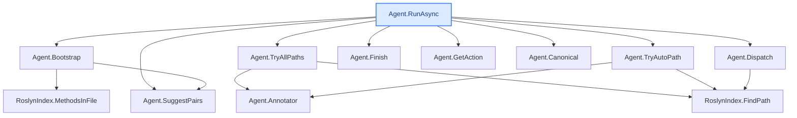

**Full `explain` example — deep + wide, with code** (`--depth 3 --max-methods 12`)

The complete showcase: a developer who has **never seen this code** gets, in one read, what would
otherwise take days of cold-reading. CodeTracer walks the call chain from `Agent.RunAsync` down 3
levels — **12 methods** — and for each one shows its **real source** (the whole section indented by
call-depth via blockquotes, so the nesting reads like the Call-flow tree; the code itself keeps its
natural indentation, and each method's source is a **foldable `<details>`**, open by default — fold
it like an IDE in the VS Code preview / on GitHub) followed by a step-by-step explanation. Then an
**end-to-end synthesis**, an **"In plain words"** recap, and the auto **`## Call-flow`** diagram
(ASCII + Mermaid). Sections with nothing to report (no side effects / risks) are **omitted, not
padded**. Reproducible:

```bash
dotnet run -- explain -s CodeTracer.sln --method "Agent.RunAsync" --depth 3 --max-methods 12 \
  --repo-url https://github.com/janjanusek/code_tracer/blob/main
```

> _Run: ~1598 s (≈27 min) · 14 model calls (12 methods + the synthesis + the plain-words recap) ·
> in 13901 / out 11600 tokens · gemma4:latest, CPU-only, no GPU. Saved **incrementally** (after each
> method) and **auto-saved** if you omit `--out`; **Ctrl+C** stops and keeps what's done._

---

# Agent.RunAsync  ([Agent.cs:118](https://github.com/janjanusek/code_tracer/blob/main/Agent.cs#L118))
`Task Agent.RunAsync(string solutionPath, string targetFile, string endpoint)`
_Deep explanation following the call chain (12 methods)._

## L0 · Agent.RunAsync  ([Agent.cs:118](https://github.com/janjanusek/code_tracer/blob/main/Agent.cs#L118))
<details open>
<summary>source</summary>

```csharp
public async Task RunAsync(string solutionPath, string targetFile, string endpoint)
    {
        var seed = Bootstrap(targetFile, endpoint);

        // Deterministic pre-flight: try candidate find_path pairs IMMEDIATELY. On CPU this is
        // faster and more reliable than waiting for (often under-filled) model calls. Roslyn
        // is the source of truth; the model is here only to navigate harder cases (interface/DI/events).
        // --all-paths/--brute: enumerate ALL paths (deep), not just the first shortest one.
        var mode = _allPaths ? "brute-force (all paths)" : "first path";
        Console.WriteLine($"[pre-flight] deterministic find_path over {_pairs.Count} candidate pairs [{mode}]...");
        var deterministic = _allPaths ? await TryAllPaths() : await TryAutoPath();
        if (deterministic.Contains("PATH FOUND"))
        {
            await Finish(deterministic, _allPaths ? "brute-force" : "pre-flight");
            return;
        }
        if (!_useLlm)
        {
            Console.WriteLine("[pre-flight] no direct path and --no-llm set - stopping.");
            await Finish(deterministic, "deterministic");
            return;
        }
        Console.WriteLine("[pre-flight] no direct path - handing over to the model loop...");

        var messages = new List<ChatMsg>
        {
            new("system", SystemPrompt),
            new("user", seed)
        };

        var seen = new HashSet<string>();
        int escalations = 0;

        for (int step = 1; step <= _maxSteps; step++)
        {
            var act = await GetAction(messages);
            if (act == null)
            {
                // model could not produce a valid action even after corrections -> deterministic escalation
                Console.WriteLine("\n[auto] model gave no valid action - using deterministic result...");
                await Finish(_lastPath ?? deterministic, "auto");
                return;
            }

            var (tool, args, raw) = act.Value;
            Console.WriteLine($"\n===== STEP {step} =====\n{raw}");

            if (tool == "finish")
            {
                var pathText = _lastPath ?? await TryAutoPath();
                await Finish(pathText, "finish");
                return;
            }

            // --- loop detection -------------------------------------------------
            var key = $"{tool}|{Canonical(args)}";
            if (!seen.Add(key))
            {
                escalations++;
                Console.WriteLine($"[!] repeated step ({escalations}) - escalating");

                if (escalations == 1)
                {
                    // one more chance: explicitly dictate the find_path calls to it
                    messages.Add(new("assistant", raw));
                    messages.Add(new("user",
                        "STOP. You already ran this exact tool+args. Do NOT repeat it.\n" +
                        "Call find_path now (return the JSON), e.g.:\n" + SuggestPairs()));
                    continue;
                }

                // model is looping -> use deterministic result (within 2 steps)
                Console.WriteLine("[auto] loop detected - using deterministic result...");
                await Finish(_lastPath ?? deterministic, "auto");
                return;
            }

            string observation;
            try { observation = await Dispatch(tool, args); }
            catch (Exception ex) { observation = $"TOOL ERROR: {ex.Message}"; }

            if (tool == "find_path" && observation.Contains("PATH FOUND"))
                _lastPath = observation;

            if (observation.Length > 3000)
                observation = observation[..3000] + "\n... (truncated)";

            Console.WriteLine($"--- OBSERVATION ---\n{observation.Trim()}");

            messages.Add(new("assistant", raw));
            messages.Add(new("user", $"OBSERVATION:\n{observation}"));
        }

        // step limit exhausted -> use the best available result
        Console.WriteLine($"\n[!] step limit {_maxSteps} reached - using deterministic result");
        await Finish(_lastPath ?? deterministic, "limit");
    }
```

</details>

This method executes an asynchronous agent workflow designed to find a path or solution by iteratively interacting with a Language Model (LLM) and external tools, starting from a defined target.

### Inputs and Outputs

*   **Inputs:**
    *   `solutionPath`: The root directory or context for the search.
    *   `targetFile`: The specific file that the agent is trying to reach or analyze.
    *   `endpoint`: An API endpoint or service location used by the agent.
*   **Outputs/Side Effects:**
    *   The method writes status updates and results to the console (`Console.WriteLine`).
    *   It may write a final path result using `Agent.Finish()`.
    *   It modifies the internal state field `_lastPath` if a successful `find_path` observation is received.

### Execution Flow

1.  **Initialization:** The method first calls `Bootstrap(targetFile, endpoint)` to generate an initial prompt or seed message for the agent.
2.  **Deterministic Pre-flight Check (Initial Path Attempt):** It attempts to find a path using deterministic methods before engaging the LLM:
    *   If `_allPaths` is true (`--brute`), it calls `TryAllPaths()` to enumerate all possible paths.
    *   Otherwise, it calls `TryAutoPath()` to find the most likely single path.
    *   If either attempt finds a path ("PATH FOUND"), the agent immediately concludes and finishes using `Agent.Finish()`.
3.  **Early Exit (No LLM):** If no path was found in the pre-flight check and the flag `_useLlm` is false, the process stops immediately.
4.  **LLM Loop Execution:** If a direct path isn't found, the agent enters an iterative loop that continues until one of three conditions is met:
    *   The LLM explicitly calls the "finish" tool.
    *   A valid path is found during the loop (via `find_path` observation).
    *   The maximum number of steps (`_maxSteps`) is reached.
5.  **Agent Step Cycle:** In each step, the following occurs:
    *   **Get Action:** The agent calls `GetAction(messages)` to request a tool call from the LLM based on the history. If no valid action is returned, the process fails and terminates using a deterministic result.
    *   **Tool Execution & Observation:** The method executes the requested tool (`tool`) with arguments (`args`), handling any exceptions during execution. It receives an `observation` string.
    *   **Path Update:** If the executed tool was `find_path` and the observation contains "PATH FOUND," the internal state `_lastPath` is updated.
    *   **History Update:** The agent updates its message history by adding both the LLM's raw action (`assistant`) and the resulting observation (`user`).
6.  **Loop Detection (Safety Mechanism):** Before processing an observation, the method checks if the combination of `tool` and canonicalized `args` has been seen before using a `HashSet`.
    *   If a repeat step is detected:
        *   The first repetition triggers a prompt to explicitly guide the LLM to call `find_path`.
        *   The second (or subsequent) repetition indicates an infinite loop, causing the agent to abort and finish using the best available deterministic result.
7.  **Termination on Limit:** If

> ## L1 · Agent.Bootstrap  ([Agent.cs:414](https://github.com/janjanusek/code_tracer/blob/main/Agent.cs#L414))
> <details open>
> <summary>source</summary>
>
> ```csharp
> private string Bootstrap(string targetFile, string endpoint)
>     {
>         // endpoint: if it is a .cshtml, the handler lives in .cshtml.cs
>         var endpointCs = endpoint.EndsWith(".cshtml", StringComparison.OrdinalIgnoreCase)
>             ? endpoint + ".cs" : endpoint;
>
>         var sb = new StringBuilder();
>         sb.AppendLine("Goal: find the call chain from the ENDPOINT down to the call in the TARGET FILE.");
>         sb.AppendLine();
>
>         var fromMethods = new List<(string cls, string method, int line)>();
>         if (File.Exists(endpointCs))
>         {
>             fromMethods = _index.MethodsInFile(endpointCs);
>             sb.AppendLine($"ENDPOINT page model ({Path.GetFileName(endpointCs)}):");
>             foreach (var m in fromMethods)
>                 sb.AppendLine($"  {m.cls}.{m.method}  :{m.line}");
>         }
>         else
>         {
>             sb.AppendLine($"ENDPOINT: {endpoint}  (resolve it with find_symbol/grep)");
>         }
>         sb.AppendLine();
>
>         var toMethods = _index.MethodsInFile(targetFile);
>         sb.AppendLine($"TARGET FILE ({Path.GetFileName(targetFile)}) methods:");
>         foreach (var m in toMethods)
>             sb.AppendLine($"  {m.cls}.{m.method}  :{m.line}");
>         sb.AppendLine();
>
>         // select candidates: handlers (On*) as source, all target methods as destination
>         var handlers = fromMethods.Where(m => m.method.StartsWith("On", StringComparison.Ordinal)).ToList();
>         if (handlers.Count == 0) handlers = fromMethods;                 // fallback: all
>         var targets = toMethods
>             .Where(m => !m.method.Equals(".ctor"))
>             .OrderByDescending(m => m.method.EndsWith("Async") ||
>                                     m.method.StartsWith("Build") || m.method.StartsWith("Generate"))
>             .ToList();
>
>         foreach (var h in handlers)
>             foreach (var t in targets)
>             {
>                 if (_pairs.Count >= 24) break;
>                 _pairs.Add((h.cls, h.method, t.cls, t.method));
>             }
>
>         sb.AppendLine("Start by calling find_path. Suggested first call:");
>         sb.AppendLine(SuggestPairs());
>         return sb.ToString();
>     }
> ```
>
> </details>
>
> This method generates a diagnostic report string that outlines potential starting points for tracing a call chain from an `endpoint` to a function within a `targetFile`.
>
> ### Inputs and Outputs
> *   **Inputs:**
>     1.  `targetFile`: The file containing the destination methods (the "call target").
>     2.  `endpoint`: The entry point or page model associated with the call chain start.
> *   **Output:** A formatted `string` that contains:
>     1.  A goal statement ("find the call chain...").
>     2.  A list of methods found in the endpoint's corresponding code file (or a note if the file doesn't exist).
>     3.  A list of all methods found in the target file.
>     4.  The suggested first command/call (`SuggestPairs()`) to begin tracing the path.
>
> ### Side Effects
> *   **State Modification:** The method adds generated pairs of class/method names (source handler, target method) to the internal `_pairs` list, stopping if this list reaches 24 entries.
>
> ### Delegation and Logic Flow
> 1.  **Endpoint Resolution:** It determines the full path for the endpoint's code file (`endpointCs`). If the provided `endpoint` ends with `.cshtml`, it assumes the handler lives in a corresponding `.cs` file (e.g., `page.cshtml` -> `page.cshtml.cs`).
> 2.  **Method Discovery:**
>     *   It calls `_index.MethodsInFile(endpointCs)` to retrieve all methods from the endpoint's code model, listing them in the report. If the file doesn't exist, it notes the original endpoint string instead.
>     *   It calls `_index.MethodsInFile(targetFile)` to retrieve all methods from the target file, listing them in the report.
> 3.  **Candidate Selection:**
>     *   **Handlers (Source):** It filters the endpoint's methods (`fromMethods`) to select those starting with "On" (typical event handlers). If no such handlers are found, it uses *all* endpoint methods as candidates.
>     *   **Targets (Destination):** It filters the target file's methods (`toMethods`), excluding constructors (`.ctor`). It then orders these remaining methods, prioritizing those ending in "Async," starting with "Build," or starting with "Generate."
> 4.  **Pair Generation:** It iterates through every selected handler and every selected target, adding a pair `(handler_class, handler_method, target_class, target_method)` to the internal `_pairs` list until 24 pairs have been recorded.
> 5.  **Suggestion:** It calls `Agent.SuggestPairs()` to generate and include the suggested next step for path finding in the final report string.

> ## L1 · Agent.TryAllPaths  ([Agent.cs:496](https://github.com/janjanusek/code_tracer/blob/main/Agent.cs#L496))
> <details open>
> <summary>source</summary>
>
> ```csharp
> private async Task<string> TryAllPaths()
>     {
>         var sb = new StringBuilder();
>         var seen = new HashSet<string>();
>         var ann = Annotator();
>         int found = 0;
>         foreach (var p in _pairs)
>         {
>             var res = await _index.FindPath(p.fc, p.fm, p.tc, p.tm, maxNodes: 20000,
>                                             withBodies: _withBodies, repoUrl: _repoUrl, annotate: ann);
>             if (!res.Contains("PATH FOUND")) continue;
>             if (!seen.Add(res)) continue;       // dedup identical paths
>             found++;
>             if (found > 1) { sb.AppendLine(); sb.AppendLine("---"); }   // clear separator between paths
>             sb.AppendLine();
>             sb.AppendLine($"### Path {found}:  {p.fc}.{p.fm}  ->  {p.tc}.{p.tm}");
>             sb.AppendLine(res.Trim());
>         }
>         if (found == 0)
>         {
>             var fb = new StringBuilder("No direct path found over candidate pairs. " +
>                                        "Callers of the target methods (going up):\n");
>             foreach (var t in _pairs.Select(p => (p.tc, p.tm)).Distinct().Take(3))
>             {
>                 fb.AppendLine($"\n# {t.tc}.{t.tm}");
>                 fb.AppendLine(await _index.FindCallers(t.tc, t.tm));
>             }
>             return fb.ToString();
>         }
>         return $"FOUND {found} distinct path(s) [brute-force]:\n\n" + sb.ToString();
>     }
> ```
>
> </details>
>
> This method performs a brute-force search for all possible execution paths connecting candidate pairs defined in `_pairs`.
>
> ### Inputs and Outputs
> *   **Input:** Relies on internal state fields: `_index` (the path indexer), `_pairs` (a list of source/target method tuples), `_repoUrl`, and `_withBodies`.
> *   **Output:** A `Task<string>` containing a formatted report. This report either lists all distinct paths found, or if no paths are found, it provides a summary listing the callers for the first three unique target methods.
>
> ### Execution Steps
> 1.  **Initialization:** It initializes a result `StringBuilder` (`sb`) and a `HashSet<string>` (`seen`) to track and deduplicate discovered paths. It calls `Annotator()` to obtain an annotator object (`ann`).
> 2.  **Path Iteration (Main Loop):** The method iterates through every candidate pair (`p`) in `_pairs`.
>     *   For each pair, it asynchronously calls `_index.FindPath()`, attempting to locate a path between the source and target methods defined by the pair components.
>     *   If a path is found and that path string has not been seen before (deduplication), the method increments a counter (`found`) and appends a formatted section to `sb`. This section includes a header identifying the specific candidate pair being analyzed, followed by the actual path result.
> 3.  **Zero Path Handling:** If the loop completes and no paths were found (`found == 0`), it generates an alternative report:
>     *   It identifies the first three unique target methods from `_pairs`.
>     *   For each of these targets, it calls `_index.FindCallers()` to retrieve a list of calling methods.
>     *   These callers are formatted and returned as the result string.
> 4.  **Final Result:** If one or more paths were found (`found > 0`), the method prepends a summary line indicating the total count of distinct paths found before returning the accumulated results in `sb`.
>
> ### Delegated Calls
> *   `Annotator()`: Called to generate an annotator object used by the path finding mechanism.
> *   `_index.FindPath(...)`: Asynchronously searches for a concrete execution path between source and target methods using the provided pair details, repository URL, body inclusion flag, and the annotator.
> *   `_index.FindCallers(String, String)`: Retrieves all calling locations (callers) for a specified target method signature.

> ## L1 · Agent.TryAutoPath  ([Agent.cs:474](https://github.com/janjanusek/code_tracer/blob/main/Agent.cs#L474))
> <details open>
> <summary>source</summary>
>
> ```csharp
> private async Task<string> TryAutoPath()
>     {
>         var ann = Annotator();
>         foreach (var p in _pairs)
>         {
>             var res = await _index.FindPath(p.fc, p.fm, p.tc, p.tm,
>                                             withBodies: _withBodies, repoUrl: _repoUrl, annotate: ann);
>             if (res.Contains("PATH FOUND"))
>                 return $"(find_path {p.fc}.{p.fm} -> {p.tc}.{p.tm})\n{res}";
>         }
>         // no direct path -> at least show who calls the target methods (callers going up)
>         var sb = new StringBuilder("No direct path found. Callers of the target methods (going up):\n");
>         foreach (var t in _pairs.Select(p => (p.tc, p.tm)).Distinct().Take(3))
>         {
>             sb.AppendLine($"\n# {t.tc}.{t.tm}");
>             sb.AppendLine(await _index.FindCallers(t.tc, t.tm));
>         }
>         return sb.ToString();
>     }
> ```
>
> </details>
>
> This method attempts to find a direct code path between candidate methods using stored pairs of identifiers. If successful, it returns the path; otherwise, it reports calling context for the target methods.
>
> 1.  **Initialization:** It first calls `Annotator()` to generate an annotation object (`ann`), which is required for subsequent path-finding operations.
> 2.  **Path Search (Primary Attempt):**
>     *   It iterates through every stored pair of identifiers (`_pairs`). Each pair represents a potential source method (`fc`, `fm`) and target method (`tc`, `tm`).
>     *   For each pair, it calls `_index.FindPath(...)` to check if a path exists from the source to the target. This call uses internal state variables: `_withBodies` (whether to include method bodies), `_repoUrl` (repository URL), and the generated annotation object (`ann`).
>     *   If the result string contains `"PATH FOUND"`, it immediately constructs and returns a formatted string detailing the successful path found, including the source/target identifiers and the full path content.
> 3.  **Fallback Mechanism (No Direct Path):**
>     *   If the loop completes without finding a direct path, it initializes a `StringBuilder` to collect fallback information.
>     *   It selects all unique target method pairs (`(p.tc, p.tm)`) from `_pairs`, taking only the first three distinct targets found.
>     *   For each of these top three target methods, it calls `_index.FindCallers(t.tc, t.tm)` to retrieve a list of methods that call the target method (the "callers going up").
>     *   It appends formatted headers and the retrieved caller information for each target into the `StringBuilder`.
> 4.  **Output:** The method returns the accumulated content of the `StringBuilder` as a string, indicating which methods call the targets if no direct path was found.
>
> **Dependencies/Delegations:**
>
> *   **`Annotator()`:** Calls an internal helper to generate necessary annotation data.
> *   **`RoslynIndex.FindPath(...)`:** Delegates the core logic of searching for a code path between two specified method identifiers, using the provided annotation context.
> *   **`RoslynIndex.FindCallers(String, String)`:** Delegates retrieving all methods that call a specific target method pair.

> ## L1 · Agent.Finish  ([Agent.cs:327](https://github.com/janjanusek/code_tracer/blob/main/Agent.cs#L327))
> <details open>
> <summary>source</summary>
>
> ```csharp
> private async Task Finish(string pathText, string reason)
>     {
>         var output = pathText.Trim();
>
>         // Built from the CLEAN path text (before any summary prose is appended), so the diagram
>         // reflects only the discovered call-path. Appended at the very end of the result.
>         var flow = Diagram.Section(Diagram.FromTraceText(output), "The path the analysis found");
>
>         if (_summarize && output.Contains("PATH FOUND"))
>         {
>             Console.Error.WriteLine("[summary] summarizing the chain...");
>             var summary = await SummarizeChain(pathText);
>             if (!string.IsNullOrWhiteSpace(summary))
>             {
>                 output += "\n\n## Summary\n" + summary.Trim();
>                 var simple = await SimplifyForKid(summary);     // a second, plain-words pass
>                 if (!string.IsNullOrWhiteSpace(simple))
>                     output += "\n\n## In plain words\n" + simple.Trim();
>             }
>         }
>
>         if (!string.IsNullOrWhiteSpace(flow))
>             output += "\n\n" + flow;
>
>         Console.WriteLine($"\n========== DONE ({reason}) ==========");
>         Console.WriteLine(output);
>
>         if (!string.IsNullOrWhiteSpace(_outPath))
>         {
>             try
>             {
>                 await File.WriteAllTextAsync(_outPath!, output + "\n");
>                 Console.Error.WriteLine($"[trace] saved to {_outPath}");
>             }
>             catch (Exception ex) { Console.Error.WriteLine($"[write error] {ex.Message}"); }
>         }
>     }
> ```
>
> </details>
>
> This method finalizes an analysis run by formatting and presenting the results to both the console and optionally a file.
>
> ### Inputs and Outputs
> *   **Inputs:**
>     *   `pathText`: The raw text detailing the path found during the analysis.
>     *   `reason`: A string describing the reason for the completion of the task.
> *   **Outputs/Side Effects:**
>     1.  Writes a formatted summary, including the final path and optional summary sections, to `Console.WriteLine`.
>     2.  If an output path (`_outPath`) is set, it writes the entire result block to that file using `File.WriteAllTextAsync`.
>     3.  Prints status messages (e.g., "[summary] summarizing the chain...", "[trace] saved...") to `Console.Error`.
>
> ### Execution Steps
>
> 1.  **Initialize Output:** The method starts by trimming leading/trailing whitespace from the input `pathText` and assigning it to a local variable, `output`.
> 2.  **Generate Flow Diagram:** It creates a visual representation (`flow`) of the discovered call path using `Diagram.FromTraceText(output)`. This diagram is appended to the `output` string later.
> 3.  **Conditional Summary Generation:** If two conditions are met—the internal flag `_summarize` is true, AND the `output` text contains "PATH FOUND"—it executes a detailed summary process:
>     *   It calls `SummarizeChain(pathText)` to generate an LLM-based summary of the analysis chain. This summary is appended to `output`.
>     *   If a summary exists, it then calls `SimplifyForKid(summary)` on that summary text to create a simpler, plain-words version, which is also appended to `output`.
> 4.  **Append Diagram:** The generated flow diagram (`flow`) is appended to the `output` string.
> 5.  **Console Output:** It prints a final header line indicating completion and the reason (`========== DONE ({reason}) ==========`). Immediately following this, it prints the entire accumulated `output` content.
> 6.  **File Writing (Optional):** If an output path (`_outPath`) is provided:
>     *   It attempts to write the complete `output` string (plus a newline) asynchronously to the specified file.
>     *   If writing fails, it catches the exception and prints the error message to `Console.Error`.
>
> ### Delegated Methods
> *   **`Diagram.Section(Diagram.FromTraceText(string))`**: Generates a structured section containing a visual diagram based on the path text.
> *   **`SummarizeChain(string)`**: Calls an internal method to generate a detailed, prose-based summary of the analysis chain from the original `pathText`.
> *   **`SimplifyForKid(string)`**: Takes the generated summary and processes it again to create a simpler, more accessible version.

> ## L1 · Agent.GetAction  ([Agent.cs:241](https://github.com/janjanusek/code_tracer/blob/main/Agent.cs#L241))
> <details open>
> <summary>source</summary>
>
> ```csharp
> private async Task<(string tool, JsonElement args, string raw)?> GetAction(List<ChatMsg> messages)
>     {
>         var opts = new ChatOptions { Temperature = 0, NumPredict = _actionNumPredict, Format = ActionSchema };
>
>         for (int attempt = 0; attempt < 3; attempt++)   // 1 attempt + 2 corrections
>         {
>             var raw = (await _llm.ChatAsync(messages, opts, "action")).Trim();
>
>             // the grammar should guarantee valid JSON; on interruption (num_predict) it may
>             // return unclosed JSON - handle that.
>             JsonElement root;
>             try { root = JsonDocument.Parse(raw).RootElement.Clone(); }
>             catch
>             {
>                 messages.Add(new("assistant", raw));
>                 messages.Add(new("user", "Your output was not a valid JSON object. Return ONLY {\"tool\":...,\"args\":{...}}."));
>                 continue;
>             }
>
>             if (root.ValueKind != JsonValueKind.Object
>                 || !root.TryGetProperty("tool", out var toolEl)
>                 || toolEl.ValueKind != JsonValueKind.String)
>             {
>                 messages.Add(new("assistant", raw));
>                 messages.Add(new("user", "Error: the object must have a string field \"tool\" and an object \"args\". Try again."));
>                 continue;
>             }
>
>             var tool = toolEl.GetString()!.Trim().ToLowerInvariant();
>             var args = root.TryGetProperty("args", out var a) && a.ValueKind == JsonValueKind.Object ? a : EmptyArgs;
>
>             if (!AllowedTools.Contains(tool))
>             {
>                 messages.Add(new("assistant", raw));
>                 messages.Add(new("user", $"Unknown tool '{tool}'. Allowed: {string.Join(", ", AllowedTools)}."));
>                 continue;
>             }
>
>             var err = ValidateArgs(tool, args);
>             if (err != null)
>             {
>                 messages.Add(new("assistant", raw));
>                 messages.Add(new("user", $"Invalid args for '{tool}': {err} Return corrected JSON."));
>                 continue;
>             }
>
>             return (tool, args, raw);
>         }
>         return null;
>     }
> ```
>
> </details>
>
> This method attempts to extract a structured action request from a large language model (LLM) by repeatedly calling the LLM until valid data is received or the maximum number of retries is reached.
>
> ### Inputs and Outputs
>
> *   **Input:** `messages` (`List<ChatMsg>`)—The conversation history used as context for the LLM call.
> *   **Output:** A `Task` that returns a tuple containing:
>     1.  `tool` (string): The name of the tool to be called.
>     2.  `args` (`JsonElement`): The arguments for the specified tool, validated against the schema.
>     3.  `raw` (string): The raw JSON output received from the LLM.
> *   **Return Value:** Returns the action tuple if successful; otherwise, returns `null` after failing all retry attempts.
>
> ### Process Flow
>
> 1.  **Initialization:** Sets up chat options for the LLM call, enforcing zero temperature and using a predefined schema (`ActionSchema`) to constrain the output format.
> 2.  **Retry Loop:** Executes in a loop that allows for 3 total attempts (the initial attempt plus two correction retries).
>     *   **LLM Call:** Calls `_llm.ChatAsync` with the current conversation history, options, and the prompt `"action"`. The resulting raw string is trimmed.
>     *   **JSON Parsing Attempt:** Attempts to parse the raw output into a JSON structure (`JsonDocument`). If parsing fails (e.g., due to incomplete JSON), it assumes an error, adds two correction messages to `messages` (one from "assistant," one from "user"), and continues to the next retry attempt.
>     *   **Schema Validation (Level 1):** Checks if the root element is a JSON object and contains a string property named `"tool"`. If not, it records an error in `messages` and retries.
>     *   **Tool Name Extraction:** Extracts the tool name, converts it to lowercase, and trims whitespace.
>     *   **Arguments Extraction:** Attempts to extract the arguments (`args`) from the JSON object. If the property is missing or not a JSON object, it defaults to `EmptyArgs`.
>     *   **Allowed Tool Check (Level 2):** Checks if the extracted tool name exists within the predefined list of `AllowedTools`. If unknown, it records an error in `messages` and retries.
>     *   **Argument Validation (Level 3):** Calls `ValidateArgs(tool, args)` to perform deep validation of the arguments against the specific tool's schema. If this returns an error (`err != null`), it records a detailed error message in `messages` and retries.
>     *   **Success:** If all checks pass (JSON is valid, tool is allowed, and arguments are correct), the method immediately returns the action tuple.
>
> ### Side Effects
>
> The method modifies the input list of messages (`messages`) by appending new entries whenever a validation or parsing failure occurs. These appended messages serve as explicit instructions/corrections to guide the LLM in subsequent retry attempts.
>
> *   **`messages.Add(...)`:** Appends error feedback turns (from both "assistant" and "user") to the `messages` list upon JSON parse failure, schema violation, unknown tool usage, or invalid arguments.
>
> ### Delegated Functionality
>
> *   **`LlmClient.ChatAsync(...)`**: Handles the actual communication with the LLM API endpoint.
> *   **`JsonDocument.Parse(raw)`**: Parses the raw string output into a structured JSON object for validation.
> *   **`Agent.ValidateArgs(tool, args)`**: Performs detailed runtime validation of the extracted arguments (`args`) against the expected schema for the given `tool`.

> ## L1 · Agent.Canonical  ([Agent.cs:321](https://github.com/janjanusek/code_tracer/blob/main/Agent.cs#L321))
> <details open>
> <summary>source</summary>
>
> ```csharp
> private static string Canonical(JsonElement args) => JsonSerializer.Serialize(args).ToLowerInvariant();
> ```
>
> </details>
>
> This method generates a standardized, lowercase string representation of the input JSON element, intended for stable comparison or detection purposes.
>
> 1.  **Input:** Takes a `JsonElement` named `args`.
> 2.  **Process:**
>     *   It first calls `JsonSerializer.Serialize(args)` to convert the structured `JsonElement` into its standard JSON string representation.
>     *   It then calls `string.ToLowerInvariant()` on that resulting string, converting all characters to lowercase using invariant culture rules.
> 3.  **Output:** Returns a `string` which is the fully serialized and lowercased version of the input data.
>
> ***
>
> ### Dependencies Called
>
> *   **`JsonSerializer.Serialize(args)`:** Converts the structured JSON element into its textual JSON format representation (a string).
> *   **`String.ToLowerInvariant()`:** Performs a case conversion on the resulting string, ensuring all characters are lowercase regardless of regional settings.

> ## L1 · Agent.SuggestPairs  ([Agent.cs:465](https://github.com/janjanusek/code_tracer/blob/main/Agent.cs#L465))
> <details open>
> <summary>source</summary>
>
> ```csharp
> private string SuggestPairs()
>     {
>         var sb = new StringBuilder();
>         foreach (var p in _pairs.Take(3))
>             sb.AppendLine($"  {{\"tool\":\"find_path\",\"args\":{{\"fromClass\":\"{p.fc}\",\"fromMethod\":\"{p.fm}\",\"toClass\":\"{p.tc}\",\"toMethod\":\"{p.tm}\"}}}}");
>         return sb.Length == 0 ? "  (no candidates - use find_symbol to resolve the endpoint)" : sb.ToString();
>     }
> ```
>
> </details>
>
> This method generates a suggested list of potential tool usage pairs based on stored data.
>
> 1.  **Inputs:** It reads the private field `_pairs`, which is expected to be a collection (list) of tuples, where each tuple contains four strings representing class names (`fc`), method names (`fm`), target class names (`tc`), and target method names (`tm`).
> 2.  **Process:**
>     *   It initializes an internal `StringBuilder` to construct the output string efficiently.
>     *   It processes only the first three pairs available in `_pairs` (using `Take(3)`).
>     *   For each pair, it formats a structured JSON-like string that specifies a path finding operation (`find_path`) using the four components from the current tuple. This formatted string is appended to the builder, followed by a newline character.
> 3.  **Output:**
>     *   If one or more pairs were processed, it returns the accumulated content of the `StringBuilder`.
>     *   If no pairs are available in `_pairs`, it returns the fallback message: `" (no candidates - use find_symbol to resolve the endpoint)"`.
>
> **Side Effects:** None. The method only reads data and constructs a string; it does not modify any state or fields.

> ## L1 · Agent.Dispatch  ([Agent.cs:566](https://github.com/janjanusek/code_tracer/blob/main/Agent.cs#L566))
> <details open>
> <summary>source</summary>
>
> ```csharp
> private async Task<string> Dispatch(string tool, JsonElement a)
>     {
>         string S(string k) => a.TryGetProperty(k, out var v) && v.ValueKind == JsonValueKind.String
>             ? (v.GetString() ?? "") : "";
>         int I(string k, int def) => a.TryGetProperty(k, out var v) && v.TryGetInt32(out var n) ? n : def;
>
>         return tool switch
>         {
>             "find_symbol"     => await _index.FindSymbol(S("name")),
>             "outline"         => _index.Outline(S("file")),
>             "get_method"      => await _index.GetMethod(S("class"), S("method")),
>             "find_callers"    => await _index.FindCallers(S("class"), S("method")),
>             "find_callees"    => await _index.FindCallees(S("class"), S("method")),
>             "find_references" => await _index.FindReferences(S("class"), S("method")),
>             "find_path"       => await _index.FindPath(S("fromClass"), S("fromMethod"), S("toClass"), S("toMethod")),
>             "read_file"       => _index.ReadFile(S("file"), I("start", 1), I("end", 0)),
>             "grep"            => _index.Grep(S("pattern")),
>             _                 => $"unknown tool '{tool}'"
>         };
>     }
> ```
>
> </details>
>
> This method acts as a router or dispatcher, taking a specified tool name and a JSON payload, then executing the corresponding functionality using an internal indexer (`_index`).
>
> 1.  **Inputs and Outputs:**
>     *   It accepts a `tool` string (specifying the desired operation) and a `JsonElement` `a` (containing parameters for that operation).
>     *   It returns a `Task<string>`, which is the result of the executed tool call, or an error message if the tool is unknown.
>
> 2.  **Parameter Extraction:**
>     The method uses two local helper functions to safely extract data from the input JSON element `a`:
>     *   `S(k)`: Attempts to retrieve a property named `k` and returns its string value, or an empty string if the property is missing or not a string.
>     *   `I(k, def)`: Attempts to retrieve a property named `k` and returns its integer value; otherwise, it uses the provided default value (`def`).
>
> 3.  **Tool Dispatch Logic:**
>     The method uses a `switch` statement on the `tool` parameter to determine which action to perform:
>
>     *   **`find_symbol`**: Calls `_index.FindSymbol(S("name"))`, searching for a symbol using the name provided in the JSON payload.
>     *   **`outline`**: Calls `_index.Outline(S("file"))`, generating an outline based on the file path provided.
>     *   **`get_method`**: Calls `_index.GetMethod(S("class"), S("method"))`, retrieving details for a specific method within a class.
>     *   **`find_callers`**: Calls `_index.FindCallers(S("class"), S("method"))`, finding all locations that call the specified method in the specified class.
>     *   **`find_callees`**: Calls `_index.FindCallees(S("class"), S("method"))`, finding all methods called by the specified method in the specified class.
>     *   **`find_references`**: Calls `_index.FindReferences(S("class"), S("method"))`, locating references to a specific method within a class.
>     *   **`find_path`**: Calls `_index.FindPath(...)`, searching for a path between two specified classes and methods, using values extracted from four different properties in the JSON payload.
>     *   **`read_file`**: Calls `_index.ReadFile(S("file"), I("start", 1), I("end", 0))`, reading content from a file, using start and end indices derived from the JSON payload (defaulting to index 1 for start and 0 for end).
>     *   **`grep`**: Calls `_index.Grep(S("pattern"))`, performing a search or pattern match across the codebase using the provided pattern string.
>     *   **Default Case (`_`)**: If the `tool` name does not match any defined case, it returns an error message indicating that the tool is unknown.

> > ## L2 · RoslynIndex.MethodsInFile  ([RoslynIndex.cs:592](https://github.com/janjanusek/code_tracer/blob/main/RoslynIndex.cs#L592))
> > <details open>
> > <summary>source</summary>
> >
> > ```csharp
> > public List<(string cls, string method, int line)> MethodsInFile(string filePath)
> >     {
> >         var result = new List<(string, string, int)>();
> >         var full = Path.IsPathRooted(filePath) ? filePath : Path.Combine(SolutionDir, filePath);
> >         var doc = _solution.Projects.SelectMany(p => p.Documents)
> >             .FirstOrDefault(d => string.Equals(Path.GetFullPath(d.FilePath ?? ""),
> >                                                Path.GetFullPath(full), StringComparison.OrdinalIgnoreCase));
> >         if (doc == null) return result;
> >         var root = doc.GetSyntaxTreeAsync().Result!.GetRoot();
> >         foreach (var type in root.DescendantNodes().OfType<TypeDeclarationSyntax>())
> >             foreach (var md in type.Members.OfType<MethodDeclarationSyntax>())
> >                 result.Add((type.Identifier.ValueText, md.Identifier.ValueText,
> >                             md.GetLocation().GetLineSpan().StartLinePosition.Line + 1));
> >         return result;
> >     }
> > ```
> >
> > </details>
> >
> > The method analyzes a given file path within the solution and extracts structured metadata about all methods defined in that file.
> >
> > ### Inputs and Outputs
> > *   **Input:** `filePath` (A string representing the relative or absolute path to the source code file).
> > *   **Output:** A `List<(string cls, string method, int line)>`. Each tuple contains:
> >     1.  The name of the containing class (`cls`).
> >     2.  The name of the method (`method`).
> >     3.  The 1-based line number where the method is declared (`line`).
> >
> > ### Execution Steps
> > 1.  **Determine Full Path:** It resolves the input `filePath` to a full, absolute path using `SolutionDir` if necessary.
> > 2.  **Locate Document:** It searches through all projects and documents in the solution to find the single document whose file path matches the resolved full path (case-insensitive). If no matching document is found, it returns an empty list immediately.
> > 3.  **Parse Syntax Tree:** It retrieves the root of the C# syntax tree for the located document.
> > 4.  **Extract Methods:** It traverses the entire syntax tree:
> >     *   It identifies all type declarations (classes or structs).
> >     *   For each type, it iterates through all member declarations that are methods.
> >     *   It records the class name, method name, and calculated line number for every found method.
> >
> > ### Delegations and Side Effects
> > *   **Path Resolution:** Uses `Path.IsPathRooted` and `Path.Combine` to ensure the input path is correctly resolved relative to the solution directory (`SolutionDir`).
> > *   **Document Lookup:** Relies on LINQ operations (`SelectMany`, `FirstOrDefault`) combined with file system path comparison (`Path.GetFullPath`) to locate the source code document object within the overall solution structure.
> > *   **AST Traversal:** Uses methods like `DescendantNodes()` and type-specific filters (`OfType<TypeDeclarationSyntax>()`, `OfType<MethodDeclarationSyntax>()`) to navigate the Abstract Syntax Tree (AST) of the file's code structure.
> > *   **Line Number Calculation:** The line number is derived from the method's location metadata, adding 1 because the underlying syntax node position is zero-based for lines.

> > ## L2 · Agent.Annotator  ([Agent.cs:532](https://github.com/janjanusek/code_tracer/blob/main/Agent.cs#L532))
> > <details open>
> > <summary>source</summary>
> >
> > ```csharp
> > private Func<string, string, string, string, Task<string?>>? Annotator()
> >     {
> >         if (!_annotate) return null;
> >         return async (context, callerSig, calleeSig, code) =>
> >         {
> >             try
> >             {
> >                 // Empty calleeSig => this is the target/destination node (end of the chain).
> >                 var prompt = string.IsNullOrEmpty(calleeSig)
> >                     ? $"{context}\n\n" +
> >                       $"This is the FINAL method of the chain: `{callerSig}`.\n\n" +
> >                       $"```csharp\n{code}\n```\n\n" +
> >                       "In ONE short phrase (max ~14 words) say what this final method does / why the chain " +
> >                       "ends here. If trivial, reply with exactly: null"
> >                     : $"{context}\n\n" +
> >                       $"Current step: `{callerSig}` runs and, at the end of the snippet below, calls `{calleeSig}`.\n\n" +
> >                       $"```csharp\n{code}\n```\n\n" +
> >                       $"In ONE short phrase (max ~14 words) say WHY it calls `{calleeSig}` here / what this step " +
> >                       "achieves in the overall chain. Be proportional to the context. If it is a trivial or obvious " +
> >                       "delegation with nothing meaningful to add, reply with exactly: null";
> >                 var reply = (await _llm.ChatAsync(new[]
> >                 {
> >                     new ChatMsg("system", "You annotate one step of a code call-chain in a single terse phrase. No markdown, no quotes."),
> >                     new ChatMsg("user", prompt)
> >                 }, new ChatOptions { Temperature = 0.2, NumPredict = 64 }, "annotate")).Trim();
> >                 if (reply.Length == 0 || reply.Equals("null", StringComparison.OrdinalIgnoreCase)) return null;
> >                 return reply.Trim('"', '`', ' ', '.');
> >             }
> >             catch { return null; }   // model down / error -> just omit the annotation
> >         };
> >     }
> > ```
> >
> > </details>
> >
> > This method generates and returns a specialized asynchronous callback function that annotates individual steps within a code call-chain using an external Language Model (LLM).
> >
> > 1.  **Initialization Check:** The method first checks the internal boolean field `_annotate`. If it is false, it immediately returns `null`, indicating no annotation functionality should be used.
> > 2.  **Annotation Callback Generation:** If annotation is enabled, it returns a lambda function that accepts four strings:
> >     *   `context`: The accumulated history of the call-chain (prior steps/notes).
> >     *   `callerSig`: The signature of the method currently executing.
> >     *   `calleeSig`: The signature of the method being called next, or empty if this is the final step.
> >     *   `code`: The code snippet containing the current call structure.
> >
> > 3.  **Prompt Construction (Input Logic):** Inside the callback, a detailed prompt is constructed based on whether `calleeSig` is null/empty:
> >     *   **If `calleeSig` is empty:** This signifies the end of the chain. The prompt asks the LLM to provide a single short phrase explaining what the final method does or why the chain concludes.
> >     *   **If `calleeSig` is present:** This signifies an intermediate step. The prompt asks the LLM to explain *why* the current caller calls the callee at this point, focusing on the step's contribution to the overall goal.
> >
> > 4.  **LLM Interaction (Delegation):** The method delegates the core task by calling `_llm.ChatAsync`. It sends a system message instructing the LLM to provide a terse annotation and includes the constructed prompt as the user input.
> >     *   The call uses specific chat options (`Temperature = 0.2`, `NumPredict = 64`).
> >
> > 5.  **Output Processing:** The callback processes the LLM's response:
> >     *   It checks if the reply is empty or explicitly equals "null" (case-insensitive). If so, it returns `null`.
> >     *   If a valid annotation is received, it cleans up common surrounding characters (`"`, `` ` ``, ` `, `.`) and returns the resulting string.
> >
> > 6.  **Error Handling:** The entire process is wrapped in a `try/catch` block. Any exception during LLM communication or processing results in the callback returning `null`, effectively omitting the annotation note.

> > ## L2 · RoslynIndex.FindPath  ([RoslynIndex.cs:281](https://github.com/janjanusek/code_tracer/blob/main/RoslynIndex.cs#L281))
> > <details open>
> > <summary>source</summary>
> >
> > ```csharp
> > public async Task<string> FindPath(string fromClass, string fromMethod, string toClass, string toMethod,
> >                                        int maxNodes = 3000, bool withBodies = false, string? repoUrl = null,
> >                                        Func<string, string, string, string, Task<string?>>? annotate = null)
> >     {
> >         var start = await ResolveMethod(fromClass, fromMethod);
> >         var target = await ResolveMethod(toClass, toMethod);
> >         if (start == null) return $"source method {fromClass}.{fromMethod} not found";
> >         if (target == null) return $"target method {toClass}.{toMethod} not found";
> >
> >         var cmp = SymbolEqualityComparer.Default;
> >         if (cmp.Equals(start, target)) return "source == target (same method)";
> >
> >         var queue = new Queue<IMethodSymbol>();
> >         var visited = new HashSet<ISymbol>(cmp) { target };
> >         var calledBy = new Dictionary<ISymbol, IMethodSymbol>(cmp); // caller -> what it called (toward the target)
> >
> >         queue.Enqueue(target);
> >         int explored = 0;
> >
> >         while (queue.Count > 0 && explored < maxNodes)
> >         {
> >             var current = queue.Dequeue();
> >             explored++;
> >
> >             var callers = await SymbolFinder.FindCallersAsync(current, _solution);
> >             foreach (var c in callers)
> >             {
> >                 if (c.CallingSymbol is not IMethodSymbol caller) continue;
> >                 if (visited.Contains(caller)) continue;
> >                 visited.Add(caller);
> >                 calledBy[caller] = current; // caller calls 'current' (direction toward the target)
> >
> >                 if (cmp.Equals(caller, start))
> >                 {
> >                     // reconstruct start -> ... -> target
> >                     var path = new List<IMethodSymbol> { start };
> >                     var node = (IMethodSymbol)start;
> >                     while (!cmp.Equals(node, target))
> >                     {
> >                         node = calledBy[node];
> >                         path.Add(node);
> >                     }
> >                     return await RenderPath(path, withBodies, repoUrl, annotate);
> >                 }
> >                 queue.Enqueue(caller);
> >             }
> >         }
> >         return $"path not found (explored {explored} nodes). " +
> >                "Interface/DI calls ARE followed (Roslyn bridges interface members to their " +
> >                "implementations), so this usually means a purely dynamic link: reflection " +
> >                "(Activator.CreateInstance / MethodInfo.Invoke), `dynamic`, or a handler wired up at " +
> >                "runtime. Try find_callers manually, or find_callees from the source going down.";
> >     }
> > ```
> >
> > </details>
> >
> > This method determines if a path exists in the call graph from a specified source method to a target method, traversing backward through callers until the source is reached.
> >
> > ### Inputs and Outputs
> >
> > *   **Inputs:**
> >     *   `fromClass`, `fromMethod`: The fully qualified name of the starting (source) method.
> >     *   `toClass`, `toMethod`: The fully qualified name of the ending (target) method.
> >     *   `maxNodes` (Default 3000): The maximum number of nodes allowed to be explored in the call graph search.
> >     *   `withBodies`: If true, includes the source code bodies when rendering the path.
> >     *   `repoUrl`: An optional URL used during path rendering.
> >     *   `annotate`: An optional callback function used during path rendering for custom annotation logic.
> > *   **Output:** A `Task<string>` containing a string representation of the found call path, or an error message if the source or target methods are not found, or if no path is discovered within the exploration limits.
> >
> > ### Logic and Execution Flow
> >
> > 1.  The method first resolves both the source and target symbols using `ResolveMethod`. If either symbol cannot be resolved, it immediately returns a "not found" error string.
> > 2.  It checks if the source and target are the exact same method; if so, it returns an immediate success message.
> > 3.  It initializes a Breadth-First Search (BFS) starting at the `target` method. The search explores *upward* through the call graph by finding all methods that call the current node (`SymbolFinder.FindCallersAsync`).
> > 4.  The BFS continues until either the source method is found, or the maximum number of nodes (`maxNodes`) has been explored.
> > 5.  When a caller (`c`) is processed:
> >     *   If `c` is the source method, the path is reconstructed by tracing back from the source through the recorded callers (`calledBy`) until the target is reached. This sequence (Source $\rightarrow$ ... $\rightarrow$ Target) is then rendered and returned.
> >     *   Otherwise, the caller is added to the queue for further exploration.
> > 6.  If the search completes without finding a path within `maxNodes`, it returns an informative error message suggesting that the link might be dynamic (e.g., reflection or `dynamic`).
> >
> > ### Delegated Methods and Dependencies
> >
> > The method relies heavily on external services and helper methods:
> >
> > *   **`ResolveMethod(string, string)`:** Used twice to convert class/method name strings into concrete symbol objects (`IMethodSymbol`) that the system can analyze.
> > *   **`SymbolFinder.FindCallersAsync(ISymbol, Solution)`:** This is the core traversal mechanism. It asynchronously retrieves all symbols (methods) within the solution that call a given method symbol.
> > *   **`RenderPath(List<IMethodSymbol>, bool, string?, Func)`:** If a path is successfully found, this method takes the ordered list of symbols and formats them into a readable string representation according to the provided options (`withBodies`, `repoUrl`, `annotate`).

## End-to-end logic
This system implements an asynchronous, multi-stage agent workflow designed to analyze source code by tracing potential execution paths between methods within a large codebase. The process combines static analysis (Roslyn indexing) with external Language Model (LLM) interaction and brute-force path searching.

### End-to-End Workflow Description

The execution begins at `Agent.RunAsync`, which orchestrates the entire agent workflow using provided context (`solutionPath`), a specific goal (`targetFile`), and an API location (`endpoint`).

#### 1. Initialization and Setup (L0 $\rightarrow$ L1)
*   **`Agent.RunAsync`** initiates the process, likely calling `Agent.Bootstrap`.
*   **`Agent.Bootstrap`** generates an initial diagnostic report string. This report defines the scope of the search by outlining potential starting points for tracing a call chain from the given `endpoint` to the methods within the `targetFile`.

#### 2. Path Generation and Candidate Selection (L1)
The agent prepares multiple hypotheses about how the target method might be reached:

*   **`Agent.SuggestPairs`**: This method reads internal state (`_pairs`)—a list of potential source/target method tuples—and formats them into a suggested list of tool usage pairs, defining candidate connections for analysis.
*   **`Agent.TryAutoPath`**: The agent attempts to find direct code paths using the stored identifier pairs. It first calls `Annotator()` to generate an annotation object (`ann`), which is crucial for subsequent path-finding steps. It then iterates through all stored pairs, attempting to validate a connection between them.
*   **`Agent.TryAllPaths`**: This method performs a comprehensive, brute-force search across *all* candidate pairs defined internally. It aims to find every distinct possible execution path connecting the source and target methods.

#### 3. Code Analysis and Annotation (L2)
The core analysis relies on two mechanisms: static indexing and LLM annotation.

*   **`RoslynIndex.MethodsInFile`**: This utility analyzes a specified file path, extracting structured metadata for every method found. It returns a list of tuples containing the class name, method name, and declaration line number for each method.
*   **`Agent.Annotator`**: If annotation is enabled (`_annotate` is true), this generates an asynchronous callback function (a lambda). This function is designed to annotate individual steps within a call-chain using external LLM context, enriching the path data with semantic understanding.
*   **`RoslynIndex.FindPath`**: This method performs graph traversal on the codebase's call graph. Given fully qualified source and target methods, it determines if a path exists by traversing *backward* through callers until the specified source is reached, respecting a maximum node limit (`maxNodes`).

#### 4. Tool Interaction and Refinement (L1)
The agent uses external tools and LLMs to refine its understanding of the paths:

*   **`Agent.Dispatch`**: This acts as a router. It accepts a tool name and a JSON payload, executing the corresponding functionality using an internal indexer (`_index`) and returning the result string from the executed tool call.
*   **`Agent.GetAction`**: When interacting with an LLM, this method handles structured output extraction. It repeatedly calls the LLM based on provided conversation history (`messages`), continuing until a valid action request (containing a `tool` name and JSON `args`) is received or retries are exhausted.
*   **`Agent.Canonical`**: This utility standardizes data for reliable comparison. It takes structured JSON arguments, serializes them to a string, and then converts the entire string to lowercase using invariant culture.

#### 5. Finalization (L1)
Once paths have been found, analyzed, and annotated:

*   **`Agent.Finish`**: This method concludes the run by formatting all collected results (`pathText`) and providing a descriptive reason for completion (`reason`). It writes a comprehensive summary report to the console and optionally saves it to a file.

## In plain words
Imagine you have a huge box of LEGO instructions (the code). This program's job is like being a super detective who wants to find out *every single way* one specific action in the box can possibly lead to another specific action.

It looks at all the connections, checks them using special tools, and even asks a smart computer brain (the LLM) to explain *why* those connections make sense. Finally, it writes up a complete report showing all the possible routes found.

## Call-flow
_How execution flows through the methods explained above — deterministic, straight from Roslyn (no model)._

```text
Agent.RunAsync   ◆ start           Agent.cs:118
├─► Agent.Bootstrap                Agent.cs:414
│   ├─► RoslynIndex.MethodsInFile  RoslynIndex.cs:592
│   └─► Agent.SuggestPairs         Agent.cs:465
├─► Agent.TryAllPaths              Agent.cs:496
│   ├─► Agent.Annotator            Agent.cs:532
│   └─► RoslynIndex.FindPath       RoslynIndex.cs:281
├─► Agent.TryAutoPath              Agent.cs:474
│   ├─► Agent.Annotator            Agent.cs:532
│   └─► RoslynIndex.FindPath       RoslynIndex.cs:281
├─► Agent.Finish                   Agent.cs:327
├─► Agent.GetAction                Agent.cs:241
├─► Agent.Canonical                Agent.cs:321
├─► Agent.SuggestPairs             Agent.cs:465
└─► Agent.Dispatch                 Agent.cs:566
    └─► RoslynIndex.FindPath       RoslynIndex.cs:281
```


