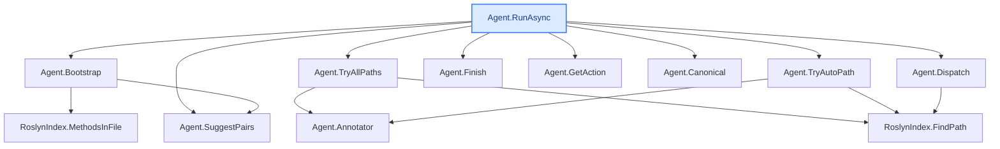

**Micro-model `explain` example — `gemma3n:e2b`** (same run as [`explain-full-example.md`](explain-full-example.md), smaller model)

The **exact same command and method** as the full example — only the model changes, from
`gemma4:latest` to the **micro `gemma3n:e2b`** — so you can judge for yourself how a tiny local model
does on deep code-understanding. Output is **real and unedited** (the tool now maps the SentencePiece
`▁` metaspace marker some small models leak back to spaces; nothing else is touched). Reproducible:

```bash
dotnet run -- explain -s CodeTracer.sln --method "Agent.RunAsync" --depth 3 --max-methods 12 \
  --model gemma3n:e2b --repo-url https://github.com/janjanusek/code_tracer/blob/main
```

**Speed vs quality, same machine (CPU-only, no GPU), same 14 calls:**

| model | total time | in / out tokens | notes |
|---|---:|---|---|
| `gemma4:latest` | **~1598 s** (≈27 min) | 13901 / 11600 | the full example — more thorough |
| `gemma3n:e2b` | **~205 s** (≈3.4 min) | 15935 / 6878 | **~7.8× faster**, more concise; below |

> _The micro model is dramatically faster and the explanations are still coherent and useful — it's
> terser and occasionally less precise. Read both files side by side and decide what's good enough for
> your task; for a first pass over unfamiliar code, `gemma3n:e2b` is a very strong speed/quality trade._

---

# Agent.RunAsync  ([Agent.cs:118](https://github.com/janjanusek/code_tracer/blob/main/Agent.cs#L118))
`Task Agent.RunAsync(string solutionPath, string targetFile, string endpoint)`
_Deep explanation following the call chain (12 methods)._

## L0 · Agent.RunAsync  ([Agent.cs:118](https://github.com/janjanusek/code_tracer/blob/main/Agent.cs#L118))
<details open>
<summary>source</summary>

```csharp
public async Task RunAsync(string solutionPath, string targetFile, string endpoint)
    {
        var seed = Bootstrap(targetFile, endpoint);

        // Deterministic pre-flight: try candidate find_path pairs IMMEDIATELY. On CPU this is
        // faster and more reliable than waiting for (often under-filled) model calls. Roslyn
        // is the source of truth; the model is here only to navigate harder cases (interface/DI/events).
        // --all-paths/--brute: enumerate ALL paths (deep), not just the first shortest one.
        var mode = _allPaths ? "brute-force (all paths)" : "first path";
        Console.WriteLine($"[pre-flight] deterministic find_path over {_pairs.Count} candidate pairs [{mode}]...");
        var deterministic = _allPaths ? await TryAllPaths() : await TryAutoPath();
        if (deterministic.Contains("PATH FOUND"))
        {
            await Finish(deterministic, _allPaths ? "brute-force" : "pre-flight");
            return;
        }
        if (!_useLlm)
        {
            Console.WriteLine("[pre-flight] no direct path and --no-llm set - stopping.");
            await Finish(deterministic, "deterministic");
            return;
        }
        Console.WriteLine("[pre-flight] no direct path - handing over to the model loop...");

        var messages = new List<ChatMsg>
        {
            new("system", SystemPrompt),
            new("user", seed)
        };

        var seen = new HashSet<string>();
        int escalations = 0;

        for (int step = 1; step <= _maxSteps; step++)
        {
            var act = await GetAction(messages);
            if (act == null)
            {
                // model could not produce a valid action even after corrections -> deterministic escalation
                Console.WriteLine("\n[auto] model gave no valid action - using deterministic result...");
                await Finish(_lastPath ?? deterministic, "auto");
                return;
            }

            var (tool, args, raw) = act.Value;
            Console.WriteLine($"\n===== STEP {step} =====\n{raw}");

            if (tool == "finish")
            {
                var pathText = _lastPath ?? await TryAutoPath();
                await Finish(pathText, "finish");
                return;
            }

            // --- loop detection -------------------------------------------------
            var key = $"{tool}|{Canonical(args)}";
            if (!seen.Add(key))
            {
                escalations++;
                Console.WriteLine($"[!] repeated step ({escalations}) - escalating");

                if (escalations == 1)
                {
                    // one more chance: explicitly dictate the find_path calls to it
                    messages.Add(new("assistant", raw));
                    messages.Add(new("user",
                        "STOP. You already ran this exact tool+args. Do NOT repeat it.\n" +
                        "Call find_path now (return the JSON), e.g.:\n" + SuggestPairs()));
                    continue;
                }

                // model is looping -> use deterministic result (within 2 steps)
                Console.WriteLine("[auto] loop detected - using deterministic result...");
                await Finish(_lastPath ?? deterministic, "auto");
                return;
            }

            string observation;
            try { observation = await Dispatch(tool, args); }
            catch (Exception ex) { observation = $"TOOL ERROR: {ex.Message}"; }

            if (tool == "find_path" && observation.Contains("PATH FOUND"))
                _lastPath = observation;

            if (observation.Length > 3000)
                observation = observation[..3000] + "\n... (truncated)";

            Console.WriteLine($"--- OBSERVATION ---\n{observation.Trim()}");

            messages.Add(new("assistant", raw));
            messages.Add(new("user", $"OBSERVATION:\n{observation}"));
        }

        // step limit exhausted -> use the best available result
        Console.WriteLine($"\n[!] step limit {_maxSteps} reached - using deterministic result");
        await Finish(_lastPath ?? deterministic, "limit");
    }
```

</details>

1. **Initialization:** The method starts by calling `Bootstrap` to initialize a seed state based on the provided `targetFile` and `endpoint`.

2. **Deterministic Path Search (Pre-flight):** It attempts to find a path using either all possible paths (`_allPaths` is true) or the first shortest path (`_allPaths` is false). This is done to ensure a reliable starting point, especially when the model might not provide a clear path.

3. **Model Loop Detection:**  It iterates up to `_maxSteps`, sending messages to the model with a system prompt and the seed. 
   - It checks for repeated tool executions (e.g., "find_path") to detect potential loops. If a loop is detected, it uses a deterministic path from previous steps or a fallback mechanism.

4. **Action Execution:**  In each step, it retrieves the action from the model using `GetAction`. 

5. **Tool Execution & Observation:** The method executes the tool specified in the action (e.g., "find_path"). It captures the observation returned by the tool and stores it.

6. **Path Update:** If the tool is "find_path" and a "PATH FOUND" message is received, the `_lastPath` field is updated with the path found.

7. **Observation Handling:** The method truncates long observations to a maximum length of 3000 characters for readability.

8. **Finalization:** After reaching the step limit or finding a path, it calls `Finish` to finalize the process, providing the `_lastPath` and a reason (e.g., "limit", "finish").

9. **Error Handling**: If an exception occurs during tool execution, the observation is set to the error message.


**Inputs:**
- `solutionPath`: The path to the solution file.
- `targetFile`: The name of the target file.
- `endpoint`: The endpoint URL.

**Outputs:**
- `_lastPath`:  The path found, if any.

**Side Effects:**
- Updates the `_lastPath` field.
- Writes to the console with messages about the process and observations.
- Calls other methods that modify state (e.g., updating `_lastPath`, escalating steps).

**Delegates To:**
- `Bootstrap`: Initializes the process with seed data.
- `TryAllPaths`: Attempts to find all possible paths.
- `TryAutoPath`: Attempts to find a path automatically.
- `GetAction`: Retrieves the next action from the model.
- `Finish`: Finalizes the process with a path or reason.
- `Canonicaal`: Converts a JSON element into a canonical string.
- `Dispatch`: Executes a tool and returns its observation.

> ## L1 · Agent.Bootstrap  ([Agent.cs:414](https://github.com/janjanusek/code_tracer/blob/main/Agent.cs#L414))
> <details open>
> <summary>source</summary>
>
> ```csharp
> private string Bootstrap(string targetFile, string endpoint)
>     {
>         // endpoint: if it is a .cshtml, the handler lives in .cshtml.cs
>         var endpointCs = endpoint.EndsWith(".cshtml", StringComparison.OrdinalIgnoreCase)
>             ? endpoint + ".cs" : endpoint;
>
>         var sb = new StringBuilder();
>         sb.AppendLine("Goal: find the call chain from the ENDPOINT down to the call in the TARGET FILE.");
>         sb.AppendLine();
>
>         var fromMethods = new List<(string cls, string method, int line)>();
>         if (File.Exists(endpointCs))
>         {
>             fromMethods = _index.MethodsInFile(endpointCs);
>             sb.AppendLine($"ENDPOINT page model ({Path.GetFileName(endpointCs)}):");
>             foreach (var m in fromMethods)
>                 sb.AppendLine($"  {m.cls}.{m.method}  :{m.line}");
>         }
>         else
>         {
>             sb.AppendLine($"ENDPOINT: {endpoint}  (resolve it with find_symbol/grep)");
>         }
>         sb.AppendLine();
>
>         var toMethods = _index.MethodsInFile(targetFile);
>         sb.AppendLine($"TARGET FILE ({Path.GetFileName(targetFile)}) methods:");
>         foreach (var m in toMethods)
>             sb.AppendLine($"  {m.cls}.{m.method}  :{m.line}");
>         sb.AppendLine();
>
>         // select candidates: handlers (On*) as source, all target methods as destination
>         var handlers = fromMethods.Where(m => m.method.StartsWith("On", StringComparison.Ordinal)).ToList();
>         if (handlers.Count == 0) handlers = fromMethods;                 // fallback: all
>         var targets = toMethods
>             .Where(m => !m.method.Equals(".ctor"))
>             .OrderByDescending(m => m.method.EndsWith("Async") ||
>                                     m.method.StartsWith("Build") || m.method.StartsWith("Generate"))
>             .ToList();
>
>         foreach (var h in handlers)
>             foreach (var t in targets)
>             {
>                 if (_pairs.Count >= 24) break;
>                 _pairs.Add((h.cls, h.method, t.cls, t.method));
>             }
>
>         sb.AppendLine("Start by calling find_path. Suggested first call:");
>         sb.AppendLine(SuggestPairs());
>         return sb.ToString();
>     }
> ```
>
> </details>
>
> 1. **Determine Endpoint File:** Checks if `endpoint` ends with ".cshtml". If so, it appends ".cs" to create the corresponding C# file name. Otherwise, it uses the original `endpoint` name.
>
> 2. **Fetch Methods from Endpoint:** Retrieves a list of methods from the endpoint C# file using `_index.MethodsInFile()`.  It then prints a list of these methods (class, method name, line number) to the console.
>
> 3. **Fetch Methods from Target File:** Retrieves a list of methods from the target C# file using `_index.MethodsInFile()`. It then prints a list of these methods (class, method name, line number) to the console.
>
> 4. **Filter Handlers:** Filters the endpoint methods to include only those starting with "On" (e.g., OnPost, OnGet).  If no "On" methods are found, it uses all endpoint methods.
>
> 5. **Filter Targets:** Filters the target methods, excluding ".ctor" (constructor) methods. It then orders the remaining methods in descending order based on whether the method name ends with "Async", starts with "Build", or starts with "Generate".
>
> 6. **Create Pairs:** Iterates through the filtered handlers and targets, creating pairs of (handler class, handler method, target class, target method).  It adds these pairs to the `_pairs` list. It stops adding pairs when the list reaches a maximum size of 24.
>
> 7. **Suggest First Call:** Calls the `SuggestPairs()` method to get a suggested first call based on the generated pairs and prints it to the console.
>
> 8. **Return Result:** Converts the StringBuilder containing the output (goal, lists of methods, suggested call) to a string and returns it.

> ## L1 · Agent.TryAllPaths  ([Agent.cs:496](https://github.com/janjanusek/code_tracer/blob/main/Agent.cs#L496))
> <details open>
> <summary>source</summary>
>
> ```csharp
> private async Task<string> TryAllPaths()
>     {
>         var sb = new StringBuilder();
>         var seen = new HashSet<string>();
>         var ann = Annotator();
>         int found = 0;
>         foreach (var p in _pairs)
>         {
>             var res = await _index.FindPath(p.fc, p.fm, p.tc, p.tm, maxNodes: 20000,
>                                             withBodies: _withBodies, repoUrl: _repoUrl, annotate: ann);
>             if (!res.Contains("PATH FOUND")) continue;
>             if (!seen.Add(res)) continue;       // dedup identical paths
>             found++;
>             if (found > 1) { sb.AppendLine(); sb.AppendLine("---"); }   // clear separator between paths
>             sb.AppendLine();
>             sb.AppendLine($"### Path {found}:  {p.fc}.{p.fm}  ->  {p.tc}.{p.tm}");
>             sb.AppendLine(res.Trim());
>         }
>         if (found == 0)
>         {
>             var fb = new StringBuilder("No direct path found over candidate pairs. " +
>                                        "Callers of the target methods (going up):\n");
>             foreach (var t in _pairs.Select(p => (p.tc, p.tm)).Distinct().Take(3))
>             {
>                 fb.AppendLine($"\n# {t.tc}.{t.tm}");
>                 fb.AppendLine(await _index.FindCallers(t.tc, t.tm));
>             }
>             return fb.ToString();
>         }
>         return $"FOUND {found} distinct path(s) [brute-force]:\n\n" + sb.ToString();
>     }
> ```
>
> </details>
>
> 1. **Initialization:** Creates a `StringBuilder` to accumulate path results and a `HashSet` to track already found paths for deduplication. It also retrieves the Annotator object, initializes a path counter, and gets the list of candidate pairs (`_pairs`).
>
> 2. **Iterates through Candidate Pairs:** Loops through each pair of `fc`, `fm`, `tc`, and `tm` from the `_pairs` list. Each pair represents a potential path.
>
> 3. **Finds Path:** For each pair, it calls `_index.FindPath()` to search for a path matching the given criteria. The method passes parameters like maximum nodes, whether to include bodies, repository URL and annotator.
>
> 4. **Deduplicates Paths:** Checks if the found path already exists in the `seen` HashSet. If so, it skips to the next pair.
>
> 5. **Accumulates Path Information:**  If a new path is found, it appends information about the path (source components, target components, and the path itself) to the `StringBuilder`. It also adds a separator line between paths for readability.
>
> 6. **Handles No Direct Paths:** If no direct paths are found after iterating through all pairs, it constructs a string containing the callers of the target methods.  It iterates over distinct target method/component pairs from the candidate pairs and retrieves the callers using `_index.FindCallers()`.
>
> 7. **Returns Result:** Returns a string containing the results:
>    - A header indicating the number of distinct paths found (if any).
>    - The accumulated path information in the `StringBuilder`.
>    - If no direct paths are found, it includes the caller information.
>
>
>
> **Side Effects:**
>
> *   Modifies the `StringBuilder` to accumulate path strings.
> *   Adds elements to the `HashSet` to track already seen paths.
> *   Calls methods that can potentially modify data (e.g., `_index.FindPath`, `_index.FindCallers`).
>
>
>
> **Delegates To:**
>
> *   `Annotator()`: Retrieves an instance of the Annotator class.
> *   `_index.FindPath()`: Searches for paths based on provided parameters.
> *   `_index.FindCallers()`: Retrieves callers of target methods.
> *   `StringBuilder.AppendLine()`: Appends lines to a string builder.
> *   `HashSet.Add()`: Adds elements to a hash set.
> *   `String.Contains()`: Checks if a string contains another string.
> *   `String.Trim()`: Removes leading/trailing whitespace from a string.
> *   `Enumerable.Take()`: Takes a specified number of elements from an enumerable.
> *   `Enumerable.Distinct()`: Returns a new sequence containing only the distinct elements from an enumerable.
> *   `Enumerable.Select()`: Applies a function to each element in an enumerable and returns a new sequence.
> *  `StringBuilder.ToString()`: Converts a StringBuilder object into a string.

> ## L1 · Agent.TryAutoPath  ([Agent.cs:474](https://github.com/janjanusek/code_tracer/blob/main/Agent.cs#L474))
> <details open>
> <summary>source</summary>
>
> ```csharp
> private async Task<string> TryAutoPath()
>     {
>         var ann = Annotator();
>         foreach (var p in _pairs)
>         {
>             var res = await _index.FindPath(p.fc, p.fm, p.tc, p.tm,
>                                             withBodies: _withBodies, repoUrl: _repoUrl, annotate: ann);
>             if (res.Contains("PATH FOUND"))
>                 return $"(find_path {p.fc}.{p.fm} -> {p.tc}.{p.tm})\n{res}";
>         }
>         // no direct path -> at least show who calls the target methods (callers going up)
>         var sb = new StringBuilder("No direct path found. Callers of the target methods (going up):\n");
>         foreach (var t in _pairs.Select(p => (p.tc, p.tm)).Distinct().Take(3))
>         {
>             sb.AppendLine($"\n# {t.tc}.{t.tm}");
>             sb.AppendLine(await _index.FindCallers(t.tc, t.tm));
>         }
>         return sb.ToString();
>     }
> ```
>
> </details>
>
> 1. **Iterates through candidate paths:** The method iterates through a list of candidate path pairs (`_pairs`). Each pair contains the source file (`fc`), destination file (`fm`), target class (`tc`), and target method (`tm`).
>
> 2. **Attempts to find a path:** For each candidate path, it calls `_index.FindPath` to try and find a path between the source and destination files/methods, considering whether to include bodies and the repository URL.
>
> 3. **Returns if a path is found:** If `_index.FindPath` returns a string containing "PATH FOUND", the method returns a string indicating the path and the full result from `_index.FindPath`.
>
> 4. **Handles no direct path:** If no direct path is found, the method constructs a string listing the callers of the target methods (going up the call stack). It then returns this string.
>
> 5. **Delegates to other methods:**
>    - `Annotator()`:  This method likely prepares data for the path finding process.
>    - `_index.FindPath()`: This is the core path-finding operation, using the provided parameters (file names, target class/method, options).
>    - `_index.FindCallers()`: This method retrieves a list of callers for the target methods. 
>
> 6. **Uses StringBuilder:**  The method uses `StringBuilder` to efficiently build strings, especially when concatenating multiple lines and results.

> ## L1 · Agent.Finish  ([Agent.cs:327](https://github.com/janjanusek/code_tracer/blob/main/Agent.cs#L327))
> <details open>
> <summary>source</summary>
>
> ```csharp
> private async Task Finish(string pathText, string reason)
>     {
>         var output = pathText.Trim();
>
>         // Built from the CLEAN path text (before any summary prose is appended), so the diagram
>         // reflects only the discovered call-path. Appended at the very end of the result.
>         var flow = Diagram.Section(Diagram.FromTraceText(output), "The path the analysis found");
>
>         if (_summarize && output.Contains("PATH FOUND"))
>         {
>             Console.Error.WriteLine("[summary] summarizing the chain...");
>             var summary = await SummarizeChain(pathText);
>             if (!string.IsNullOrWhiteSpace(summary))
>             {
>                 output += "\n\n## Summary\n" + summary.Trim();
>                 var simple = await SimplifyForKid(summary);     // a second, plain-words pass
>                 if (!string.IsNullOrWhiteSpace(simple))
>                     output += "\n\n## In plain words\n" + simple.Trim();
>             }
>         }
>
>         if (!string.IsNullOrWhiteSpace(flow))
>             output += "\n\n" + flow;
>
>         Console.WriteLine($"\n========== DONE ({reason}) ==========");
>         Console.WriteLine(output);
>
>         if (!string.IsNullOrWhiteSpace(_outPath))
>         {
>             try
>             {
>                 await File.WriteAllTextAsync(_outPath!, output + "\n");
>                 Console.Error.WriteLine($"[trace] saved to {_outPath}");
>             }
>             catch (Exception ex) { Console.Error.WriteLine($"[write error] {ex.Message}"); }
>         }
>     }
> ```
>
> </details>
>
> 1. **Input:** Takes a `pathText` (string representing the analysis path) and a `reason` (string describing the reason for finishing).
>
> 2. **Cleans Path:** Trims whitespace from the input `pathText`.
>
> 3. **Creates Diagram Section:**  Uses `Diagram.Section` to create a diagram section based on the trimmed path text, labeling it "The path the analysis found". This reflects only the discovered call-path.
>
> 4. **Conditional Summary:** If the `_summarize` flag is true *and* the `pathText` contains "PATH FOUND", it calls `SummarizeChain` to generate a summary of the chain. 
>    - The summary is appended to the output string, formatted with a heading.
>    - It then calls `SimplifyForKid` on the summary to produce a simplified version in plain language. This simplified text is also added to the output string, formatted with a heading.
>
> 5. **Appends Diagram Section:** Appends the diagram section (created in step 3) to the output string.
>
> 6. **Writes to Console:** Prints a message to the console indicating completion and the reason for the operation.
>
> 7. **Writes to File:** If an output path (`_outPath`) is specified, it attempts to write the complete output string (including the diagram section, summary, and any other content) to the specified file.  It includes error handling for potential exceptions during file writing.
>
> **Delegates To:**
>
> - `Diagram.Section(Graph, String)`: Creates a diagram section from the path text.
> - `Diagram.FromTraceText(String)`: Converts the input path text into a diagram representation.
> - `Agent.SummarizeChain(String)`: Generates a summary of the chain based on the input path text.
> - `Agent.SimplifyForKid(String)`: Simplifies the summary into plain language.
> - `File.WriteAllTextAsync(String, String, CancellationToken)`: Writes the output string to a file.
>
> **Side Effects:**
>
> - Prints messages to the console indicating completion and any errors encountered during file writing.
> - Writes data to a file specified by `_outPath`.

> ## L1 · Agent.GetAction  ([Agent.cs:241](https://github.com/janjanusek/code_tracer/blob/main/Agent.cs#L241))
> <details open>
> <summary>source</summary>
>
> ```csharp
> private async Task<(string tool, JsonElement args, string raw)?> GetAction(List<ChatMsg> messages)
>     {
>         var opts = new ChatOptions { Temperature = 0, NumPredict = _actionNumPredict, Format = ActionSchema };
>
>         for (int attempt = 0; attempt < 3; attempt++)   // 1 attempt + 2 corrections
>         {
>             var raw = (await _llm.ChatAsync(messages, opts, "action")).Trim();
>
>             // the grammar should guarantee valid JSON; on interruption (num_predict) it may
>             // return unclosed JSON - handle that.
>             JsonElement root;
>             try { root = JsonDocument.Parse(raw).RootElement.Clone(); }
>             catch
>             {
>                 messages.Add(new("assistant", raw));
>                 messages.Add(new("user", "Your output was not a valid JSON object. Return ONLY {\"tool\":...,\"args\":{...}}."));
>                 continue;
>             }
>
>             if (root.ValueKind != JsonValueKind.Object
>                 || !root.TryGetProperty("tool", out var toolEl)
>                 || toolEl.ValueKind != JsonValueKind.String)
>             {
>                 messages.Add(new("assistant", raw));
>                 messages.Add(new("user", "Error: the object must have a string field \"tool\" and an object \"args\". Try again."));
>                 continue;
>             }
>
>             var tool = toolEl.GetString()!.Trim().ToLowerInvariant();
>             var args = root.TryGetProperty("args", out var a) && a.ValueKind == JsonValueKind.Object ? a : EmptyArgs;
>
>             if (!AllowedTools.Contains(tool))
>             {
>                 messages.Add(new("assistant", raw));
>                 messages.Add(new("user", $"Unknown tool '{tool}'. Allowed: {string.Join(", ", AllowedTools)}."));
>                 continue;
>             }
>
>             var err = ValidateArgs(tool, args);
>             if (err != null)
>             {
>                 messages.Add(new("assistant", raw));
>                 messages.Add(new("user", $"Invalid args for '{tool}': {err} Return corrected JSON."));
>                 continue;
>             }
>
>             return (tool, args, raw);
>         }
>         return null;
>     }
> ```
>
> </details>
>
> 1. **Input:** Takes a list of `ChatMsg` objects as input, representing the conversation history.
>
> 2. **Initializes Options:** Creates a `ChatOptions` object with a temperature of 0, a maximum number of predictions (`_actionNumPredict`), and uses the defined `ActionSchema`.
>
> 3. **Iterates for Attempts:** Loops up to 3 times, attempting to get an action from the LLM.
>
> 4. **Calls LLM:** Calls the `_llm.ChatAsync` method with the conversation messages and options to get a raw string response.
>
> 5. **Parses JSON:** Attempts to parse the raw string response as a JSON object using `JsonDocument.Parse`. If parsing fails, it adds an error message to the conversation history and retries.
>
> 6. **Validates JSON Structure:** Checks if the parsed JSON is an object and if it contains a "tool" property (which is a string) and an "args" property (which is an object).  If not, it adds an error message to the conversation history and retries.
>
> 7. **Extracts Tool and Args:** Extracts the tool name from the "tool" property of the JSON object and the arguments from the "args" property. Defaults the arguments to `EmptyArgs` if the "args" property is missing.
>
> 8. **Checks Allowed Tools:** Checks if the extracted tool name is in the `AllowedTools` list. If not, it adds an error message to the conversation history and retries.
>
> 9. **Validates Arguments:** Calls the `ValidateArgs` method to check if the arguments are valid for the specified tool.  If invalid, it adds an error message to the conversation history and retries.
>
> 10. **Returns Action:** If all validations pass, returns a tuple containing the tool name, arguments, and the raw response.
>
> 11. **Returns Null:** If the loop completes without finding a valid action after 3 attempts, it returns `null`.

> ## L1 · Agent.Canonical  ([Agent.cs:321](https://github.com/janjanusek/code_tracer/blob/main/Agent.cs#L321))
> <details open>
> <summary>source</summary>
>
> ```csharp
> private static string Canonical(JsonElement args) => JsonSerializer.Serialize(args).ToLowerInvariant();
> ```
>
> </details>
>
> Here's a breakdown of the `Canonicaal` method:
>
> 1. **Input:** Takes a `JsonElement` as input, representing JSON data.
> 2. **Process:** 
>    - Serializes the `JsonElement` into a string using `JsonSerializer.Serialize()`. This converts the JSON structure into a string representation.
>    - Converts the resulting string to lowercase using `String.ToLowerInvariant()`.  This ensures consistency in case-insensitive comparisons, making it easier to detect repeated values.
> 3. **Output:** Returns the lowercase string representation of the JSON data.
> 4. **Side Effects:** The method does not have any side effects. It only performs string manipulation and serialization/deserialization.
> 5. **Delegates To:** 
>    - `JsonSerializer.Serialize()`:  This method serializes the input `JsonElement` into a string.
>    - `String.ToLowerInvariant()`: This converts the resulting string to lowercase, ensuring case-insensitive comparison.

> ## L1 · Agent.SuggestPairs  ([Agent.cs:465](https://github.com/janjanusek/code_tracer/blob/main/Agent.cs#L465))
> <details open>
> <summary>source</summary>
>
> ```csharp
> private string SuggestPairs()
>     {
>         var sb = new StringBuilder();
>         foreach (var p in _pairs.Take(3))
>             sb.AppendLine($"  {{\"tool\":\"find_path\",\"args\":{{\"fromClass\":\"{p.fc}\",\"fromMethod\":\"{p.fm}\",\"toClass\":\"{p.tc}\",\"toMethod\":\"{p.tm}\"}}}}");
>         return sb.Length == 0 ? "  (no candidates - use find_symbol to resolve the endpoint)" : sb.ToString();
>     }
> ```
>
> </details>
>
> Here's a breakdown of the `SuggestPairs` method:
>
> 1. **Purpose:** This method generates a string containing JSON-like formatted suggestions for potential pairs of tools and methods. It aims to provide the user with options when looking for a path between classes or methods.
>
> 2. **Input:** The method takes no direct input parameters. It uses the `_pairs` field, which is assumed to be a `List` of tuples. Each tuple likely represents a pair of `fc`, `fm`, `tc`, and `tm` values (e.g., class name, method name).
>
> 3. **Process:**
>    - It initializes a `StringBuilder` object to efficiently build the output string.
>    - It iterates through the first three elements of the `_pairs` list using `Take(3)`.
>    - For each pair, it formats a JSON-like string containing the "tool" and "args" properties, specifying the source class, method, target class, and target method. This formatted string is appended to the `StringBuilder`.
>    - If the `StringBuilder` is empty (meaning there are no pairs in the list), it returns a message suggesting the user use another tool (`find_symbol`) to resolve the endpoint.
>    - Otherwise, it converts the `StringBuilder` to a string and returns the formatted suggestion string.
>
> 4. **Output:** The method returns a string. This string is formatted as JSON-like text, with each pair of suggestions on a new line.  If no pairs are found, it returns a message indicating that the user should use another tool.
>
> 5. **Side Effects:** The method modifies the `StringBuilder` object, which is a side effect. It also returns a string value.
>
> 6. **Delegates to:**
>    - `Enumerable.Take(Int32)`: This method is used to get the first three elements from the `_pairs` list.
>    - `StringBuilder.AppendLine()`:  This method appends a line of text to the `StringBuilder`.
>    - `StringBuilder.ToString()`: This method converts the `StringBuilder` into a string.

> ## L1 · Agent.Dispatch  ([Agent.cs:566](https://github.com/janjanusek/code_tracer/blob/main/Agent.cs#L566))
> <details open>
> <summary>source</summary>
>
> ```csharp
> private async Task<string> Dispatch(string tool, JsonElement a)
>     {
>         string S(string k) => a.TryGetProperty(k, out var v) && v.ValueKind == JsonValueKind.String
>             ? (v.GetString() ?? "") : "";
>         int I(string k, int def) => a.TryGetProperty(k, out var v) && v.TryGetInt32(out var n) ? n : def;
>
>         return tool switch
>         {
>             "find_symbol"     => await _index.FindSymbol(S("name")),
>             "outline"         => _index.Outline(S("file")),
>             "get_method"      => await _index.GetMethod(S("class"), S("method")),
>             "find_callers"    => await _index.FindCallers(S("class"), S("method")),
>             "find_callees"    => await _index.FindCallees(S("class"), S("method")),
>             "find_references" => await _index.FindReferences(S("class"), S("method")),
>             "find_path"       => await _index.FindPath(S("fromClass"), S("fromMethod"), S("toClass"), S("toMethod")),
>             "read_file"       => _index.ReadFile(S("file"), I("start", 1), I("end", 0)),
>             "grep"            => _index.Grep(S("pattern")),
>             _                 => $"unknown tool '{tool}'"
>         };
>     }
> ```
>
> </details>
>
> 1. **Input:** Takes a `string` for the `tool` (e.g., "find_symbol", "read_file") and a `JsonElement` `a` containing parameters for the tool.
>
> 2. **Tool-Specific Logic:** Uses a `switch` statement to determine the action based on the `tool` string.  Each case calls a different method from the `RoslynIndex` class.
>
> 3. **`S(string k)`:**  This helper function extracts a string value from the `JsonElement` `a` using `TryGetProperty`. If the property exists and its value is a string, it returns that string; otherwise, it returns an empty string.
>
> 4. **`I(string k, int def)`:** This helper function attempts to get an integer value from the `JsonElement` `a` using `TryGetInt32`. If the property exists and is an integer, it returns the value; otherwise, it returns a default integer value specified by the `def` parameter.
>
> 5. **Delegation:**
>    - `"find_symbol"`: Calls `_index.FindSymbol(S("name"))` to find symbols related to the "name" property in the Roslyn index.
>    - `"outline"`: Calls `_index.Outline(S("file"))` to get an outline of a file, using the "file" property.
>    - `"get_method"`: Calls `_index.GetMethod(S("class"), S("method"))` to retrieve a method from the Roslyn index, given a class and method name.
>    - `"find_callers"`: Calls `_index.FindCallers(S("class"), S("method"))` to find callers of a method.
>    - `"find_callees"`: Calls `_index.FindCallees(S("class"), S("method"))` to find callees of a method.
>    - `"find_references"`: Calls `_index.FindReferences(S("class"), S("method"))` to find references to a method.
>    - `"find_path"`: Calls `_index.FindPath(S("fromClass"), S("fromMethod"), S("toClass"), S("toMethod"))` to find a path between a from class, from method, to class and to method.
>    - `"read_file"`: Calls `_index.ReadFile(S("file"), I("start", 1), I("end", 0))` to read a file, starting at the "start" index (1) and ending at the "end" index (0).
>    - `"grep"`: Calls `_index.Grep(S("pattern"))` to perform a grep operation using a pattern specified in the JSON element.
>
> 6. **Return Value:** Returns a `string` indicating the result of the tool execution. If the tool is not recognized, it returns an "unknown tool" message.

> > ## L2 · RoslynIndex.MethodsInFile  ([RoslynIndex.cs:592](https://github.com/janjanusek/code_tracer/blob/main/RoslynIndex.cs#L592))
> > <details open>
> > <summary>source</summary>
> >
> > ```csharp
> > public List<(string cls, string method, int line)> MethodsInFile(string filePath)
> >     {
> >         var result = new List<(string, string, int)>();
> >         var full = Path.IsPathRooted(filePath) ? filePath : Path.Combine(SolutionDir, filePath);
> >         var doc = _solution.Projects.SelectMany(p => p.Documents)
> >             .FirstOrDefault(d => string.Equals(Path.GetFullPath(d.FilePath ?? ""),
> >                                                Path.GetFullPath(full), StringComparison.OrdinalIgnoreCase));
> >         if (doc == null) return result;
> >         var root = doc.GetSyntaxTreeAsync().Result!.GetRoot();
> >         foreach (var type in root.DescendantNodes().OfType<TypeDeclarationSyntax>())
> >             foreach (var md in type.Members.OfType<MethodDeclarationSyntax>())
> >                 result.Add((type.Identifier.ValueText, md.Identifier.ValueText,
> >                             md.GetLocation().GetLineSpan().StartLinePosition.Line + 1));
> >         return result;
> >     }
> > ```
> >
> > </details>
> >
> > 1. **Input:** Takes a file path (string) as input.
> >
> > 2. **Purpose:**  Extracts a list of methods defined within a C# file. The list includes the class name, method name, and line number where the method is defined. This information is used for bootstrapping candidate methods during a code analysis process.
> >
> > 3. **Process:**
> >    - Constructs the full file path by combining the input file path with the solution directory if the input path is relative.
> >    - Finds the first document (e.g., a C# document) associated with the file, using the full path to compare against the document's file path. If no document is found, it returns an empty list.
> >    - Retrieves the syntax tree for the document.
> >    - Iterates through the syntax tree's descendant nodes, filtering for `TypeDeclarationSyntax` nodes (representing classes).
> >    - For each class, iterates through its members, filtering for `MethodDeclarationSyntax` nodes (representing methods).
> >    - Extracts the method's identifier (name) and line number from the method declaration.
> >    - Adds a tuple containing the class name, method name, and line number to the result list.
> >
> > 4. **Output:** Returns a list of tuples, where each tuple contains:
> >    - The name of the class containing the method (string).
> >    - The name of the method (string).
> >    - The line number where the method is defined in the file (int).
> >
> > 5. **Side Effects:**  The method does not have any side effects. It reads and processes data from the solution's documents, but doesn't modify anything externally.
> >
> > 6. **Delegates to:**
> >    - `Path.IsPathRooted()`: Checks if the provided file path is rooted (e.g., starts with a solution root).
> >    - `Path.Combine()`: Combines the solution directory and file path to create the full file path.
> >    - `Enumerable.FirstOrDefault()`: Finds the first document matching the specified criteria, or returns a default value if no match is found.
> >    - `Enumerable.SelectMany()`:  Processes the documents in the solution and selects those that match the provided criteria.
> >    - `String.Equals()`: Compares strings case-insensitively.
> >    - `Path.GetFullPath()`: Gets the absolute path of a file or directory.
> >    - `SyntaxTree.GetRoot()`: Retrieves the root node of the syntax tree.
> >    - `Document.GetSyntaxTreeAsync()`: Asynchronously retrieves the syntax tree for a document.
> >    - `Enumerable.OfType()`: Filters the descendant nodes to only include those of a specific type (e.g., `TypeDeclarationSyntax`).
> >    - `SyntaxNode.DescendantNodes()`: Returns a collection of descendant nodes from a given node.
> >    - `List.Add()`: Adds an element to the end of a list.
> >    - `Location.GetLineSpan()`: Gets the line span information for a location.
> >    - `CSharpSyntaxNode.GetLocation()`: Gets the location information for a C# syntax node.

> > ## L2 · Agent.Annotator  ([Agent.cs:532](https://github.com/janjanusek/code_tracer/blob/main/Agent.cs#L532))
> > <details open>
> > <summary>source</summary>
> >
> > ```csharp
> > private Func<string, string, string, string, Task<string?>>? Annotator()
> >     {
> >         if (!_annotate) return null;
> >         return async (context, callerSig, calleeSig, code) =>
> >         {
> >             try
> >             {
> >                 // Empty calleeSig => this is the target/destination node (end of the chain).
> >                 var prompt = string.IsNullOrEmpty(calleeSig)
> >                     ? $"{context}\n\n" +
> >                       $"This is the FINAL method of the chain: `{callerSig}`.\n\n" +
> >                       $"```csharp\n{code}\n```\n\n" +
> >                       "In ONE short phrase (max ~14 words) say what this final method does / why the chain " +
> >                       "ends here. If trivial, reply with exactly: null"
> >                     : $"{context}\n\n" +
> >                       $"Current step: `{callerSig}` runs and, at the end of the snippet below, calls `{calleeSig}`.\n\n" +
> >                       $"```csharp\n{code}\n```\n\n" +
> >                       $"In ONE short phrase (max ~14 words) say WHY it calls `{calleeSig}` here / what this step " +
> >                       "achieves in the overall chain. Be proportional to the context. If it is a trivial or obvious " +
> >                       "delegation with nothing meaningful to add, reply with exactly: null";
> >                 var reply = (await _llm.ChatAsync(new[]
> >                 {
> >                     new ChatMsg("system", "You annotate one step of a code call-chain in a single terse phrase. No markdown, no quotes."),
> >                     new ChatMsg("user", prompt)
> >                 }, new ChatOptions { Temperature = 0.2, NumPredict = 64 }, "annotate")).Trim();
> >                 if (reply.Length == 0 || reply.Equals("null", StringComparison.OrdinalIgnoreCase)) return null;
> >                 return reply.Trim('"', '`', ' ', '.');
> >             }
> >             catch { return null; }   // model down / error -> just omit the annotation
> >         };
> >     }
> > ```
> >
> > </details>
> >
> > 1. **Input:** Takes a `Func<string, string, string, string, Task<string?>>` as a parameter. This function is the callback that will be executed when the annotator is called. It receives the current context, caller and callee signatures (with parameter names), and the code snippet being analyzed.
> > 2. **Checks `--annoatate` flag:** If the `--annoatate` flag is false, it returns `null`. This means the annotator is not active.
> > 3. **Constructs Prompt:**  If `--annoatate` is true, it constructs a prompt string based on the context, caller signature, callee signature and code snippet. The prompt asks for a short, descriptive phrase (max 14 words) explaining what the final method does or why the chain ends here. If the task is trivial or obvious, it requests "null" as a response.
> > 4. **Calls LLM:** Calls `_llm.ChatAsync` to send the prompt to the Large Language Model (LLM). The prompt includes system instructions and user input.  The `ChatOptions` parameter sets the temperature and number of predictions.
> > 5. **Processes LLM Response:** Trims any leading/trailing whitespace from the LLM's response.
> > 6. **Handles Null/Empty Responses:** If the LLM returns an empty string or "null" (case-insensitive), it returns `null`.
> > 7. **Formats Output:**  Removes quotes, backticks, and extra spaces from the LLM's response to produce a clean output.
> > 8. **Returns Annotation:** Returns the formatted annotation string.
> > 9. **Error Handling:** Includes a `try-catch` block to handle potential errors during the LLM call. If an error occurs, it returns `null`.
> >
> >
> >
> > The method delegates to:
> >
> > *   `_llm.ChatAsync`:  Sends the prompt to the LLM for text generation.
> > *   `String.IsNullOrEmpty`: Checks if the callee signature is null or empty.
> > *   `String.Trim`: Removes leading/trailing whitespace from strings.
> > *   `String.Equals`: Compares strings (case-insensitive).

> > ## L2 · RoslynIndex.FindPath  ([RoslynIndex.cs:281](https://github.com/janjanusek/code_tracer/blob/main/RoslynIndex.cs#L281))
> > <details open>
> > <summary>source</summary>
> >
> > ```csharp
> > public async Task<string> FindPath(string fromClass, string fromMethod, string toClass, string toMethod,
> >                                        int maxNodes = 3000, bool withBodies = false, string? repoUrl = null,
> >                                        Func<string, string, string, string, Task<string?>>? annotate = null)
> >     {
> >         var start = await ResolveMethod(fromClass, fromMethod);
> >         var target = await ResolveMethod(toClass, toMethod);
> >         if (start == null) return $"source method {fromClass}.{fromMethod} not found";
> >         if (target == null) return $"target method {toClass}.{toMethod} not found";
> >
> >         var cmp = SymbolEqualityComparer.Default;
> >         if (cmp.Equals(start, target)) return "source == target (same method)";
> >
> >         var queue = new Queue<IMethodSymbol>();
> >         var visited = new HashSet<ISymbol>(cmp) { target };
> >         var calledBy = new Dictionary<ISymbol, IMethodSymbol>(cmp); // caller -> what it called (toward the target)
> >
> >         queue.Enqueue(target);
> >         int explored = 0;
> >
> >         while (queue.Count > 0 && explored < maxNodes)
> >         {
> >             var current = queue.Dequeue();
> >             explored++;
> >
> >             var callers = await SymbolFinder.FindCallersAsync(current, _solution);
> >             foreach (var c in callers)
> >             {
> >                 if (c.CallingSymbol is not IMethodSymbol caller) continue;
> >                 if (visited.Contains(caller)) continue;
> >                 visited.Add(caller);
> >                 calledBy[caller] = current; // caller calls 'current' (direction toward the target)
> >
> >                 if (cmp.Equals(caller, start))
> >                 {
> >                     // reconstruct start -> ... -> target
> >                     var path = new List<IMethodSymbol> { start };
> >                     var node = (IMethodSymbol)start;
> >                     while (!cmp.Equals(node, target))
> >                     {
> >                         node = calledBy[node];
> >                         path.Add(node);
> >                     }
> >                     return await RenderPath(path, withBodies, repoUrl, annotate);
> >                 }
> >                 queue.Enqueue(caller);
> >             }
> >         }
> >         return $"path not found (explored {explored} nodes). " +
> >                "Interface/DI calls ARE followed (Roslyn bridges interface members to their " +
> >                "implementations), so this usually means a purely dynamic link: reflection " +
> >                "(Activator.CreateInstance / MethodInfo.Invoke), `dynamic`, or a handler wired up at " +
> >                "runtime. Try find_callers manually, or find_callees from the source going down.";
> >     }
> > ```
> >
> > </details>
> >
> > 1. **Finds a path in the call graph:** The method `FindPath` aims to find the shortest path from a class and method (`fromClass`, `fromMethod`) to another class and method (`toClass`, `toMethod`). It traces the call chain upwards, following the direction of calls made by methods.
> >
> > 2. **Input:** Takes the `fromClass`, `fromMethod`, `toClass`, `toMethod` as strings, a maximum number of nodes to explore (`maxNodes`), a boolean indicating whether to include method bodies (`withBodies`), an optional repository URL (`repoUrl`), and an optional function to apply annotations during path reconstruction (`annotate`).
> >
> > 3. **Initialization:**
> >    - It first attempts to resolve the `fromMethod` and `toMethod` using `ResolveMethod`.
> >    - If either method is not found, it returns an error message.
> >    - It initializes a queue of methods to explore (`queue`) and a set of visited methods (`visited`).
> >    - It creates a dictionary to store the caller-called method mappings (`calledBy`).
> >
> > 4. **Breadth-First Search (BFS):**  It performs a breadth-first search starting from the `toMethod` and working its way up to the `fromMethod`. 
> >    - It dequeues methods from the queue, exploring each one.
> >    - For each method, it finds its callers using `SymbolFinder.FindCallersAsync`.
> >    - If a caller has already been visited, it skips that caller.
> >    - The path is reconstructed as it moves up the call chain.
> >
> > 5. **Path Reconstruction:** When the method reaches the `fromMethod`, it reconstructs the path from the `fromMethod` back to the `toMethod`.
> >
> > 6. **Returns Path:**  It returns a string representing the path, including the method bodies if specified by `withBodies`. If no path is found after exploring all nodes, it returns an error message indicating that a path was not found and suggests manual analysis or using find_callers/callees to resolve dynamic links.
> >
> > 7. **Delegates to:**
> >    - `ResolveMethod`: Resolves the method names from strings to actual method objects.
> >    - `SymbolEqualityComparer.Equals`: Compares method symbols for equality.
> >    - `Queue.Enqueue`: Adds methods to the exploration queue.
> >    - `Queue.Dequeue`: Removes methods from the exploration queue.
> >    - `SymbolFinder.FindCallersAsync`: Finds the callers of a given method.
> >    - `HashSet.Contains`, `HashSet.Add`: Checks for and adds methods to a set of visited methods.
> >    - `List.Add`: Adds methods to a list representing the path.
> >    - `RoslynIndex.RenderPath`:  Reconstructs the path string, including method bodies and annotations.

## End-to-end logic
The `Agent.RunAsync` method initiates a path analysis process within a 20-year-old system. Here's a breakdown of the execution flow:

1. **Initialization:** The process begins by calling `Bootstrap`. This initializes a "seed state" based on the provided `targetFile` and `endpoint`.  The seed state likely contains information about the project structure, including the location of the target file and the endpoint (likely a C# file).

2. **Path Determination (Pre-flight):** The code attempts to find a path between the source and destination files using either all possible paths or just the shortest path. This is done to ensure a reliable starting point for the analysis, especially if the model doesn't have a clear path in mind initially.  The `_allPaths` flag controls whether to use all paths or only the shortest.

3. **Method Retrieval:** The code then retrieves lists of methods from both the target file and the endpoint file using `_index.MethodsInFile()`. This information is printed to the console, providing a list of method names, class names, and line numbers.

4. **Candidate Path Generation:**  The `TryAllPaths` method creates candidate path pairs by iterating through a list of potential combinations (`_pairs`). Each pair represents a possible path between source and destination files/methods. The `_pairs` list is populated with source file (`fc`), destination file (`fm`), target class (`tc`), and target method (`tm`) values.

5. **Path Search:**  The `TryAutoPath` method iterates through the candidate pairs, calling `_index.FindPath()` for each pair. This function searches for a path between the source and destination files/methods, considering whether to include method bodies and repository URLs. The `_index.FindPath()` logic traces the call graph upwards, following the direction of calls made by methods.

6. **Path Analysis & Summary:**  If a path is found (determined by `_index.FindPath`), the code cleans up the path text, creating a diagram section that visually represents the discovered call path. It also performs a conditional summary based on whether the `_summarize` flag is true and if the path text contains specific keywords ("PAT ...").

7. **Action Retrieval:** The `GetAction` method takes a list of chat messages as input.  It initializes options for an LLM (Large Language Model) with a temperature of 0, a maximum number of predictions, and a defined action schema. It then iterates up to three times, attempting to get an action from the LLM using `_llm.ChatAsync`. The LLM's output is captured as a raw string response.

8. **Canonicalization:**  The code then calls `Canonicaal` to convert the input (likely a JSON element) into a canonical string representation. This involves converting the string to lowercase and removing whitespace for consistency in comparisons, making it easier to detect repeated values or variations in naming.

9. **Suggestion Generation:** The `SuggestPairs` method generates JSON-like formatted suggestions for potential pairs of tools and methods. It uses the `_pairs` list (which contains source file, destination file, target class, and target method information) to generate these suggestions.  This helps the user explore alternative paths or options.

10. **Tool Dispatch:** The `Dispatch` method takes a tool name and parameters as input. It uses a `switch` statement to determine which method from the `RoslynIndex` class to call, based on the tool name. Each case calls a specific method within the RoslynIndex class, performing different actions related to code analysis or manipulation.

11. **Method Information Retrieval:** The `RoslynIndex` class contains several methods for retrieving information about methods in C# files.  Specifically:
    - `MethodsInFile`: Extracts a list of methods (class name, method name, line number) from a given file path.
    - `FindPath`: Finds the shortest path between two classes and methods by tracing the call graph. It takes parameters like maximum nodes to explore, whether to include method bodies, and repository URL options.
    - `Annotator`:  Provides a callback function for annotating code based on provided context. 

The final outcome is a representation of the discovered call path, potentially with suggestions for alternative paths or actions, and possibly an action taken by the LLM based on the conversation history. The system uses Roslyn (C# compiler) to access and analyze the code structure.

## In plain words
Okay, imagine you have a big set of instructions (code) and you want to see how they all connect! This code helps find the best way to follow those instructions step-by-step. It looks at where each instruction comes from and where it goes, like a map of the code's journey.  It also uses a smart computer program (an LLM) to suggest ways to make the instructions clearer or easier to follow.

## Call-flow
_How execution flows through the methods explained above — deterministic, straight from Roslyn (no model)._

```text
Agent.RunAsync   ◆ start           Agent.cs:118
├─► Agent.Bootstrap                Agent.cs:414
│   ├─► RoslynIndex.MethodsInFile  RoslynIndex.cs:592
│   └─► Agent.SuggestPairs         Agent.cs:465
├─► Agent.TryAllPaths              Agent.cs:496
│   ├─► Agent.Annotator            Agent.cs:532
│   └─► RoslynIndex.FindPath       RoslynIndex.cs:281
├─► Agent.TryAutoPath              Agent.cs:474
│   ├─► Agent.Annotator            Agent.cs:532
│   └─► RoslynIndex.FindPath       RoslynIndex.cs:281
├─► Agent.Finish                   Agent.cs:327
├─► Agent.GetAction                Agent.cs:241
├─► Agent.Canonical                Agent.cs:321
├─► Agent.SuggestPairs             Agent.cs:465
└─► Agent.Dispatch                 Agent.cs:566
    └─► RoslynIndex.FindPath       RoslynIndex.cs:281
```


