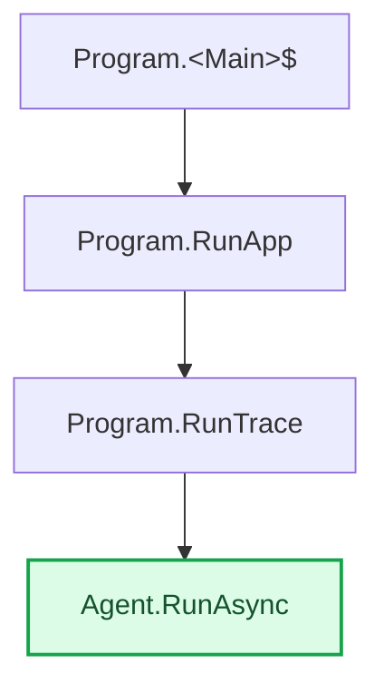

```mermaid
flowchart TD
    n0["Agent.RunAsync"]
    n1["Agent.Bootstrap"]
    n2["Agent.TryAllPaths"]
    n3["Agent.TryAutoPath"]
    n4["Agent.Finish"]
    n5["Agent.GetAction"]
    n6["Agent.Canonical"]
    n7["Agent.SuggestPairs"]
    n8["Agent.Dispatch"]
    n9["RoslynIndex.MethodsInFile"]
    n10["Agent.Annotator"]
    n11["RoslynIndex.FindPath"]
    n12["RoslynIndex.FindCallers"]
    n13["Diagram.Section"]
    n14["Diagram.FromTraceText"]
    n15["Agent.SummarizeChain"]
    n16["Agent.SimplifyForKid"]
    n17["LlmClient.ChatAsync"]
    n18["Agent.ValidateArgs"]
    n19["RoslynIndex.FindSymbol"]
    n20["Agent.S"]
    n21["RoslynIndex.Outline"]
    n22["RoslynIndex.GetMethod"]
    n23["RoslynIndex.FindCallees"]
    n24["RoslynIndex.FindReferences"]
    n25["RoslynIndex.ReadFile"]
    n26["Agent.I"]
    n27["RoslynIndex.Grep"]
    n28["RoslynIndex.ResolveMethod"]
    n29["RoslynIndex.RenderPath"]
    n30["RoslynIndex.Sig"]
    n31["RoslynIndex.Rel"]
    n32["Diagram.Ascii"]
    n33["Diagram.Mermaid"]
    n34["Diagram.SplitPaths"]
    n35["Diagram.ExtractNodes"]
    n36["Graph.Add"]
    n37["Graph.Edge"]
    n38["Graph.Children"]
    n39["LlmClient.BuildOllama"]
    n40["LlmClient.BuildOpenAI"]
    n41["LlmClient.Truncate"]
    n42["Agent.Get"]
    n43["Agent.Has"]
    n44["Agent.Empty"]
    n45["Agent.Need"]
    n46["RoslynIndex.FindDeclarations"]
    n47["RoslynIndex.GetBody"]
    n48["RoslynIndex.WarnIfAmbiguous"]
    n49["RoslynIndex.RepoLink"]
    n50["RoslynIndex.SigNamed"]
    n51["RoslynIndex.MethodBodyWithRaw"]
    n52["RoslynIndex.SnippetUpToCall"]
    n53["Graph.Roots"]
    n54["Diagram.IsLinearChain"]
    n55["Diagram.AsciiBoxes"]
    n56["Diagram.AsciiTree"]
    n57["Diagram.Esc"]
    n58["RoslynIndex.ClipRange"]
    n59["RoslynIndex.RawRange"]
    n60["RoslynIndex.ArgMapping"]
    n61["Graph.HasIncoming"]
    n62["Graph.ById"]
    n63["Diagram.LabelWithTag"]
    n64["Diagram.Walk"]
    n0 --> n1
    n0 --> n2
    n0 --> n3
    n0 --> n4
    n0 --> n5
    n0 --> n6
    n0 --> n7
    n0 --> n8
    n1 --> n9
    n1 --> n7
    n2 --> n10
    n2 --> n11
    n2 --> n12
    n3 --> n10
    n3 --> n11
    n3 --> n12
    n4 --> n13
    n4 --> n14
    n4 --> n15
    n4 --> n16
    n5 --> n17
    n5 --> n18
    n8 --> n19
    n8 --> n20
    n8 --> n21
    n8 --> n22
    n8 --> n12
    n8 --> n23
    n8 --> n24
    n8 --> n11
    n8 --> n25
    n8 --> n26
    n8 --> n27
    n10 --> n17
    n11 --> n28
    n11 --> n29
    n12 --> n28
    n12 --> n30
    n12 --> n31
    n13 --> n32
    n13 --> n33
    n14 --> n34
    n14 --> n35
    n14 --> n36
    n14 --> n37
    n14 --> n38
    n15 --> n17
    n16 --> n17
    n17 --> n39
    n17 --> n40
    n17 --> n41
    n18 --> n42
    n18 --> n43
    n18 --> n44
    n18 --> n45
    n19 --> n46
    n19 --> n31
    n22 --> n28
    n22 --> n47
    n22 --> n30
    n22 --> n31
    n23 --> n28
    n23 --> n47
    n23 --> n30
    n24 --> n28
    n24 --> n31
    n28 --> n46
    n28 --> n48
    n29 --> n31
    n29 --> n30
    n29 --> n49
    n29 --> n50
    n29 --> n51
    n29 --> n52
    n32 --> n53
    n32 --> n54
    n32 --> n55
    n32 --> n56
    n33 --> n57
    n43 --> n42
    n45 --> n43
    n48 --> n31
    n51 --> n47
    n51 --> n58
    n51 --> n59
    n52 --> n47
    n52 --> n58
    n52 --> n49
    n52 --> n31
    n52 --> n60
    n52 --> n59
    n53 --> n61
    n55 --> n62
    n55 --> n38
    n56 --> n62
    n56 --> n63
    n56 --> n38
    n56 --> n64
    n64 --> n62
    n64 --> n63
    n64 --> n38
    classDef entry fill:#dbeafe,stroke:#3b82f6,color:#1e3a8a,stroke-width:2px;
    classDef target fill:#dcfce7,stroke:#16a34a,color:#14532d,stroke-width:2px;
    class n0 entry;
```

**Full `map` example — both directions** (`map --method "Agent.RunAsync"`)

`map` gives a **deterministic reachability overview** from one point — no model, so it's fast and
runs over the whole solution. By default it maps **both directions** and writes **two files**:
*downstream* (what the root calls) and *upstream* (what reaches the root — impact). It's a map, not
a deep-dive: pick an interesting node and run `explain`/`trace` on it for the detail. Reproducible:

```bash
dotnet run -- map -s CodeTracer.sln --method "Agent.RunAsync"
# -> codetracer-map-down-Agent.RunAsync.md  +  codetracer-map-up-Agent.RunAsync.md
```

Both renders below are **exactly as produced** (`gemma4` not needed — 0 model calls). Each result is
an ASCII tree (readable anywhere) **and** a Mermaid graph (renders as graphics on GitHub / VS Code).

---

## ⬇ Downstream — what `Agent.RunAsync` reaches

# Map · Agent.RunAsync · what it calls (downstream / callees)  (Agent.cs:118)
_Deterministic reachability (no model), in-solution calls only, to depth 64. A fast overview — pick an interesting node and run `explain`/`trace` on it for the detail._

## Call-flow
_Everything Agent.RunAsync reaches — deterministic, straight from Roslyn (no model)._

```text
Agent.RunAsync   ◆ start                       Agent.cs:118
├─► Agent.Bootstrap                            Agent.cs:414
│   ├─► RoslynIndex.MethodsInFile              RoslynIndex.cs:592
│   └─► Agent.SuggestPairs                     Agent.cs:465
├─► Agent.TryAllPaths                          Agent.cs:496
│   ├─► Agent.Annotator                        Agent.cs:532
│   │   └─► LlmClient.ChatAsync                LlmClient.cs:87
│   │       ├─► LlmClient.BuildOllama          LlmClient.cs:136
│   │       ├─► LlmClient.BuildOpenAI          LlmClient.cs:159
│   │       └─► LlmClient.Truncate             LlmClient.cs:201
│   ├─► RoslynIndex.FindPath                   RoslynIndex.cs:281
│   │   ├─► RoslynIndex.ResolveMethod          RoslynIndex.cs:76
│   │   │   ├─► RoslynIndex.FindDeclarations   RoslynIndex.cs:56
│   │   │   └─► RoslynIndex.WarnIfAmbiguous    RoslynIndex.cs:100
│   │   │       └─► RoslynIndex.Rel            RoslynIndex.cs:38
│   │   └─► RoslynIndex.RenderPath             RoslynIndex.cs:416
│   │       ├─► RoslynIndex.Rel                RoslynIndex.cs:38
│   │       ├─► RoslynIndex.Sig                RoslynIndex.cs:46
│   │       ├─► RoslynIndex.RepoLink           RoslynIndex.cs:580
│   │       ├─► RoslynIndex.SigNamed           RoslynIndex.cs:50
│   │       ├─► RoslynIndex.MethodBodyWithRaw  RoslynIndex.cs:516
│   │       │   ├─► RoslynIndex.GetBody        RoslynIndex.cs:111
│   │       │   ├─► RoslynIndex.ClipRange      RoslynIndex.cs:559
│   │       │   └─► RoslynIndex.RawRange       RoslynIndex.cs:548
│   │       └─► RoslynIndex.SnippetUpToCall    RoslynIndex.cs:479
│   │           ├─► RoslynIndex.GetBody        RoslynIndex.cs:111
│   │           ├─► RoslynIndex.ClipRange      RoslynIndex.cs:559
│   │           ├─► RoslynIndex.RepoLink       RoslynIndex.cs:580
│   │           ├─► RoslynIndex.Rel            RoslynIndex.cs:38
│   │           ├─► RoslynIndex.ArgMapping     RoslynIndex.cs:532
│   │           └─► RoslynIndex.RawRange       RoslynIndex.cs:548
│   └─► RoslynIndex.FindCallers                RoslynIndex.cs:183
│       ├─► RoslynIndex.ResolveMethod          RoslynIndex.cs:76
│       │   ├─► RoslynIndex.FindDeclarations   RoslynIndex.cs:56
│       │   └─► RoslynIndex.WarnIfAmbiguous    RoslynIndex.cs:100
│       │       └─► RoslynIndex.Rel            RoslynIndex.cs:38
│       ├─► RoslynIndex.Sig                    RoslynIndex.cs:46
│       └─► RoslynIndex.Rel                    RoslynIndex.cs:38
├─► Agent.TryAutoPath                          Agent.cs:474
│   ├─► Agent.Annotator                        Agent.cs:532
│   │   └─► LlmClient.ChatAsync                LlmClient.cs:87
│   │       ├─► LlmClient.BuildOllama          LlmClient.cs:136
│   │       ├─► LlmClient.BuildOpenAI          LlmClient.cs:159
│   │       └─► LlmClient.Truncate             LlmClient.cs:201
│   ├─► RoslynIndex.FindPath                   RoslynIndex.cs:281
│   │   ├─► RoslynIndex.ResolveMethod          RoslynIndex.cs:76
│   │   │   ├─► RoslynIndex.FindDeclarations   RoslynIndex.cs:56
│   │   │   └─► RoslynIndex.WarnIfAmbiguous    RoslynIndex.cs:100
│   │   │       └─► RoslynIndex.Rel            RoslynIndex.cs:38
│   │   └─► RoslynIndex.RenderPath             RoslynIndex.cs:416
│   │       ├─► RoslynIndex.Rel                RoslynIndex.cs:38
│   │       ├─► RoslynIndex.Sig                RoslynIndex.cs:46
│   │       ├─► RoslynIndex.RepoLink           RoslynIndex.cs:580
│   │       ├─► RoslynIndex.SigNamed           RoslynIndex.cs:50
│   │       ├─► RoslynIndex.MethodBodyWithRaw  RoslynIndex.cs:516
│   │       │   ├─► RoslynIndex.GetBody        RoslynIndex.cs:111
│   │       │   ├─► RoslynIndex.ClipRange      RoslynIndex.cs:559
│   │       │   └─► RoslynIndex.RawRange       RoslynIndex.cs:548
│   │       └─► RoslynIndex.SnippetUpToCall    RoslynIndex.cs:479
│   │           ├─► RoslynIndex.GetBody        RoslynIndex.cs:111
│   │           ├─► RoslynIndex.ClipRange      RoslynIndex.cs:559
│   │           ├─► RoslynIndex.RepoLink       RoslynIndex.cs:580
│   │           ├─► RoslynIndex.Rel            RoslynIndex.cs:38
│   │           ├─► RoslynIndex.ArgMapping     RoslynIndex.cs:532
│   │           └─► RoslynIndex.RawRange       RoslynIndex.cs:548
│   └─► RoslynIndex.FindCallers                RoslynIndex.cs:183
│       ├─► RoslynIndex.ResolveMethod          RoslynIndex.cs:76
│       │   ├─► RoslynIndex.FindDeclarations   RoslynIndex.cs:56
│       │   └─► RoslynIndex.WarnIfAmbiguous    RoslynIndex.cs:100
│       │       └─► RoslynIndex.Rel            RoslynIndex.cs:38
│       ├─► RoslynIndex.Sig                    RoslynIndex.cs:46
│       └─► RoslynIndex.Rel                    RoslynIndex.cs:38
├─► Agent.Finish                               Agent.cs:327
│   ├─► Diagram.Section                        Diagram.cs:70
│   │   ├─► Diagram.Ascii                      Diagram.cs:151
│   │   │   ├─► Graph.Roots                    Diagram.cs:56
│   │   │   │   └─► Graph.HasIncoming          Diagram.cs:53
│   │   │   ├─► Diagram.IsLinearChain          Diagram.cs:277
│   │   │   ├─► Diagram.AsciiBoxes             Diagram.cs:158
│   │   │   │   ├─► Graph.ById                 Diagram.cs:51
│   │   │   │   └─► Graph.Children             Diagram.cs:52
│   │   │   └─► Diagram.AsciiTree              Diagram.cs:198
│   │   │       ├─► Graph.ById                 Diagram.cs:51
│   │   │       ├─► Diagram.LabelWithTag       Diagram.cs:268
│   │   │       ├─► Graph.Children             Diagram.cs:52
│   │   │       └─► Diagram.Walk               Diagram.cs:204
│   │   │           ├─► Graph.ById             Diagram.cs:51
│   │   │           ├─► Diagram.LabelWithTag   Diagram.cs:268
│   │   │           └─► Graph.Children         Diagram.cs:52
│   │   └─► Diagram.Mermaid                    Diagram.cs:243
│   │       └─► Diagram.Esc                    Diagram.cs:273
│   ├─► Diagram.FromTraceText                  Diagram.cs:125
│   │   ├─► Diagram.SplitPaths                 Diagram.cs:306
│   │   ├─► Diagram.ExtractNodes               Diagram.cs:338
│   │   ├─► Graph.Add                          Diagram.cs:31
│   │   ├─► Graph.Edge                         Diagram.cs:45
│   │   └─► Graph.Children                     Diagram.cs:52
│   ├─► Agent.SummarizeChain                   Agent.cs:367
│   │   └─► LlmClient.ChatAsync                LlmClient.cs:87
│   │       ├─► LlmClient.BuildOllama          LlmClient.cs:136
│   │       ├─► LlmClient.BuildOpenAI          LlmClient.cs:159
│   │       └─► LlmClient.Truncate             LlmClient.cs:201
│   └─► Agent.SimplifyForKid                   Agent.cs:394
│       └─► LlmClient.ChatAsync                LlmClient.cs:87
│           ├─► LlmClient.BuildOllama          LlmClient.cs:136
│           ├─► LlmClient.BuildOpenAI          LlmClient.cs:159
│           └─► LlmClient.Truncate             LlmClient.cs:201
├─► Agent.GetAction                            Agent.cs:241
│   ├─► LlmClient.ChatAsync                    LlmClient.cs:87
│   │   ├─► LlmClient.BuildOllama              LlmClient.cs:136
│   │   ├─► LlmClient.BuildOpenAI              LlmClient.cs:159
│   │   └─► LlmClient.Truncate                 LlmClient.cs:201
│   └─► Agent.ValidateArgs                     Agent.cs:293
│       ├─► Agent.Get                          Agent.cs:295
│       ├─► Agent.Has                          Agent.cs:297
│       │   └─► Agent.Get                      Agent.cs:295
│       ├─► Agent.Empty                        Agent.cs:317
│       └─► Agent.Need                         Agent.cs:298
│           └─► Agent.Has                      Agent.cs:297
│               └─► Agent.Get                  Agent.cs:295
├─► Agent.Canonical                            Agent.cs:321
├─► Agent.SuggestPairs                         Agent.cs:465
└─► Agent.Dispatch                             Agent.cs:566
    ├─► RoslynIndex.FindSymbol                 RoslynIndex.cs:157
    │   ├─► RoslynIndex.FindDeclarations       RoslynIndex.cs:56
    │   └─► RoslynIndex.Rel                    RoslynIndex.cs:38
    ├─► Agent.S                                Agent.cs:568
    ├─► RoslynIndex.Outline                    RoslynIndex.cs:125
    ├─► RoslynIndex.GetMethod                  RoslynIndex.cs:171
    │   ├─► RoslynIndex.ResolveMethod          RoslynIndex.cs:76
    │   │   ├─► RoslynIndex.FindDeclarations   RoslynIndex.cs:56
    │   │   └─► RoslynIndex.WarnIfAmbiguous    RoslynIndex.cs:100
    │   │       └─► RoslynIndex.Rel            RoslynIndex.cs:38
    │   ├─► RoslynIndex.GetBody                RoslynIndex.cs:111
    │   ├─► RoslynIndex.Sig                    RoslynIndex.cs:46
    │   └─► RoslynIndex.Rel                    RoslynIndex.cs:38
    ├─► RoslynIndex.FindCallers                RoslynIndex.cs:183
    │   ├─► RoslynIndex.ResolveMethod          RoslynIndex.cs:76
    │   │   ├─► RoslynIndex.FindDeclarations   RoslynIndex.cs:56
    │   │   └─► RoslynIndex.WarnIfAmbiguous    RoslynIndex.cs:100
    │   │       └─► RoslynIndex.Rel            RoslynIndex.cs:38
    │   ├─► RoslynIndex.Sig                    RoslynIndex.cs:46
    │   └─► RoslynIndex.Rel                    RoslynIndex.cs:38
    ├─► RoslynIndex.FindCallees                RoslynIndex.cs:202
    │   ├─► RoslynIndex.ResolveMethod          RoslynIndex.cs:76
    │   │   ├─► RoslynIndex.FindDeclarations   RoslynIndex.cs:56
    │   │   └─► RoslynIndex.WarnIfAmbiguous    RoslynIndex.cs:100
    │   │       └─► RoslynIndex.Rel            RoslynIndex.cs:38
    │   ├─► RoslynIndex.GetBody                RoslynIndex.cs:111
    │   └─► RoslynIndex.Sig                    RoslynIndex.cs:46
    ├─► RoslynIndex.FindReferences             RoslynIndex.cs:225
    │   ├─► RoslynIndex.ResolveMethod          RoslynIndex.cs:76
    │   │   ├─► RoslynIndex.FindDeclarations   RoslynIndex.cs:56
    │   │   └─► RoslynIndex.WarnIfAmbiguous    RoslynIndex.cs:100
    │   │       └─► RoslynIndex.Rel            RoslynIndex.cs:38
    │   └─► RoslynIndex.Rel                    RoslynIndex.cs:38
    ├─► RoslynIndex.FindPath                   RoslynIndex.cs:281
    │   ├─► RoslynIndex.ResolveMethod          RoslynIndex.cs:76
    │   │   ├─► RoslynIndex.FindDeclarations   RoslynIndex.cs:56
    │   │   └─► RoslynIndex.WarnIfAmbiguous    RoslynIndex.cs:100
    │   │       └─► RoslynIndex.Rel            RoslynIndex.cs:38
    │   └─► RoslynIndex.RenderPath             RoslynIndex.cs:416
    │       ├─► RoslynIndex.Rel                RoslynIndex.cs:38
    │       ├─► RoslynIndex.Sig                RoslynIndex.cs:46
    │       ├─► RoslynIndex.RepoLink           RoslynIndex.cs:580
    │       ├─► RoslynIndex.SigNamed           RoslynIndex.cs:50
    │       ├─► RoslynIndex.MethodBodyWithRaw  RoslynIndex.cs:516
    │       │   ├─► RoslynIndex.GetBody        RoslynIndex.cs:111
    │       │   ├─► RoslynIndex.ClipRange      RoslynIndex.cs:559
    │       │   └─► RoslynIndex.RawRange       RoslynIndex.cs:548
    │       └─► RoslynIndex.SnippetUpToCall    RoslynIndex.cs:479
    │           ├─► RoslynIndex.GetBody        RoslynIndex.cs:111
    │           ├─► RoslynIndex.ClipRange      RoslynIndex.cs:559
    │           ├─► RoslynIndex.RepoLink       RoslynIndex.cs:580
    │           ├─► RoslynIndex.Rel            RoslynIndex.cs:38
    │           ├─► RoslynIndex.ArgMapping     RoslynIndex.cs:532
    │           └─► RoslynIndex.RawRange       RoslynIndex.cs:548
    ├─► RoslynIndex.ReadFile                   RoslynIndex.cs:241
    ├─► Agent.I                                Agent.cs:570
    └─► RoslynIndex.Grep                       RoslynIndex.cs:254
```



---

## ⬆ Upstream — what reaches `Agent.RunAsync` (impact)

# Map · Agent.RunAsync · what reaches it (upstream / callers — impact)  (Agent.cs:118)
_Deterministic reachability (no model), in-solution calls only, to depth 64. A fast overview — pick an interesting node and run `explain`/`trace` on it for the detail._

## Call-flow
_Everything that reaches Agent.RunAsync — deterministic, straight from Roslyn (no model)._

```text
┌───────────────────────────┐
│ Program.<Main>$           │   Program.cs:1
└─────────────┬─────────────┘
              ▼  calls
┌───────────────────────────┐
│ Program.RunApp            │   Program.cs:13
└─────────────┬─────────────┘
              ▼  calls
┌───────────────────────────┐
│ Program.RunTrace          │   Program.cs:26
└─────────────┬─────────────┘
              ▼  calls
┌───────────────────────────┐
│ Agent.RunAsync   ★ target │   Agent.cs:118
└───────────────────────────┘
```


