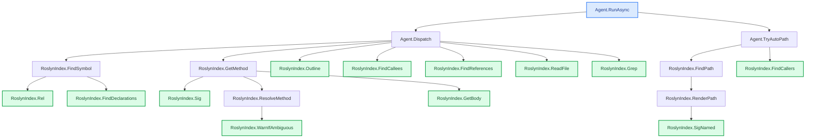

# Trace example — all paths (`--all-paths`) with a summary

Real brute-force output: **every distinct path** from `Agent.cs` to `RoslynIndex.cs`,
deterministic (zero model calls for the path-finding). Each path is clearly **separated by a
`---` rule**; `--repo-url` turns each `file:line` into a clickable link; `--summary` adds the
closing LLM summary (the only model call). Reproducible from this repo:

```bash
dotnet run -- trace -s CodeTracer.sln -f RoslynIndex.cs -e Agent.cs --all-paths --no-llm \
  --summary --repo-url https://github.com/janjanusek/code_tracer/blob/main
```

`--all-paths` enumerates **all** ways the entry reaches the target class, not just the first/
shortest — for non-trivial code where one path isn't the whole picture. (For one path *with the
code* between hops, see [`trace-with-bodies.md`](trace-with-bodies.md).)

> _Run: ~98 s · 1 model call (the summary; the 15 paths are deterministic) · in 3759 / out 768
> tokens · gemma4:latest, CPU-only, no GPU._

FOUND 15 distinct path(s) [brute-force]:

### Path 1:  Agent.RunAsync  ->  RoslynIndex.Rel
PATH FOUND (4 nodes):
  1. Agent.RunAsync(String, String, String)   [Agent.cs:118](https://github.com/janjanusek/code_tracer/blob/main/Agent.cs#L118)  -->
  2. Agent.Dispatch(String, JsonElement)   [Agent.cs:520](https://github.com/janjanusek/code_tracer/blob/main/Agent.cs#L520)  -->
  3. RoslynIndex.FindSymbol(String)   [RoslynIndex.cs:157](https://github.com/janjanusek/code_tracer/blob/main/RoslynIndex.cs#L157)  -->
  4. RoslynIndex.Rel(Location)   [RoslynIndex.cs:38](https://github.com/janjanusek/code_tracer/blob/main/RoslynIndex.cs#L38)

---

### Path 2:  Agent.RunAsync  ->  RoslynIndex.Sig
PATH FOUND (4 nodes):
  1. Agent.RunAsync(String, String, String)   [Agent.cs:118](https://github.com/janjanusek/code_tracer/blob/main/Agent.cs#L118)  -->
  2. Agent.Dispatch(String, JsonElement)   [Agent.cs:520](https://github.com/janjanusek/code_tracer/blob/main/Agent.cs#L520)  -->
  3. RoslynIndex.GetMethod(String, String)   [RoslynIndex.cs:171](https://github.com/janjanusek/code_tracer/blob/main/RoslynIndex.cs#L171)  -->
  4. RoslynIndex.Sig(IMethodSymbol)   [RoslynIndex.cs:46](https://github.com/janjanusek/code_tracer/blob/main/RoslynIndex.cs#L46)

---

### Path 3:  Agent.RunAsync  ->  RoslynIndex.SigNamed
PATH FOUND (5 nodes):
  1. Agent.RunAsync(String, String, String)   [Agent.cs:118](https://github.com/janjanusek/code_tracer/blob/main/Agent.cs#L118)  -->
  2. Agent.TryAutoPath()   [Agent.cs:428](https://github.com/janjanusek/code_tracer/blob/main/Agent.cs#L428)  -->
  3. RoslynIndex.FindPath(String, String, String, String, Int32, Boolean, String, Func)   [RoslynIndex.cs:281](https://github.com/janjanusek/code_tracer/blob/main/RoslynIndex.cs#L281)  -->
  4. RoslynIndex.RenderPath(List, Boolean, String, Func)   [RoslynIndex.cs:336](https://github.com/janjanusek/code_tracer/blob/main/RoslynIndex.cs#L336)  -->
  5. RoslynIndex.SigNamed(IMethodSymbol)   [RoslynIndex.cs:50](https://github.com/janjanusek/code_tracer/blob/main/RoslynIndex.cs#L50)

---

### Path 4:  Agent.RunAsync  ->  RoslynIndex.FindDeclarations
PATH FOUND (4 nodes):
  1. Agent.RunAsync(String, String, String)   [Agent.cs:118](https://github.com/janjanusek/code_tracer/blob/main/Agent.cs#L118)  -->
  2. Agent.Dispatch(String, JsonElement)   [Agent.cs:520](https://github.com/janjanusek/code_tracer/blob/main/Agent.cs#L520)  -->
  3. RoslynIndex.FindSymbol(String)   [RoslynIndex.cs:157](https://github.com/janjanusek/code_tracer/blob/main/RoslynIndex.cs#L157)  -->
  4. RoslynIndex.FindDeclarations(String)   [RoslynIndex.cs:56](https://github.com/janjanusek/code_tracer/blob/main/RoslynIndex.cs#L56)

---

### Path 5:  Agent.RunAsync  ->  RoslynIndex.ResolveMethod
PATH FOUND (4 nodes):
  1. Agent.RunAsync(String, String, String)   [Agent.cs:118](https://github.com/janjanusek/code_tracer/blob/main/Agent.cs#L118)  -->
  2. Agent.Dispatch(String, JsonElement)   [Agent.cs:520](https://github.com/janjanusek/code_tracer/blob/main/Agent.cs#L520)  -->
  3. RoslynIndex.GetMethod(String, String)   [RoslynIndex.cs:171](https://github.com/janjanusek/code_tracer/blob/main/RoslynIndex.cs#L171)  -->
  4. RoslynIndex.ResolveMethod(String, String)   [RoslynIndex.cs:76](https://github.com/janjanusek/code_tracer/blob/main/RoslynIndex.cs#L76)

---

### Path 6:  Agent.RunAsync  ->  RoslynIndex.WarnIfAmbiguous
PATH FOUND (5 nodes):
  1. Agent.RunAsync(String, String, String)   [Agent.cs:118](https://github.com/janjanusek/code_tracer/blob/main/Agent.cs#L118)  -->
  2. Agent.Dispatch(String, JsonElement)   [Agent.cs:520](https://github.com/janjanusek/code_tracer/blob/main/Agent.cs#L520)  -->
  3. RoslynIndex.GetMethod(String, String)   [RoslynIndex.cs:171](https://github.com/janjanusek/code_tracer/blob/main/RoslynIndex.cs#L171)  -->
  4. RoslynIndex.ResolveMethod(String, String)   [RoslynIndex.cs:76](https://github.com/janjanusek/code_tracer/blob/main/RoslynIndex.cs#L76)  -->
  5. RoslynIndex.WarnIfAmbiguous(String, List)   [RoslynIndex.cs:100](https://github.com/janjanusek/code_tracer/blob/main/RoslynIndex.cs#L100)

---

### Path 7:  Agent.RunAsync  ->  RoslynIndex.GetBody
PATH FOUND (4 nodes):
  1. Agent.RunAsync(String, String, String)   [Agent.cs:118](https://github.com/janjanusek/code_tracer/blob/main/Agent.cs#L118)  -->
  2. Agent.Dispatch(String, JsonElement)   [Agent.cs:520](https://github.com/janjanusek/code_tracer/blob/main/Agent.cs#L520)  -->
  3. RoslynIndex.GetMethod(String, String)   [RoslynIndex.cs:171](https://github.com/janjanusek/code_tracer/blob/main/RoslynIndex.cs#L171)  -->
  4. RoslynIndex.GetBody(IMethodSymbol)   [RoslynIndex.cs:111](https://github.com/janjanusek/code_tracer/blob/main/RoslynIndex.cs#L111)

---

### Path 8:  Agent.RunAsync  ->  RoslynIndex.Outline
PATH FOUND (3 nodes):
  1. Agent.RunAsync(String, String, String)   [Agent.cs:118](https://github.com/janjanusek/code_tracer/blob/main/Agent.cs#L118)  -->
  2. Agent.Dispatch(String, JsonElement)   [Agent.cs:520](https://github.com/janjanusek/code_tracer/blob/main/Agent.cs#L520)  -->
  3. RoslynIndex.Outline(String)   [RoslynIndex.cs:125](https://github.com/janjanusek/code_tracer/blob/main/RoslynIndex.cs#L125)

---

### Path 9:  Agent.RunAsync  ->  RoslynIndex.FindSymbol
PATH FOUND (3 nodes):
  1. Agent.RunAsync(String, String, String)   [Agent.cs:118](https://github.com/janjanusek/code_tracer/blob/main/Agent.cs#L118)  -->
  2. Agent.Dispatch(String, JsonElement)   [Agent.cs:520](https://github.com/janjanusek/code_tracer/blob/main/Agent.cs#L520)  -->
  3. RoslynIndex.FindSymbol(String)   [RoslynIndex.cs:157](https://github.com/janjanusek/code_tracer/blob/main/RoslynIndex.cs#L157)

---

### Path 10:  Agent.RunAsync  ->  RoslynIndex.GetMethod
PATH FOUND (3 nodes):
  1. Agent.RunAsync(String, String, String)   [Agent.cs:118](https://github.com/janjanusek/code_tracer/blob/main/Agent.cs#L118)  -->
  2. Agent.Dispatch(String, JsonElement)   [Agent.cs:520](https://github.com/janjanusek/code_tracer/blob/main/Agent.cs#L520)  -->
  3. RoslynIndex.GetMethod(String, String)   [RoslynIndex.cs:171](https://github.com/janjanusek/code_tracer/blob/main/RoslynIndex.cs#L171)

---

### Path 11:  Agent.RunAsync  ->  RoslynIndex.FindCallers
PATH FOUND (3 nodes):
  1. Agent.RunAsync(String, String, String)   [Agent.cs:118](https://github.com/janjanusek/code_tracer/blob/main/Agent.cs#L118)  -->
  2. Agent.TryAutoPath()   [Agent.cs:428](https://github.com/janjanusek/code_tracer/blob/main/Agent.cs#L428)  -->
  3. RoslynIndex.FindCallers(String, String)   [RoslynIndex.cs:183](https://github.com/janjanusek/code_tracer/blob/main/RoslynIndex.cs#L183)

---

### Path 12:  Agent.RunAsync  ->  RoslynIndex.FindCallees
PATH FOUND (3 nodes):
  1. Agent.RunAsync(String, String, String)   [Agent.cs:118](https://github.com/janjanusek/code_tracer/blob/main/Agent.cs#L118)  -->
  2. Agent.Dispatch(String, JsonElement)   [Agent.cs:520](https://github.com/janjanusek/code_tracer/blob/main/Agent.cs#L520)  -->
  3. RoslynIndex.FindCallees(String, String)   [RoslynIndex.cs:202](https://github.com/janjanusek/code_tracer/blob/main/RoslynIndex.cs#L202)

---

### Path 13:  Agent.RunAsync  ->  RoslynIndex.FindReferences
PATH FOUND (3 nodes):
  1. Agent.RunAsync(String, String, String)   [Agent.cs:118](https://github.com/janjanusek/code_tracer/blob/main/Agent.cs#L118)  -->
  2. Agent.Dispatch(String, JsonElement)   [Agent.cs:520](https://github.com/janjanusek/code_tracer/blob/main/Agent.cs#L520)  -->
  3. RoslynIndex.FindReferences(String, String)   [RoslynIndex.cs:225](https://github.com/janjanusek/code_tracer/blob/main/RoslynIndex.cs#L225)

---

### Path 14:  Agent.RunAsync  ->  RoslynIndex.ReadFile
PATH FOUND (3 nodes):
  1. Agent.RunAsync(String, String, String)   [Agent.cs:118](https://github.com/janjanusek/code_tracer/blob/main/Agent.cs#L118)  -->
  2. Agent.Dispatch(String, JsonElement)   [Agent.cs:520](https://github.com/janjanusek/code_tracer/blob/main/Agent.cs#L520)  -->
  3. RoslynIndex.ReadFile(String, Int32, Int32)   [RoslynIndex.cs:241](https://github.com/janjanusek/code_tracer/blob/main/RoslynIndex.cs#L241)

---

### Path 15:  Agent.RunAsync  ->  RoslynIndex.Grep
PATH FOUND (3 nodes):
  1. Agent.RunAsync(String, String, String)   [Agent.cs:118](https://github.com/janjanusek/code_tracer/blob/main/Agent.cs#L118)  -->
  2. Agent.Dispatch(String, JsonElement)   [Agent.cs:520](https://github.com/janjanusek/code_tracer/blob/main/Agent.cs#L520)  -->
  3. RoslynIndex.Grep(String)   [RoslynIndex.cs:254](https://github.com/janjanusek/code_tracer/blob/main/RoslynIndex.cs#L254)

## Summary

This call chain traces how a high-level agent system executes complex code analysis queries
against an indexed codebase using Roslyn APIs. It provides the mechanism for IDE-style features
like symbol lookup and navigation within a large C# project.

#### 1. What it does / purpose
The primary function is to **translate user intent (via `Agent.RunAsync`) into specific code
analysis operations** using Roslyn. It acts as an abstraction layer that lets the system:
*   Resolve symbols and types (`FindSymbol`, `Sig`).
*   Determine method signatures and parameters (`GetMethod`, `SigNamed`).
*   Analyze code structure (finding references, callers, or reading file contents).

#### 2. Dependencies
*   **`Agent` class:** the entry point for all operations; it parses and routes the request via
    `Agent.Dispatch`.
*   **Roslyn API (`RoslynIndex`):** the core dependency — it wraps the Roslyn compiler services
    (`FindSymbol`, `GetMethod`, `Grep`, …) to interact with the semantic model.

#### 3. Good to know
*   **Execution flow:** almost all paths follow `Agent.RunAsync → Agent.Dispatch → a specific
    RoslynIndex method`, confirming that `Dispatch` routes the request payload (JSON) to the
    correct analysis function. A few go through `Agent.TryAutoPath` instead.
*   **Path variation:** the variation (e.g. Path 1 vs. Path 2) shows that even for similar goals
    (looking up a symbol), different internal methods (`FindSymbol` vs. `GetMethod`) are used
    depending on the query.

All 15 paths merged into one **`## Call-flow`** map — the auto-generated diagram that ends
every trace. Each branch is a way `Agent.RunAsync` reaches a method in `RoslynIndex`; the
`★ target` markers sit on the leaves where the chains actually bottom out:

## Call-flow
_The path the analysis found — deterministic, straight from Roslyn (no model)._

```text
Agent.RunAsync   ◆ start                                Agent.cs:118
├─► Agent.Dispatch                                      Agent.cs:563
│   ├─► RoslynIndex.FindSymbol                          RoslynIndex.cs:157
│   │   ├─► RoslynIndex.Rel   ★ target                  RoslynIndex.cs:38
│   │   └─► RoslynIndex.FindDeclarations   ★ target     RoslynIndex.cs:56
│   ├─► RoslynIndex.GetMethod                           RoslynIndex.cs:171
│   │   ├─► RoslynIndex.Sig   ★ target                  RoslynIndex.cs:46
│   │   ├─► RoslynIndex.ResolveMethod                   RoslynIndex.cs:76
│   │   │   └─► RoslynIndex.WarnIfAmbiguous   ★ target  RoslynIndex.cs:100
│   │   └─► RoslynIndex.GetBody   ★ target              RoslynIndex.cs:111
│   ├─► RoslynIndex.Outline   ★ target                  RoslynIndex.cs:125
│   ├─► RoslynIndex.FindCallees   ★ target              RoslynIndex.cs:202
│   ├─► RoslynIndex.FindReferences   ★ target           RoslynIndex.cs:225
│   ├─► RoslynIndex.ReadFile   ★ target                 RoslynIndex.cs:241
│   └─► RoslynIndex.Grep   ★ target                     RoslynIndex.cs:254
└─► Agent.TryAutoPath                                   Agent.cs:471
    ├─► RoslynIndex.FindPath                            RoslynIndex.cs:281
    │   └─► RoslynIndex.RenderPath                      RoslynIndex.cs:416
    │       └─► RoslynIndex.SigNamed   ★ target         RoslynIndex.cs:50
    └─► RoslynIndex.FindCallers   ★ target              RoslynIndex.cs:183
```



