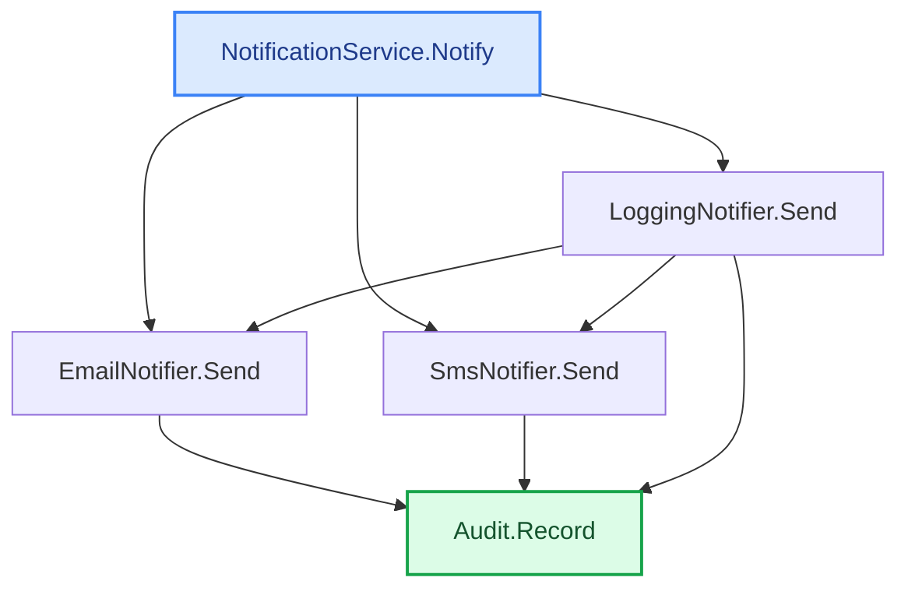

# Trace example — DI / interfaces, multiple implementations

This is the case that matters in real enterprise code: a call goes **through an interface**, the
interface has **several implementations**, and **more than one reaches the target**. CodeTracer
follows the interface to its implementations (Roslyn cascades `FindCallersAsync` through
interface members) and, with `--all-paths`, lists **every** distinct path.

Run against [`samples/di-playground`](../samples/di-playground) — `NotificationService.Notify`
calls `INotifier.Send` (an interface; DI decides the impl); `INotifier` has 3 implementations,
and `LoggingNotifier` is a **decorator** that wraps another `INotifier`. All of them reach
`Audit.Record`. Deterministic, **zero model calls**. Reproducible:

```bash
dotnet run -- trace -s samples/di-playground/DiPlayground.sln \
  --from "NotificationService.Notify" --to "Audit.Record" --all-paths --no-llm
```

```
FOUND 5 distinct path(s) [all]:

### Path 1:  NotificationService.Notify  ->  Audit.Record
  1. NotificationService.Notify(String)   Services.cs:10  -->
  2. EmailNotifier.Send(String)   Notifications.cs:13  -->
  3. Audit.Record(String, String)   Audit.cs:8

---

### Path 2:  NotificationService.Notify  ->  Audit.Record
  1. NotificationService.Notify(String)   Services.cs:10  -->
  2. SmsNotifier.Send(String)   Notifications.cs:23  -->
  3. Audit.Record(String, String)   Audit.cs:8

---

### Path 3:  NotificationService.Notify  ->  Audit.Record
  1. NotificationService.Notify(String)   Services.cs:10  -->
  2. LoggingNotifier.Send(String)   Notifications.cs:36  -->
  3. Audit.Record(String, String)   Audit.cs:8

---

### Path 4:  NotificationService.Notify  ->  Audit.Record
  1. NotificationService.Notify(String)   Services.cs:10  -->
  2. LoggingNotifier.Send(String)   Notifications.cs:36  -->
  3. EmailNotifier.Send(String)   Notifications.cs:13  -->
  4. Audit.Record(String, String)   Audit.cs:8

---

### Path 5:  NotificationService.Notify  ->  Audit.Record
  1. NotificationService.Notify(String)   Services.cs:10  -->
  2. LoggingNotifier.Send(String)   Notifications.cs:36  -->
  3. SmsNotifier.Send(String)   Notifications.cs:23  -->
  4. Audit.Record(String, String)   Audit.cs:8
```

The result then ends with an auto-generated **`## Call-flow`** — the DI fan-out drawn as a
branching tree (ASCII, readable anywhere) plus a Mermaid graph that renders on GitHub / VS Code.
This is the "from the side" view: three implementations diverge from `Notify` and **all converge
on `Audit.Record`**, and the decorator (`LoggingNotifier`) shows up as the extra nesting:

## Call-flow
_The path the analysis found — deterministic, straight from Roslyn (no model)._

```text
NotificationService.Notify   ◆ start  Services.cs:10
├─► EmailNotifier.Send                Notifications.cs:13
│   └─► Audit.Record   ★ target       Audit.cs:8
├─► SmsNotifier.Send                  Notifications.cs:23
│   └─► Audit.Record   ★ target       Audit.cs:8
└─► LoggingNotifier.Send              Notifications.cs:36
    ├─► Audit.Record   ★ target       Audit.cs:8
    ├─► EmailNotifier.Send            Notifications.cs:13
    │   └─► Audit.Record   ★ target   Audit.cs:8
    └─► SmsNotifier.Send              Notifications.cs:23
        └─► Audit.Record   ★ target   Audit.cs:8
```



**Notes**
- `Notify` only ever writes `_notifier.Send(...)` against the `INotifier` interface — yet all
  three concrete `Send` implementations are found (paths 1-3).
- The **decorator** (`LoggingNotifier`, which holds another `INotifier` and calls it) produces
  the nested paths 4-5: `Notify → LoggingNotifier.Send → EmailNotifier/SmsNotifier.Send → Audit`.
  In the Mermaid graph this is the `LoggingNotifier.Send` node with edges to the other two
  implementations as well as straight to `Audit.Record`.
- Without `--all-paths` you get the single shortest path; with it you get the full set of
  candidates. Kept compact — just the paths and the call-flow map, no code bodies and no model
  summary — so every candidate is visible at a glance.
