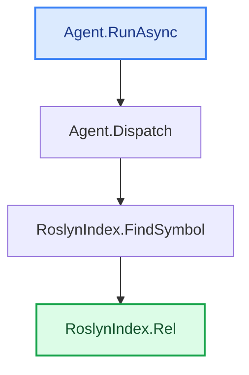

**Full `trace` example — everything on** (`--with-bodies --annotate --summary`)

Everything a dev gets from a trace, in one file: the discovered path with the **code between every
hop** (each method from its start down to where it calls the next, with the argument → parameter
mapping), a short LLM **"why" note per hop** (`--annotate`), a final **Summary** + **"In plain
words"** recap (`--summary`), and the auto **`## Call-flow`** diagram. The chart **reuses those
per-hop notes** as a one-liner on each node — so the diagram alone explains the whole path, for
free (no extra model calls). Path-finding is deterministic (zero model calls); the model only
writes the notes and the summary. Sections with nothing to report are **omitted, not padded**.
Reproducible (needs the model running):

```bash
dotnet run -- trace -s CodeTracer.sln -f RoslynIndex.cs -e Agent.cs --with-bodies --annotate --summary \
  --repo-url https://github.com/janjanusek/code_tracer/blob/main
```

> _Run: ~85 s · 6 model calls (per-hop "why" notes + Summary + the plain-words recap) ·
> in 4694 / out 641 tokens · gemma4:latest, CPU-only, no GPU. Auto-saves if you omit `--out`._

---

(find_path Agent.RunAsync -> RoslynIndex.Rel)
PATH FOUND (4 nodes):

**1. Agent.RunAsync(String solutionPath, String targetFile, String endpoint)**   [Agent.cs:118](https://github.com/janjanusek/code_tracer/blob/main/Agent.cs#L118)
> _Executes model-requested external tool call and processes observation_

```csharp
  118      public async Task RunAsync(string solutionPath, string targetFile, string endpoint)
  119      {
  120          var seed = Bootstrap(targetFile, endpoint);
  121  
  122          // Deterministic pre-flight: try candidate find_path pairs IMMEDIATELY. On CPU this is
  123          // faster and more reliable than waiting for (often under-filled) model calls. Roslyn
  124          // is the source of truth; the model is here only to navigate harder cases (interface/DI/events).
  125          // --all-paths/--brute: enumerate ALL paths (deep), not just the first shortest one.
  126          var mode = _allPaths ? "brute-force (all paths)" : "first path";
  127          Console.WriteLine($"[pre-flight] deterministic find_path over {_pairs.Count} candidate pairs [{mode}]...");
  128          var deterministic = _allPaths ? await TryAllPaths() : await TryAutoPath();
  129          if (deterministic.Contains("PATH FOUND"))
  130          {
  131              await Finish(deterministic, _allPaths ? "brute-force" : "pre-flight");
  132              return;
  133          }
  134          if (!_useLlm)
  135          {
  136              Console.WriteLine("[pre-flight] no direct path and --no-llm set - stopping.");
  137              await Finish(deterministic, "deterministic");
  138              return;
  139          }
  140          Console.WriteLine("[pre-flight] no direct path - handing over to the model loop...");
  141  
  142          var messages = new List<ChatMsg>
  143          {
  144              new("system", SystemPrompt),
  145              new("user", seed)
  146          };
  147  
  148          var seen = new HashSet<string>();
  149          int escalations = 0;
  150  
  151          for (int step = 1; step <= _maxSteps; step++)
  152          {
  153              var act = await GetAction(messages);
  154              if (act == null)
  155              {
  156                  // model could not produce a valid action even after corrections -> deterministic escalation
  157                  Console.WriteLine("\n[auto] model gave no valid action - using deterministic result...");
  158                  await Finish(_lastPath ?? deterministic, "auto");
  159                  return;
  160              }
  161  
  162              var (tool, args, raw) = act.Value;
  163              Console.WriteLine($"\n===== STEP {step} =====\n{raw}");
  164  
  165              if (tool == "finish")
  166              {
  167                  var pathText = _lastPath ?? await TryAutoPath();
      // … (19 lines omitted) …
  187                  }
  188  
  189                  // model is looping -> use deterministic result (within 2 steps)
  190                  Console.WriteLine("[auto] loop detected - using deterministic result...");
  191                  await Finish(_lastPath ?? deterministic, "auto");
  192                  return;
  193              }
  194  
  195              string observation;
  196              try { observation = await Dispatch(tool, args); }
```
_call site: [Agent.cs:196](https://github.com/janjanusek/code_tracer/blob/main/Agent.cs#L196)  ·  args: tool → tool, args → a_

↓ calls **Agent.Dispatch(String tool, JsonElement a)**

**2. Agent.Dispatch(String tool, JsonElement a)**   [Agent.cs:566](https://github.com/janjanusek/code_tracer/blob/main/Agent.cs#L566)
> _Extracts symbol name from JSON and queries Roslyn index for symbol details_

```csharp
  566      private async Task<string> Dispatch(string tool, JsonElement a)
  567      {
  568          string S(string k) => a.TryGetProperty(k, out var v) && v.ValueKind == JsonValueKind.String
  569              ? (v.GetString() ?? "") : "";
  570          int I(string k, int def) => a.TryGetProperty(k, out var v) && v.TryGetInt32(out var n) ? n : def;
  571  
  572          return tool switch
  573          {
  574              "find_symbol"     => await _index.FindSymbol(S("name")),
```
_call site: [Agent.cs:574](https://github.com/janjanusek/code_tracer/blob/main/Agent.cs#L574)  ·  args: S("name") → name_

↓ calls **RoslynIndex.FindSymbol(String name)**

**3. RoslynIndex.FindSymbol(String name)**   [RoslynIndex.cs:157](https://github.com/janjanusek/code_tracer/blob/main/RoslynIndex.cs#L157)
> _Converts location object into a readable source code snippet_

```csharp
  157      public async Task<string> FindSymbol(string name)
  158      {
  159          var decls = await FindDeclarations(name);
  160          if (decls.Count == 0) return $"no declaration '{name}'";
  161          var sb = new System.Text.StringBuilder();
  162          foreach (var s in decls.Take(40))
  163          {
  164              var loc = s.Locations.FirstOrDefault(l => l.IsInSource);
  165              var where = loc != null ? Rel(loc) : "?";
```
_call site: [RoslynIndex.cs:165](https://github.com/janjanusek/code_tracer/blob/main/RoslynIndex.cs#L165)  ·  args: loc → loc_

↓ calls **RoslynIndex.Rel(Location loc)**

**4. RoslynIndex.Rel(Location loc)**   [RoslynIndex.cs:38](https://github.com/janjanusek/code_tracer/blob/main/RoslynIndex.cs#L38)  (target)
> _Formats location into file path and line number string_

```csharp
   38      private string Rel(Location loc)
   39      {
   40          var span = loc.GetLineSpan();
   41          var path = span.Path;
   42          try { path = Path.GetRelativePath(SolutionDir, path); } catch { /* keep absolute */ }
   43          return $"{path}:{span.StartLinePosition.Line + 1}";
   44      }
```

## Summary
### Summary for Developer

**What it does / purpose**
This call chain executes an AI agent's workflow to determine potential code paths or symbols within a solution. It first attempts a deterministic "pre-flight" path finding using the Roslyn index. If that fails, it enters a model loop where the LLM suggests tools (like `find_symbol`), which are then executed by querying the static analysis index (`RoslynIndex`) to retrieve code details and locations.

**Dependencies**
*   **`RoslynIndex`:** The core dependency, providing static analysis capabilities (e.g., finding declarations, resolving symbols).
*   **Location/File System APIs:** Used heavily in `RoslynIndex.Rel` to format the location object into a readable file path and line number string relative to the solution directory.

**Good to know**
The system prioritizes deterministic code analysis over model output. If an initial path is found during the pre-flight check (Lines 122-132), the agent will finish immediately without needing the LLM. The `RoslynIndex` acts as the "source of truth" for code structure, while the LLM handles complex navigation logic (like interface or DI resolution).

## In plain words
Imagine you have a giant box of LEGO instructions, and you need to figure out how one specific piece fits somewhere.

This code is like a smart helper that tries two ways: First, it checks the official instruction manual (the "pre-flight" check) to see if it can find the answer right away. If the manual is confusing, it asks a super-smart friend (the AI) for ideas, and then uses the manual again to double-check those ideas until it finds the exact spot in the instructions where the piece belongs.

## Call-flow
_The path the analysis found — flow from Roslyn; the one-line note on each node is reused from --annotate (no extra calls)._

```text
┌────────────────────────────┐
│ Agent.RunAsync   ◆ start   │   Agent.cs:118   — Executes model-requested external tool call and processes observation
└──────────────┬─────────────┘
               ▼  calls
┌────────────────────────────┐
│ Agent.Dispatch             │   Agent.cs:566   — Extracts symbol name from JSON and queries Roslyn index for symbol details
└──────────────┬─────────────┘
               ▼  calls
┌────────────────────────────┐
│ RoslynIndex.FindSymbol     │   RoslynIndex.cs:157   — Converts location object into a readable source code snippet
└──────────────┬─────────────┘
               ▼  calls
┌────────────────────────────┐
│ RoslynIndex.Rel   ★ target │   RoslynIndex.cs:38   — Formats location into file path and line number string
└────────────────────────────┘
```


