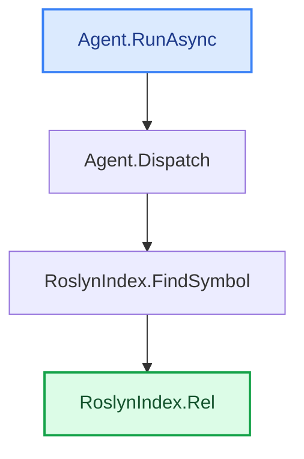

**Micro-model `trace` example — `gemma3n:e2b`** (same run as [`trace-full-example.md`](trace-full-example.md), smaller model)

The **exact same `trace`** as the full example — only the model changes from `gemma4:latest` to the
micro **`gemma3n:e2b`**. Output is real and unedited (the tool maps the `▁` metaspace marker small
models leak back to spaces). Reproducible:

```bash
dotnet run -- trace -s CodeTracer.sln -f RoslynIndex.cs -e Agent.cs --with-bodies --annotate --summary \
  --model gemma3n:e2b --repo-url https://github.com/janjanusek/code_tracer/blob/main
```

**Speed vs quality, same machine (CPU-only), same 6 model calls (path-finding is deterministic):**

| model | total time | in / out tokens | notes |
|---|---:|---|---|
| `gemma4:latest` | ~85 s | 4694 / 641 | the full example |
| `gemma3n:e2b` | **~67 s** | 5166 / 463 | terser notes/summary, still coherent |

> _Unlike `explain` (where the micro model was ~7.8× faster), `trace` barely changes with the model:
> the path-finding is pure Roslyn (zero model calls) and the model only writes the 6 short "why" notes
> + the summary. So for `trace`, model choice is a minor factor — a strong argument for running it on a
> small local model. The notes and summary below are terser than gemma4:latest but stay accurate._

---

(find_path Agent.RunAsync -> RoslynIndex.Rel)
PATH FOUND (4 nodes):

**1. Agent.RunAsync(String solutionPath, String targetFile, String endpoint)**   [Agent.cs:118](https://github.com/janjanusek/code_tracer/blob/main/Agent.cs#L118)
> _Executes the specified tool with its arguments and returns the result_

```csharp
  118      public async Task RunAsync(string solutionPath, string targetFile, string endpoint)
  119      {
  120          var seed = Bootstrap(targetFile, endpoint);
  121  
  122          // Deterministic pre-flight: try candidate find_path pairs IMMEDIATELY. On CPU this is
  123          // faster and more reliable than waiting for (often under-filled) model calls. Roslyn
  124          // is the source of truth; the model is here only to navigate harder cases (interface/DI/events).
  125          // --all-paths/--brute: enumerate ALL paths (deep), not just the first shortest one.
  126          var mode = _allPaths ? "brute-force (all paths)" : "first path";
  127          Console.WriteLine($"[pre-flight] deterministic find_path over {_pairs.Count} candidate pairs [{mode}]...");
  128          var deterministic = _allPaths ? await TryAllPaths() : await TryAutoPath();
  129          if (deterministic.Contains("PATH FOUND"))
  130          {
  131              await Finish(deterministic, _allPaths ? "brute-force" : "pre-flight");
  132              return;
  133          }
  134          if (!_useLlm)
  135          {
  136              Console.WriteLine("[pre-flight] no direct path and --no-llm set - stopping.");
  137              await Finish(deterministic, "deterministic");
  138              return;
  139          }
  140          Console.WriteLine("[pre-flight] no direct path - handing over to the model loop...");
  141  
  142          var messages = new List<ChatMsg>
  143          {
  144              new("system", SystemPrompt),
  145              new("user", seed)
  146          };
  147  
  148          var seen = new HashSet<string>();
  149          int escalations = 0;
  150  
  151          for (int step = 1; step <= _maxSteps; step++)
  152          {
  153              var act = await GetAction(messages);
  154              if (act == null)
  155              {
  156                  // model could not produce a valid action even after corrections -> deterministic escalation
  157                  Console.WriteLine("\n[auto] model gave no valid action - using deterministic result...");
  158                  await Finish(_lastPath ?? deterministic, "auto");
  159                  return;
  160              }
  161  
  162              var (tool, args, raw) = act.Value;
  163              Console.WriteLine($"\n===== STEP {step} =====\n{raw}");
  164  
  165              if (tool == "finish")
  166              {
  167                  var pathText = _lastPath ?? await TryAutoPath();
      // … (19 lines omitted) …
  187                  }
  188  
  189                  // model is looping -> use deterministic result (within 2 steps)
  190                  Console.WriteLine("[auto] loop detected - using deterministic result...");
  191                  await Finish(_lastPath ?? deterministic, "auto");
  192                  return;
  193              }
  194  
  195              string observation;
  196              try { observation = await Dispatch(tool, args); }
```
_call site: [Agent.cs:196](https://github.com/janjanusek/code_tracer/blob/main/Agent.cs#L196)  ·  args: tool → tool, args → a_

↓ calls **Agent.Dispatch(String tool, JsonElement a)**

**2. Agent.Dispatch(String tool, JsonElement a)**   [Agent.cs:566](https://github.com/janjanusek/code_tracer/blob/main/Agent.cs#L566)
> _Retrieves a symbol's name from the JSON element using the "name" property_

```csharp
  566      private async Task<string> Dispatch(string tool, JsonElement a)
  567      {
  568          string S(string k) => a.TryGetProperty(k, out var v) && v.ValueKind == JsonValueKind.String
  569              ? (v.GetString() ?? "") : "";
  570          int I(string k, int def) => a.TryGetProperty(k, out var v) && v.TryGetInt32(out var n) ? n : def;
  571  
  572          return tool switch
  573          {
  574              "find_symbol"     => await _index.FindSymbol(S("name")),
```
_call site: [Agent.cs:574](https://github.com/janjanusek/code_tracer/blob/main/Agent.cs#L574)  ·  args: S("name") → name_

↓ calls **RoslynIndex.FindSymbol(String name)**

**3. RoslynIndex.FindSymbol(String name)**   [RoslynIndex.cs:157](https://github.com/janjanusek/code_tracer/blob/main/RoslynIndex.cs#L157)
> _Formats the location string for display_

```csharp
  157      public async Task<string> FindSymbol(string name)
  158      {
  159          var decls = await FindDeclarations(name);
  160          if (decls.Count == 0) return $"no declaration '{name}'";
  161          var sb = new System.Text.StringBuilder();
  162          foreach (var s in decls.Take(40))
  163          {
  164              var loc = s.Locations.FirstOrDefault(l => l.IsInSource);
  165              var where = loc != null ? Rel(loc) : "?";
```
_call site: [RoslynIndex.cs:165](https://github.com/janjanusek/code_tracer/blob/main/RoslynIndex.cs#L165)  ·  args: loc → loc_

↓ calls **RoslynIndex.Rel(Location loc)**

**4. RoslynIndex.Rel(Location loc)**   [RoslynIndex.cs:38](https://github.com/janjanusek/code_tracer/blob/main/RoslynIndex.cs#L38)  (target)
> _Formats a relative path string with line number.


null_

```csharp
   38      private string Rel(Location loc)
   39      {
   40          var span = loc.GetLineSpan();
   41          var path = span.Path;
   42          try { path = Path.GetRelativePath(SolutionDir, path); } catch { /* keep absolute */ }
   43          return $"{path}:{span.StartLinePosition.Line + 1}";
   44      }
```

## Summary
This code chain focuses on finding a path to a target file within a solution. It starts by attempting to find a path using pre-flight checks and a "first path" strategy, prioritizing Roslyn's accuracy over potentially underfilled model predictions. If no direct path is found, it falls back to a more extensive search ("all paths") or relies on an LLM for guidance.

Key dependencies include: `Agent` class (for orchestrating the process), `RoslynIndex` class (for path resolution), and internal helper methods like `Bootstrap`, `TryAllPaths`, `TryAutoPath`, `GetAction`, `Dispatch`, and `Rel`. It also relies on string manipulation for path construction.

The process involves:
*   **Finding a Path:** The code attempts to find a path using either deterministic (pre-flight) or dynamic (model-assisted) methods. 
*   **Path Resolution:**  If a path is found, it's resolved to include the line number within the source file.
*   **Tool Execution:** Once a path is determined, the `Agent` orchestrates execution of a tool associated with that path using the `Dispatch` method. This involves passing the tool name and arguments (e.g., "find\_symbol") as JSON elements. 

A potential gotcha: The code uses string manipulation for path construction which could be prone to errors if paths are not well-formatted or contain unexpected characters. Also, the `Rel` function assumes a relative path is provided, but it might need adjustments if absolute paths are used.

## In plain words
Okay, imagine you're looking for a specific file in a big folder of files. This code helps find that file! It tries different ways to find it – sometimes using clues it already knows, and sometimes asking a smart computer program ("LLM") for help.  Basically, it finds the right path to the file so a tool can open it and do what it needs to do.

## Call-flow
_The path the analysis found — flow from Roslyn; the one-line note on each node is reused from --annotate (no extra calls)._

```text
┌────────────────────────────┐
│ Agent.RunAsync   ◆ start   │   Agent.cs:118   — Executes the specified tool with its arguments and returns the result
└──────────────┬─────────────┘
               ▼  calls
┌────────────────────────────┐
│ Agent.Dispatch             │   Agent.cs:566   — Retrieves a symbol's name from the JSON element using the "name" property
└──────────────┬─────────────┘
               ▼  calls
┌────────────────────────────┐
│ RoslynIndex.FindSymbol     │   RoslynIndex.cs:157   — Formats the location string for display
└──────────────┬─────────────┘
               ▼  calls
┌────────────────────────────┐
│ RoslynIndex.Rel   ★ target │   RoslynIndex.cs:38   — Formats a relative path string with line number.
└────────────────────────────┘
```


