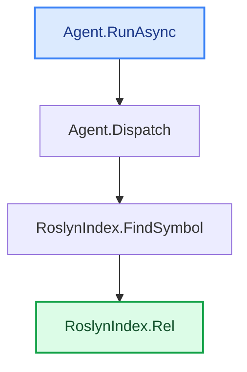

# Trace example — full options (`--with-bodies --annotate --summary`)

The same code-walk as [`trace-with-bodies.md`](trace-with-bodies.md), but with **everything on**:
`--annotate` adds a short LLM **"why" note** per hop (the `> _…_` lines), `--summary` adds a final
**Summary** + **In plain words** recap, and every trace ends with the auto-generated
**`## Call-flow`** diagram (ASCII boxes + Mermaid). Signatures show **parameter names**, each call
site shows the **argument → parameter** mapping, and the **target** node shows its full body. This
is everything a dev gets from a trace, in one file. Reproducible (needs the model running):

```bash
dotnet run -- trace -s CodeTracer.sln -f RoslynIndex.cs -e Agent.cs --with-bodies --annotate --summary \
  --repo-url https://github.com/janjanusek/code_tracer/blob/main
```

> _Path-finding is deterministic (zero model calls); the model is only used for the per-hop "why"
> notes, the Summary, and the plain-words recap. If you omit `--out`, the result **auto-saves** to
> `codetracer-trace-Agent.cs-to-RoslynIndex.md` (default on, no flag), so a trace is never lost._

---

(find_path Agent.RunAsync -> RoslynIndex.Rel)
PATH FOUND (4 nodes):

**1. Agent.RunAsync(String solutionPath, String targetFile, String endpoint)**   [Agent.cs:118](https://github.com/janjanusek/code_tracer/blob/main/Agent.cs#L118)
> _Executes model-requested external tool call and processes observation_

```csharp
  118      public async Task RunAsync(string solutionPath, string targetFile, string endpoint)
  119      {
  120          var seed = Bootstrap(targetFile, endpoint);
  121  
  122          // Deterministic pre-flight: try candidate find_path pairs IMMEDIATELY. On CPU this is
  123          // faster and more reliable than waiting for (often under-filled) model calls. Roslyn
  124          // is the source of truth; the model is here only to navigate harder cases (interface/DI/events).
  125          // --all-paths/--brute: enumerate ALL paths (deep), not just the first shortest one.
  126          var mode = _allPaths ? "brute-force (all paths)" : "first path";
  127          Console.WriteLine($"[pre-flight] deterministic find_path over {_pairs.Count} candidate pairs [{mode}]...");
  128          var deterministic = _allPaths ? await TryAllPaths() : await TryAutoPath();
  129          if (deterministic.Contains("PATH FOUND"))
  130          {
  131              await Finish(deterministic, _allPaths ? "brute-force" : "pre-flight");
  132              return;
  133          }
  134          if (!_useLlm)
  135          {
  136              Console.WriteLine("[pre-flight] no direct path and --no-llm set - stopping.");
  137              await Finish(deterministic, "deterministic");
  138              return;
  139          }
  140          Console.WriteLine("[pre-flight] no direct path - handing over to the model loop...");
  141  
  142          var messages = new List<ChatMsg>
  143          {
  144              new("system", SystemPrompt),
  145              new("user", seed)
  146          };
  147  
  148          var seen = new HashSet<string>();
  149          int escalations = 0;
  150  
  151          for (int step = 1; step <= _maxSteps; step++)
  152          {
  153              var act = await GetAction(messages);
  154              if (act == null)
  155              {
  156                  // model could not produce a valid action even after corrections -> deterministic escalation
  157                  Console.WriteLine("\n[auto] model gave no valid action - using deterministic result...");
  158                  await Finish(_lastPath ?? deterministic, "auto");
  159                  return;
  160              }
  161  
  162              var (tool, args, raw) = act.Value;
  163              Console.WriteLine($"\n===== STEP {step} =====\n{raw}");
  164  
  165              if (tool == "finish")
  166              {
  167                  var pathText = _lastPath ?? await TryAutoPath();
      // … (19 lines omitted) …
  187                  }
  188  
  189                  // model is looping -> use deterministic result (within 2 steps)
  190                  Console.WriteLine("[auto] loop detected - using deterministic result...");
  191                  await Finish(_lastPath ?? deterministic, "auto");
  192                  return;
  193              }
  194  
  195              string observation;
  196              try { observation = await Dispatch(tool, args); }
```
_call site: [Agent.cs:196](https://github.com/janjanusek/code_tracer/blob/main/Agent.cs#L196)  ·  args: tool → tool, args → a_

↓ calls **Agent.Dispatch(String tool, JsonElement a)**

**2. Agent.Dispatch(String tool, JsonElement a)**   [Agent.cs:563](https://github.com/janjanusek/code_tracer/blob/main/Agent.cs#L563)
> _Extracts symbol name from JSON and queries index for symbol details_

```csharp
  563      private async Task<string> Dispatch(string tool, JsonElement a)
  564      {
  565          string S(string k) => a.TryGetProperty(k, out var v) && v.ValueKind == JsonValueKind.String
  566              ? (v.GetString() ?? "") : "";
  567          int I(string k, int def) => a.TryGetProperty(k, out var v) && v.TryGetInt32(out var n) ? n : def;
  568  
  569          return tool switch
  570          {
  571              "find_symbol"     => await _index.FindSymbol(S("name")),
```
_call site: [Agent.cs:571](https://github.com/janjanusek/code_tracer/blob/main/Agent.cs#L571)  ·  args: S("name") → name_

↓ calls **RoslynIndex.FindSymbol(String name)**

**3. RoslynIndex.FindSymbol(String name)**   [RoslynIndex.cs:157](https://github.com/janjanusek/code_tracer/blob/main/RoslynIndex.cs#L157)
> _Converts location object into a readable source code reference string_

```csharp
  157      public async Task<string> FindSymbol(string name)
  158      {
  159          var decls = await FindDeclarations(name);
  160          if (decls.Count == 0) return $"no declaration '{name}'";
  161          var sb = new System.Text.StringBuilder();
  162          foreach (var s in decls.Take(40))
  163          {
  164              var loc = s.Locations.FirstOrDefault(l => l.IsInSource);
  165              var where = loc != null ? Rel(loc) : "?";
```
_call site: [RoslynIndex.cs:165](https://github.com/janjanusek/code_tracer/blob/main/RoslynIndex.cs#L165)  ·  args: loc → loc_

↓ calls **RoslynIndex.Rel(Location loc)**

**4. RoslynIndex.Rel(Location loc)**   [RoslynIndex.cs:38](https://github.com/janjanusek/code_tracer/blob/main/RoslynIndex.cs#L38)  (target)
> _Formats location into a file path and line number string_

```csharp
   38      private string Rel(Location loc)
   39      {
   40          var span = loc.GetLineSpan();
   41          var path = span.Path;
   42          try { path = Path.GetRelativePath(SolutionDir, path); } catch { /* keep absolute */ }
   43          return $"{path}:{span.StartLinePosition.Line + 1}";
   44      }
```

## Summary
### Summary for Developer

This call chain executes a core functionality within an AI Agent framework designed to resolve code references by querying a structured index based on source code analysis (Roslyn).

#### 1. What it does / purpose
The primary goal of this path is **Symbol Resolution and Location Formatting**. The process begins when the `Agent` determines that it needs to find details about a specific symbol (e.g., a class or method name) mentioned in the user's prompt. It uses an internal index (`RoslynIndex`) to look up this symbol, which returns structured location data (`Location`). Finally, the deepest function formats this raw `Location` object into a human-readable file path and line number string (e.g., `MyFile.cs:123`).

#### 2. Dependencies
*   **Agent:** The orchestrating class that manages the overall interaction loop (including model calls and tool dispatching).
*   **RoslynIndex:** A service responsible for querying code structure information using Roslyn APIs. It acts as the source of truth for symbol existence.
*   **Location Object:** A complex type representing a specific point in the source code, containing path and line span details.
*   **File System (`System.IO.Path`):** Used by `RoslynIndex.Rel` to calculate relative paths from the solution directory.

#### 3. Good to know
*   **Deterministic Fallback:** The agent prioritizes a "deterministic pre-flight" check (lines 122-132). This means that if a path can be found purely through code logic (Roslyn) without needing an LLM call, it will use that result immediately, improving reliability and speed.
*   **Source of Truth:** The agent explicitly treats `RoslynIndex` as the "source of truth" for code structure; the LLM is only used to navigate complex cases like interface implementations or dependency injection graphs.
*   **Path Handling:** The `Rel` function handles path normalization by attempting to calculate a relative path (`Path.GetRelativePath`) from the solution directory, ensuring the output is clean and context-aware.

## In plain words
Imagine you have a giant book of computer instructions. When someone asks your smart helper AI about a specific word or idea in that book, this process acts like a super-fast librarian. It quickly looks up where that exact word is written—like pointing to the right page and line number—so it can give you an accurate answer without guessing.

## Call-flow
_The path the analysis found — deterministic, straight from Roslyn (no model)._

```text
┌────────────────────────────┐
│ Agent.RunAsync   ◆ start   │   Agent.cs:118
└──────────────┬─────────────┘
               ▼  calls
┌────────────────────────────┐
│ Agent.Dispatch             │   Agent.cs:563
└──────────────┬─────────────┘
               ▼  calls
┌────────────────────────────┐
│ RoslynIndex.FindSymbol     │   RoslynIndex.cs:157
└──────────────┬─────────────┘
               ▼  calls
┌────────────────────────────┐
│ RoslynIndex.Rel   ★ target │   RoslynIndex.cs:38
└────────────────────────────┘
```


