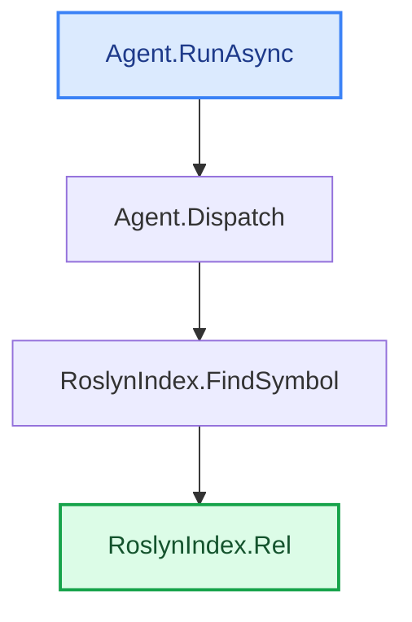

# Trace example with code (`--with-bodies`)

The same trace, but between each hop CodeTracer inserts the method's code **from its start
down to the exact line where it calls the next hop** — so you read the actual flow, not just
method names. Signatures show **parameter names**, each call site shows the **argument →
parameter** mapping, and the **target** node shows its full body (where the chain ends). With
`--repo-url` every location and call site is a clickable link. Deterministic, **zero model
calls**. Reproducible:

```bash
dotnet run -- trace -s CodeTracer.sln -f RoslynIndex.cs -e Agent.cs --no-llm --with-bodies \
  --repo-url https://github.com/janjanusek/code_tracer/blob/main
```

> Tip: add `--annotate` for a short LLM "why" note per hop, and `--summary` for a final
> summary section — see [`trace-with-bodies-annotated.md`](trace-with-bodies-annotated.md).

PATH FOUND (4 nodes):

**1. Agent.RunAsync(String solutionPath, String targetFile, String endpoint)**   [Agent.cs:118](https://github.com/janjanusek/code_tracer/blob/main/Agent.cs#L118)

```csharp
  118      public async Task RunAsync(string solutionPath, string targetFile, string endpoint)
  119      {
  120          var seed = Bootstrap(targetFile, endpoint);
  ...
  195              string observation;
  196              try { observation = await Dispatch(tool, args); }
```
_call site: [Agent.cs:196](https://github.com/janjanusek/code_tracer/blob/main/Agent.cs#L196)  ·  args: tool → tool, args → a_

↓ calls **Agent.Dispatch(String tool, JsonElement a)**

**2. Agent.Dispatch(String tool, JsonElement a)**   [Agent.cs:494](https://github.com/janjanusek/code_tracer/blob/main/Agent.cs#L494)

```csharp
  494      private async Task<string> Dispatch(string tool, JsonElement a)
  495      {
  496          string S(string k) => a.TryGetProperty(k, out var v) && v.ValueKind == JsonValueKind.String
  497              ? (v.GetString() ?? "") : "";
  498          int I(string k, int def) => a.TryGetProperty(k, out var v) && v.TryGetInt32(out var n) ? n : def;
  499
  500          return tool switch
  501          {
  502              "find_symbol"     => await _index.FindSymbol(S("name")),
```
_call site: [Agent.cs:502](https://github.com/janjanusek/code_tracer/blob/main/Agent.cs#L502)  ·  args: S("name") → name_

↓ calls **RoslynIndex.FindSymbol(String name)**

**3. RoslynIndex.FindSymbol(String name)**   [RoslynIndex.cs:130](https://github.com/janjanusek/code_tracer/blob/main/RoslynIndex.cs#L130)

```csharp
  130      public async Task<string> FindSymbol(string name)
  131      {
  132          var decls = await FindDeclarations(name);
  133          if (decls.Count == 0) return $"no declaration '{name}'";
  134          var sb = new System.Text.StringBuilder();
  135          foreach (var s in decls.Take(40))
  136          {
  137              var loc = s.Locations.FirstOrDefault(l => l.IsInSource);
  138              var where = loc != null ? Rel(loc) : "?";
```
_call site: [RoslynIndex.cs:138](https://github.com/janjanusek/code_tracer/blob/main/RoslynIndex.cs#L138)  ·  args: loc → loc_

↓ calls **RoslynIndex.Rel(Location loc)**

**4. RoslynIndex.Rel(Location loc)**   [RoslynIndex.cs:38](https://github.com/janjanusek/code_tracer/blob/main/RoslynIndex.cs#L38)  (target)

```csharp
   38      private string Rel(Location loc)
   39      {
   40          var span = loc.GetLineSpan();
   41          var path = span.Path;
   42          try { path = Path.GetRelativePath(SolutionDir, path); } catch { /* keep absolute */ }
   43          return $"{path}:{span.StartLinePosition.Line + 1}";
   44      }
```

Every trace result ends with an auto-generated **`## Call-flow`** diagram. A single straight path
is drawn as vertical boxes (ASCII, readable anywhere) plus a Mermaid block that renders as
graphics on GitHub / VS Code:

## Call-flow
_The path the analysis found — deterministic, straight from Roslyn (no model)._

```text
┌────────────────────────────┐
│ Agent.RunAsync   ◆ start   │   Agent.cs:118
└──────────────┬─────────────┘
               ▼  calls
┌────────────────────────────┐
│ Agent.Dispatch             │   Agent.cs:563
└──────────────┬─────────────┘
               ▼  calls
┌────────────────────────────┐
│ RoslynIndex.FindSymbol     │   RoslynIndex.cs:157
└──────────────┬─────────────┘
               ▼  calls
┌────────────────────────────┐
│ RoslynIndex.Rel   ★ target │   RoslynIndex.cs:38
└────────────────────────────┘
```


